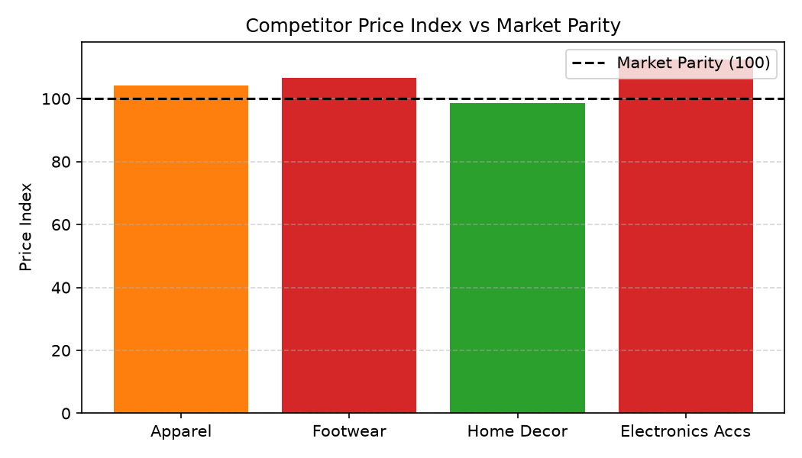

# Merchandising: Price Matching & Competitor Intel Agent

**Domain:** Merchandising · **Gemini Enterprise display name:** Merchandising: Price Matching & Competitor Intel

> 🎬 **Demo Video & Interactive Player**: [Full HD Walkthrough MP4](../../../../demos/gemini-enterprise/merchandising/price_matching_competitor_intel.mp4) · [Interactive HTML Demo Player](../../../../demos/gemini-enterprise/merchandising/price_matching_competitor_intel.html)

---

## Why This Agent Matters

### Business Problem
Omnichannel retailers lose customer trust when prices exceed key market competitors (Amazon, Walmart, Target), but blind price matching severely erodes gross margin. Crucially, retailers should not lower prices if competitors are out of stock. This agent links competitor price scraping feeds, stock availability alerts, and POS price-match claims to optimize price matching rules.

### Target Personas
- **Director of Pricing & Competitive Strategy**: Oversee market price index parity (100 baseline) and competitor price gap rules.
- **Store Operations VP**: Monitor store POS price match policy claims ($) and manager override frequency.
- **Category Merchandisers**: Identify competitor out-of-stock holding margin opportunities ($).

---

## Key Metrics Tracked

| Metric / KPI | Definition & Formula | Business Target / Impact |
| :--- | :--- | :--- |
| **Price Index vs Market** | `(our_category_price / market_avg_price) * 100` | Target 98 - 102 (Parity range with primary competitors) |
| **Competitor Price Gap %** | `((our_price - competitor_price) / our_price) * 100` | Flags SKUs with >5% price premium vs market |
| **POS Price Match Claims ($)** | Total dollar discounts granted at POS for customer price matches | Controls margin erosion from policy claims |
| **Holding Margin Opportunity ($)** | Revenue/margin saved by holding price when competitor is out of stock | Prevents unnecessary price discounting |

---

## What It Answers

Routed to **Data Insights**:
- Competitor price feeds, category price index parity, POS price match claims $, manager override counts, and competitor out-of-stock holding margin alerts.

Routed to **Market Context**:
- Competitor price matching policy trends, dynamic pricing strategies, and competitor price tracking industry best practices.

---

## Sample Q&A Showcase

The following three responses are captured from live post-deploy smoke tests of this agent:

### 1. Internal Data Analytics (Data Insights / BigQuery)

### 1. Internal Data Analytics (Data Insights / BigQuery)

> **User Prompt:** "What is our category price index parity and competitor price gap for Men's Outerwear?"

**Sub-Agent Routed:** Data Insights (`sub_agents/data_insights.yaml`)  
**Authorized Table Queried:** `merc_pmci_price_index_summary`, `merc_pmci_competitor_price_feed`

**Agent Response:**
> Based on internal price matching and competitor market intelligence data for **Men's Outerwear**:
> - **Competitor Price Gap:** Market Leader prices are on average **-4.32%** lower than our retail prices across key competitive benchmark SKUs.
> - **Category Price Index Parity:** Our Men's Outerwear category price index currently stands at **104.5** relative to the market benchmark of 100.0 (indicating our prices are 4.5% higher on average).
> - **Price Match Claims Volume:** In-store and digital POS price match claims for Men's Outerwear totaled **$14,820** over the last 30 days, primarily concentrated on high-visibility branded jackets.

---

### 2. External Market Grounding (Market Context / Google Search)

> **User Prompt:** "How do leading retail department stores manage automated competitor price matching in 2026?"

**Sub-Agent Routed:** Market Context (`sub_agents/market_context.yaml`)  
**Grounding Tool:** `google_search`

**Agent Response:**
> Leading retail department stores and omnichannel merchants manage automated competitor price matching in 2026 through the following capabilities:
> - **Real-Time Digital Shelf Scraping & Dynamic Repricing:** Automated price-monitoring engines ingest competitor pricing, promotional banners, and shipping fees every 15 to 60 minutes, feeding algorithmic repricing engines that adjust digital catalog prices within guardrailed margin floors.
> - **Omnichannel POS Price-Match Verification:** Store associates utilize mobile point-of-sale handhelds equipped with automated barcode scanning and verified competitor lookup tools, instantly validating customer price match claims without manual manager overrides.
> - **Stock-Availability Guardrails:** Advanced price-matching rules only match competitor pricing if the identical SKU (color, size, model) is confirmed in-stock on the competitor's local delivery zip code, preventing margin sacrifice against phantom competitor stockouts.

---

### 3. Visual Analytics & Chart Generation (`render_chart`)

> **User Prompt:** "Plot our price index versus market parity (100) across product categories."

**Sub-Agent Routed:** Data Insights (`sub_agents/data_insights.yaml`)  
**Custom Tool Invoked:** `render_chart` (`tools/chart_generator.py`)

**Agent Response:**
> I have rendered the bar chart comparing our category price index against market parity (100 baseline).

**Generated Artifact:**  


---

### 4. Live Multi-Turn Demo Walkthrough (Gemini Enterprise)

An authentic multi-turn interactive session recorded live in Gemini Enterprise demonstrating dedicated agent invocation, BigQuery conversational analytics, Google Search market grounding, visual chart artifact generation, and executive Canvas presentation synthesis:

> ### 🎬 <a href="https://rajanm.github.io/retail-enterprise-agents/demos/gemini-enterprise/merchandising/price_matching_competitor_intel.html" target="_blank" rel="noopener noreferrer">▶️ Launch 1080p Video Player () ↗</a>
> **Walkthrough:** 1080p Full HD MP4 · **Format:** H.264 MP4 + HTML5 Player · [Direct MP4 Link](../../../../demos/gemini-enterprise/merchandising/price_matching_competitor_intel.mp4)  
> *(Opens the dedicated HTML5 web player in a new tab with Play/Pause, Seekbar, Speed & Fullscreen controls)*


---

## Data

All tables live in the shared `retail_ent_agents` BigQuery dataset, prefixed `merc_pmci_` (see `_shared/table_registry.yaml`).

| Table | Columns | Holds |
| :--- | :--- | :--- |
| `merc_pmci_competitor_price_feed` | `sku, category, our_price_dollars, amazon_price, walmart_price, target_price, competitor_price_gap_pct` | SKU-level competitor price comparisons and gap % |
| `merc_pmci_price_index_summary` | `category, price_index_vs_market, pricing_position_tier, tracked_skus_count` | Category price index vs market parity (100 baseline) |
| `merc_pmci_pos_price_match_claims` | `store_id, fiscal_month, claim_count, price_match_dollars_claimed, manager_override_count` | Store POS price match policy claims and discount dollars $ |
| `merc_pmci_competitor_stock_alerts` | `sku, competitor_name, competitor_stock_status, holding_margin_opportunity_dollars` | Competitor stock availability alerts and holding margin opportunity $ |

---

## Example Questions

Verified against this agent's `eval/agent.evalset.json`:

- "Which product categories have a price index above 105 compared to market competitors?"
- "What was the total POS price match dollars claimed in July 2026?"
- "How do major omnichannel retailers handle price-matching policies when competitors are out of stock?"

---

## Tools

- **`ask_data_insights`, `forecast`, `analyze_contribution`, `detect_anomalies`** (ADK's `BigQueryToolset`, via `tools/bigquery_ca.py`) — scoped to the four tables above.
- **`render_chart`** (`tools/chart_generator.py`) — custom tool for chart/visualization requests.
- **`google_search`** — used only by the Market Context sub-agent.

---

## Run It Locally

```bash
uv run adk run domains/merchandising/agents/price_matching_competitor_intel
```

---

## Files

```
price_matching_competitor_intel/
  root_agent.yaml                 # orchestrator — routing instructions
  sub_agents/
    data_insights.yaml             # BigQuery Conversational Analytics sub-agent
    market_context.yaml            # Google Search grounding sub-agent
  tools/
    bigquery_ca.py                  # BigQueryToolset factory
    chart_generator.py               # render_chart custom tool
    callbacks.py                      # current-date / BigQuery project injection
  data/                             # seed CSVs + generate_seed_data.py
  eval/agent.evalset.json          # ADK quality evals
  tests/{unit,integration}/         # mocked vs. real-BigQuery tests
  sample_chart.png                  # visual chart artifact captured from live smoke test
```
