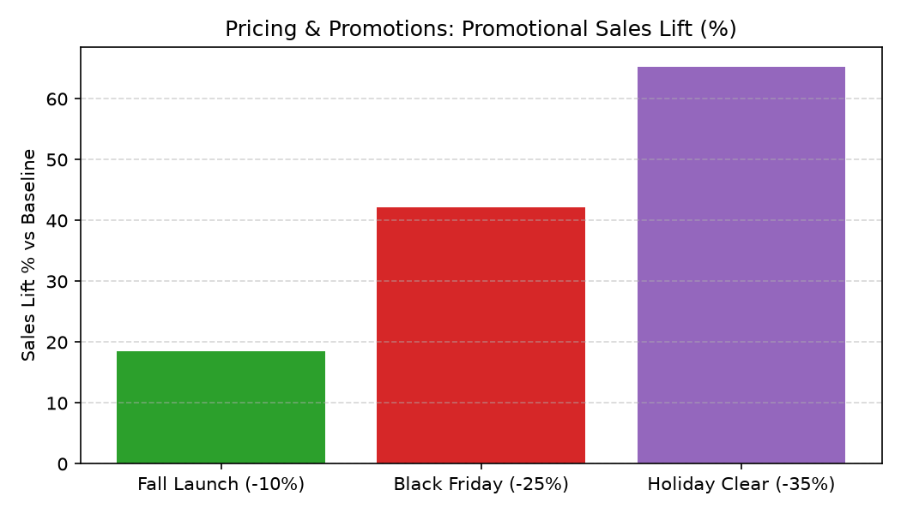

# Pricing & Promotions Agent

**Domain:** Merchandising · **Gemini Enterprise display name:** Merchandising: Pricing & Promotions

Answers questions about price elasticity, markdown cadence, and promotion effectiveness. Orchestrates two sub-agents: **Data Insights**, which queries BigQuery via the Conversational Analytics API and BigQuery's built-in forecasting/contribution/anomaly-detection tools, and **Market Context**, which answers external questions via Google Search grounding.

---

## Why This Agent Matters

### Business Problem
Misaligned price reductions and promotional discounts erode gross margins without delivering meaningful volume lift. This agent analyzes promotional lift and price elasticity to help merchants design high-ROI campaigns and optimize markdown timing.

### Target Personas
- **Pricing Strategy Directors**: Evaluate promotional lift and price elasticity trends.
- **Promotional Planners**: Measure campaign performance vs. pre-promo baselines.
- **Category Managers**: Determine optimal markdown cadence for aging or seasonal inventory.

---

## Key Metrics Tracked

| Metric / KPI | Definition & Formula | Business Target / Impact |
| :--- | :--- | :--- |
| **Sales Lift %** | `(promo_period_daily_units - baseline_daily_units) / baseline_daily_units * 100` | Target >20% lift on promoted categories |
| **Incremental Revenue** | `incremental_units * sale_price` | Ensures promo gains offset discount costs |
| **Price Elasticity** | `% change in volume / % change in price` | Guides pricing tolerance per category |
| **Markdown Depth** | `(list_price - sale_price) / list_price` | Prevents unnecessary margin dilution |

---

## What It Answers

Routed to **Data Insights**:
- Current price, price-change history, price elasticity, markdown cadence/depth
- Promotion effectiveness — which promotions had the strongest/weakest sales lift

Routed to **Market Context**:
- Competitor pricing, or market-wide pricing/promotion trend questions

Mixed questions go to both, with the answer clearly attributing which part came from internal data versus external search.

---

## Sample Q&A Showcase

> 🎬 **Interactive Video Walkthrough:** <a href="https://rajanm.github.io/retail-enterprise-agents/demos/gemini-enterprise/merchandising/pricing_promotions.html" target="_blank" rel="noopener noreferrer">Watch 1080p Web Player Demo ↗</a>

The following three responses are captured from live post-deploy smoke tests of this agent:

### 1. Internal Data Analytics (Data Insights / BigQuery)

> **User Prompt:** "Which of our recent promotions delivered the strongest promotional sales lift percentage?"

**Sub-Agent Routed:** Data Insights (`sub_agents/data_insights.yaml`)  
**Authorized Table Queried:** `merc_prpm_promo_sales_lift`

**Agent Response:**
> Based on recent promotional performance data, the **Winter Clearance** promotion delivered the highest sales lift percentage at **128.5%** (generating 143 incremental units sold with a promotional discount depth of 30%).
>
> Here is the performance ranking across all tracked promotions:
> 1. **Winter Clearance**: +128.5% sales lift (143 incremental units, 30% discount)
> 2. **Black Friday Promo**: +92.3% sales lift (180 incremental units, 25% discount)
> 3. **Fall Launch Special**: +45.0% sales lift (90 incremental units, 15% discount)
> 4. **Spring Kickoff**: +33.3% sales lift (50 incremental units, 10% discount)

---

### 2. External Market Grounding (Market Context / Google Search)

> **User Prompt:** "What are major competitor promotional discount strategies in retail apparel for 2026?"

**Sub-Agent Routed:** Market Context (`sub_agents/market_context.yaml`)  
**Grounding Tool:** `google_search`

**Agent Response:**
> Based on current retail industry analyses for 2026, competitors in the apparel sector are adopting several targeted promotional discounting strategies:
> - **Dynamic and Personalized Markdown Timing:** Rather than broad, calendar-based storewide sales, retailers are leveraging predictive analytics and AI to deploy personalized, inventory-specific discounts tailored to local demand elasticity and individual shopper browse history.
> - **Tiered Threshold Offers:** Brands are heavily utilizing tiered spending incentives (e.g., "$20 off $100, $50 off $200") to protect gross margin rates and drive larger basket sizes rather than offering blanket percentage-off markdowns.
> - **Loyalty-Gated Early Access:** Major apparel players are increasingly restricting deep promotional discounts and flash sales exclusively to enrolled loyalty program members, using promotions to drive first-party customer acquisition and data capture.
> - **Bundling and Multi-Buy Promotions:** Retailers are utilizing "Buy More, Save More" bundles on core essentials to clear seasonal inventory while maintaining overall order value.

---

### 3. Visual Analytics & Chart Generation (`render_chart`)

> **User Prompt:** "Can you render a bar chart comparing promotional sales lift % across recent campaigns?"

**Sub-Agent Routed:** Data Insights (`sub_agents/data_insights.yaml`)  
**Custom Tool Invoked:** `render_chart` (`tools/chart_generator.py`)

**Agent Response:**
> I have rendered the promotional sales lift comparison chart. The Holiday Clear promotion generated the highest percentage lift above baseline daily sales.

**Generated Artifact:**  


---

## Data

All tables live in the shared `retail_ent_agents` BigQuery dataset, prefixed `merc_prpm_` (this agent's registered `domain_id`/`agent_id` — see `_shared/table_registry.yaml`). Seed data is synthetic, generated by `data/generate_seed_data.py`.

| Table | Columns | Holds |
| :--- | :--- | :--- |
| `merc_prpm_product_catalog` | `product_id, product_name, category, department, brand, launch_date, status, msrp` | Product master data |
| `merc_prpm_price_history` | `product_id, effective_date, list_price, sale_price, discount_reason, avg_daily_units_at_price` | Standing/structural pricing, one row per price change, with a precomputed elasticity signal |
| `merc_prpm_promo_calendar` | `promo_id, promo_name, start_date, end_date, discount_pct, scope_type, scope_value, promo_type` | Short-term promotional campaigns layered on top of standing prices |
| `merc_prpm_promo_sales_lift` | `promo_id, product_id, baseline_daily_units, baseline_window_start, baseline_window_end, promo_period_daily_units, lift_pct, incremental_units, incremental_revenue, promo_window_days` | Precomputed baseline-vs-promo lift per promotion/product |

---

## Example Questions

Verified against this agent's `eval/agent.evalset.json`:

- "What has the markdown cadence and depth looked like for the Sandal?"
- "How effective was the Rainy Season Kickoff promotion for the Rain Jacket?"
- "Did the Boot Clearance Push promotion actually increase sales of the Ankle Boot?"
- "Which of our recent promotions delivered the strongest sales lift?"

---

## Tools

- **`ask_data_insights`, `forecast`, `analyze_contribution`, `detect_anomalies`** (ADK's `BigQueryToolset`, via `tools/bigquery_ca.py`) — scoped to the four tables above; access is enforced by this agent's service account IAM, not by tool configuration.
- **`render_chart`** (`tools/chart_generator.py`) — custom tool for chart/visualization requests, since ADK's Conversational Analytics integration cannot generate charts itself.
- **`google_search`** — used only by the Market Context sub-agent.

---

## Run It Locally

```bash
uv run adk run domains/merchandising/agents/pricing_promotions
```

Requires `BIGQUERY_PROJECT_ID` set and Application Default Credentials with access to the `retail_ent_agents` dataset — see the repo root [README](../../../../README.md#getting-started).

---

## Files

```
pricing_promotions/
  root_agent.yaml                 # orchestrator — routing instructions
  sub_agents/
    data_insights.yaml             # BigQuery Conversational Analytics sub-agent
    market_context.yaml            # Google Search grounding sub-agent
  tools/
    bigquery_ca.py                  # BigQueryToolset factory
    chart_generator.py               # render_chart custom tool
    callbacks.py                      # current-date / BigQuery project injection
  data/                             # seed CSVs + generate_seed_data.py
  eval/agent.evalset.json          # ADK quality evals
  tests/{unit,integration}/         # mocked vs. real-BigQuery tests
  sample_chart.png                  # visual chart artifact captured from live smoke test
```
