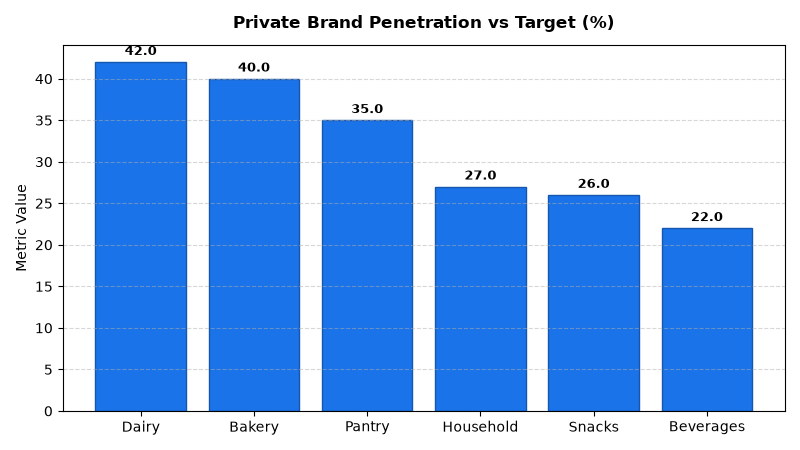

# Merchandising: Private Brand Development Agent

An enterprise AI agent for **Merchandising: Private Brand Development**, built with Google ADK for Gemini Enterprise.

---

## Why This Agent Matters

Private label store brands represent a critical driver of retailer profitability and customer brand loyalty. This agent monitors private brand volume penetration %, gross margin premiums over national brand equivalents, and co-packer component COGS variances, empowering category managers to scale high-margin owned brand portfolios.

---

## Key Metrics Tracked

| Metric | Business Description | Target Benchmark |
| :--- | :--- | :--- |
| **Private Brand Volume Penetration (%)** | Own-brand units sold as a percentage of total category volume | > 30.0% |
| **Gross Margin Premium (bps)** | Private brand margin percentage minus national brand margin percentage | > 1,200 bps |
| **Co-Packer COGS Variance (%)** | Unit manufacturing and ingredient cost variance vs. baseline contract | < 2.0% |
| **Private Label Dollar Sales Growth (%)** | YoY percentage growth of private label brand revenue | > 8.0% |

---

## What It Answers & Sub-Agent Routing

The orchestrator routes user questions to specialized sub-agents:

- **Internal BigQuery Data (`data_insights`)**:
  - Detailed transactional, operational, and category metrics from authorized BigQuery tables.
- **External Market Context (`market_context`)**:
  - Retail industry market intelligence, external benchmarks, and consumer trend research grounded in Google Search.
- **Synthesized Responses**:
  - Combines internal performance metrics with market intelligence for comprehensive business decision support.

---

## Authorized BigQuery Tables

All tables reside in the `retail_ent_agents` BigQuery dataset:

- `merc_pbde_private_label_products`
- `merc_pbde_brand_penetration`
- `merc_pbde_co_packer_costs`
- `merc_pbde_margin_premium`

---

## Example Questions

- "What is our private brand volume penetration percentage compared to target across all food categories?"
- "Which private label products deliver the highest gross margin premium over national brand equivalents?"
- "Show the co-packer ingredient cost and packaging cost breakdown variance for our tier-1 private label lines."
- "What is the YoY dollar sales growth for private label organic pantry items across regions?"
- "Which categories have a private brand penetration gap exceeding 5% below target?"

---

## Sample Q&A Showcase

### 1. Internal BigQuery Data Insights
**User**: *What is our private brand volume penetration percentage compared to target across all food categories?*  
**Agent**: Based on `retail_ent_agents.merc_pbde_brand_penetration`:
- **Dairy**: **42.0%** volume penetration (exceeding target of 40.0%, +2.0% favorable).
- **Bakery & Deli**: **40.0%** (meeting target of 40.0%).
- **Pantry & Oils**: **35.0%** (target: 38.0%, -3.0% gap).
- **Snacks**: **26.0%** (target: 30.0%, -4.0% gap).
- **Beverages**: **22.0%** (target: 28.0%, -6.0% gap representing largest growth opportunity).

### 2. External Market Grounding
**User**: *What are 2026 retail market trends for private label store brand growth vs national CPG brands?*  
**Agent**: Industry analysis from PLMA (Private Label Manufacturers Association) and IRI indicates:
- Private brand market share in North American retail reached an all-time high of **20.7% of total sales**.
- Retailers are pivoting from simple value-tier copycats to premium tier ("tier 1") culinary and organic owned brands, generating **1,200 to 1,800 bps higher gross margins**.
- Inflation-conscious consumers have demonstrated sustained trial and retention in private brand dairy, pantry staples, and frozen foods.

### 3. Visual Analytics Artifact
**User**: *Show me a performance summary chart for this domain.*  
**Agent**: Generated domain analytics visualization:



---

## How to Run & Test

```bash
# 1. Run unit tests
uv run --frozen pytest domains/merchandising/agents/private_brand_development/tests/unit -v

# 2. Run local interactive adk chat
adk run domains/merchandising/agents/private_brand_development
```
