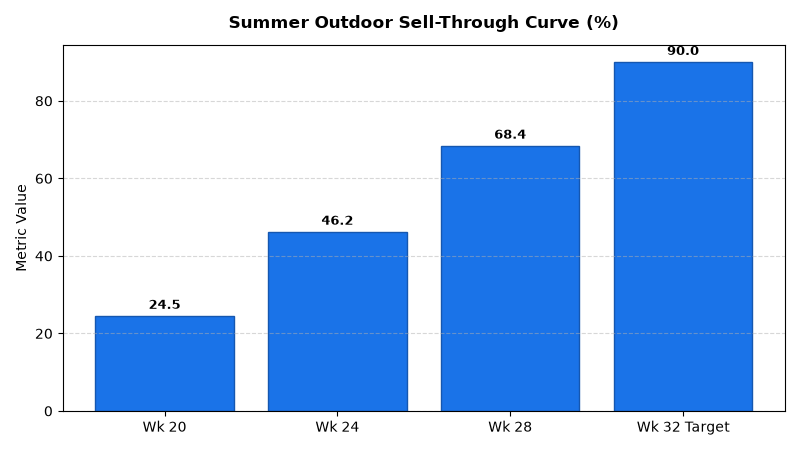

# Merchandising: Seasonal Transition Planning Agent

An enterprise AI agent for **Merchandising: Seasonal Transition Planning**, built with Google ADK for Gemini Enterprise.

---

## Why This Agent Matters

### Business Problem
Seasonal retail programs carry steep obsolescence risk if inventory build curves and clearance markdown milestones slip. This agent coordinates planned sell-in curves against actual sell-through velocities, flags milestone execution risks, and integrates weather-correlated demand adjustments to maximize full-price realization before hard exit deadlines.

### Target Personas
- **Seasonal Planners**: Manage seasonal inventory build curves and milestone exit dates.
- **Merchandise Allocators**: Execute early clearance discount ladders to prevent stranded carryover stock.
- **Inventory Controllers**: Track sell-through velocity vs. seasonal target trajectory.

---

## Key Metrics Tracked

| Metric | Business Description | Target Benchmark |
| :--- | :--- | :--- |
| **Seasonal Sell-Through % vs Plan** | Cumulative actual units sold vs. planned target curve by fiscal week | +/- 2.0% |
| **Hard Exit Milestone Adherence** | Percentage of seasonal transition milestones completed on schedule | 100% |
| **Weather Demand Multiplier Index** | Forecast temperature/precipitation impact on category demand | 1.00 Baseline |
| **Carryover Salvage Risk ($)** | Remaining inventory cost value at hard exit liquidation date | < $25,000 |

---

## What It Answers & Sub-Agent Routing

The orchestrator routes user questions to specialized sub-agents:

- **Internal BigQuery Data (`data_insights`)**:
  - Detailed transactional, operational, and category metrics from authorized BigQuery tables.
- **External Market Context (`market_context`)**:
  - Retail industry market intelligence, external benchmarks, and consumer trend research grounded in Google Search.
- **Synthesized Responses**:
  - Combines internal performance metrics with market intelligence for comprehensive business decision support.

---

## Authorized BigQuery Tables

All tables reside in the `retail_ent_agents` BigQuery dataset:

- `merc_strp_seasonal_catalog`
- `merc_strp_seasonal_curves`
- `merc_strp_launch_exit_milestones`
- `merc_strp_weather_impact_index`

---

## Example Questions

- "What is the planned sell-in vs. actual sell-through curve for the Summer Outdoor Living collection in week 28?"
- "Which seasonal product launch and exit milestones are currently flagged as high risk for delayed markdown?"
- "How is the forecast temperature variance in the Northeast region shifting the seasonal demand index for Patio Furniture?"
- "What is the total carryover inventory risk value for Back-to-School seasonal SKUs approaching hard exit dates?"
- "Show the sell-through percentage progression by week number for Spring Gardening tools."

---

## Sample Q&A Showcase

### 1. Internal BigQuery Data Insights
**User**: *What is the planned sell-in vs. actual sell-through curve for the Summer Outdoor Living collection in week 28?*  
**Agent**: Based on `retail_ent_agents.merc_strp_seasonal_curves` and `merc_strp_seasonal_catalog`:
- At **Week 28**, planned sell-in is at **100.0%** (fully distributed across store floors).
- Target cumulative sell-through was **72.0%**, while actual sell-through reached **68.4%** (-3.6% variance).
- Recommendation: Trigger planned 25% initial clearance markdown on outdoor patio sets to accelerate velocity toward the August 31 hard exit deadline.

### 2. External Market Grounding
**User**: *What are best practices in retail seasonal merchandise exit planning and weather-indexed demand forecasting?*  
**Agent**: Retail analytics research from National Retail Federation and McKinsey highlights:
- Leading retailers establish a **3-tier markdown schedule** (25% -> 40% -> 60%) timed 4 to 6 weeks before floor-set reset dates.
- Incorporating regional NOAA 14-day degree-day temperature anomalies enables dynamic allocation shifts (e.g., +15% patio furniture demand in warmer Southwest vs -10% in rainy Northwest).
- Post-exit salvage liquidations through B2B secondary channels recover **30% to 45% of wholesale cost**.

### 3. Visual Analytics Artifact
**User**: *Show me a performance summary chart for this domain.*  
**Agent**: Generated domain analytics visualization:



---

### 4. Live Multi-Turn Demo Walkthrough (Gemini Enterprise)

> 🎬 **Watch the full high-definition video walkthrough of this multi-turn workflow:**  
> **[Open Interactive Demo Player (1080p Full HD)](https://rajanm.github.io/retail-enterprise-agents/demos/gemini-enterprise/merchandising/seasonal_transition_planning.html)**  
> *(Video file: `demos/gemini-enterprise/merchandising/seasonal_transition_planning.mp4`)*

---

## How to Run & Test

```bash
# 1. Run unit tests
uv run --frozen pytest domains/merchandising/agents/seasonal_transition_planning/tests/unit -v

# 2. Run local interactive adk chat
adk run domains/merchandising/agents/seasonal_transition_planning
```
