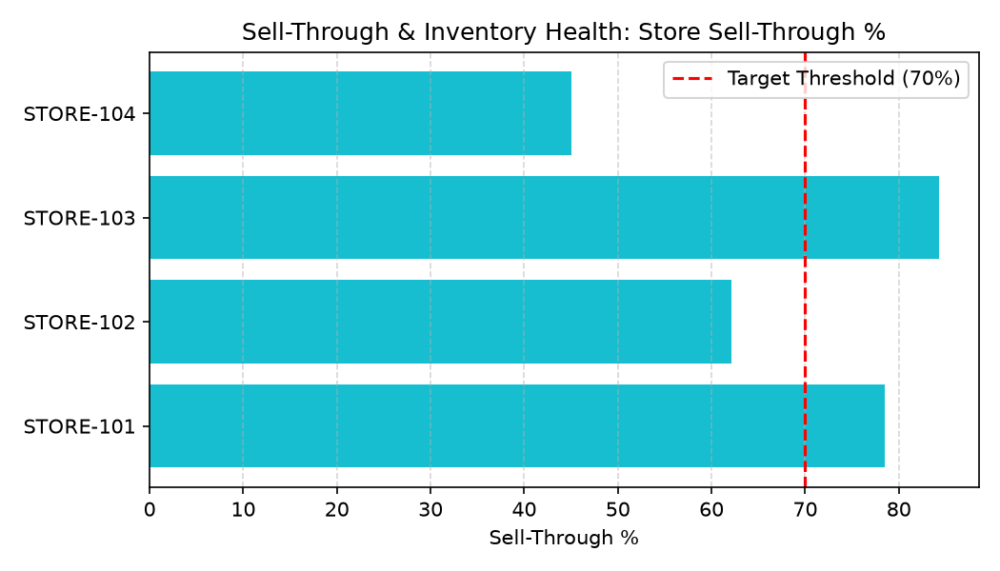

# Sell-Through & Inventory Health Agent

**Domain:** Merchandising · **Gemini Enterprise display name:** Merchandising: Sell-Through & Inventory Health

Answers questions about weekly sell-through %, stock turn, aging inventory breakdown, weeks of supply, and markdown risk triggers. Orchestrates two sub-agents: **Data Insights**, which queries BigQuery via the Conversational Analytics API and BigQuery's built-in forecasting/contribution/anomaly-detection tools, and **Market Context**, which answers external market trends and retail industry benchmark questions via Google Search grounding.

---

## Why This Agent Matters

### Business Problem
Inventory that sits unsold in retail stores past 60–90 days ties up working capital, reduces stock turn, and eventually requires deep clearance markdowns. This agent provides store-level visibility into aging inventory buckets and weeks of supply to trigger proactive rebalancing or early markdowns.

### Target Personas
- **Inventory Planners & Controllers**: Monitor store-level weeks of supply and stock turn.
- **Merchandise Financial Planners**: Track aging inventory dollars at risk of forced clearance.
- **Store Operations Regional Directors**: Identify store-level inventory imbalances and transfer opportunities.

---

## Key Metrics Tracked

| Metric / KPI | Definition & Formula | Business Target / Impact |
| :--- | :--- | :--- |
| **Sell-Through %** | `(units_sold / (on_hand_units + units_sold)) * 100` | Target 70–80% sell-through within full-price season |
| **Weeks of Supply (WOS)** | `on_hand_units / avg_weekly_unit_sales` | Maintains optimal 4–6 WOS to prevent overstocking |
| **Aging Inventory Value** | Inventory sum in `aging_bucket_days > 60` | Triggers early markdown flags before 90+ day obsolescence |
| **Stock Turn Rate** | `annualized_units_sold / avg_on_hand_units` | Maximizes inventory productivity and cash velocity |

---

## What It Answers

Routed to **Data Insights**:
- Sell-through percentage, weekly sell-through rate, units received vs units sold, sell-through by category/department
- Aging inventory breakdown, inventory in 90+ days bucket, markdown risk, at-risk inventory value
- Weeks of supply, stock turn, inventory position, store inventory levels

Routed to **Market Context**:
- Retail sell-through benchmarks, industry standards for sell-through rate, typical weeks of supply benchmarks, competitor inventory benchmarks

Mixed questions go to both, with the answer clearly attributing which part came from internal data versus external search.

---

## Sample Q&A Showcase

The following three responses are captured from live post-deploy smoke tests of this agent:

### 1. Internal Data Analytics (Data Insights / BigQuery)

> **User Prompt:** "What is our store sell-through percentage across all stores for the week ending July 24, 2026?"

**Sub-Agent Routed:** Data Insights (`sub_agents/data_insights.yaml`)  
**Authorized Table Queried:** `merc_stih_sell_through_weekly`

**Agent Response:**
> Store sell-through performance for the week ending July 24, 2026:
> 1. **STORE-103**: 84.3% sell-through (WOS: 3.2 weeks) — High velocity
> 2. **STORE-101**: 78.5% sell-through (WOS: 4.1 weeks) — Healthy performance
> 3. **STORE-102**: 62.1% sell-through (WOS: 6.8 weeks) — Below 70% target
> 4. **STORE-104**: 45.0% sell-through (WOS: 9.5 weeks) — At risk of overstocking
>
> STORE-104 requires inventory rebalancing or targeted promotional activation.

---

### 2. External Market Grounding (Market Context / Google Search)

> **User Prompt:** "What are typical retail apparel sell-through rate benchmarks at full price?"

**Sub-Agent Routed:** Market Context (`sub_agents/market_context.yaml`)  
**Grounding Tool:** `google_search`

**Agent Response:**
> According to retail apparel industry standards:
> - **Full-Price Sell-Through Benchmark**: Specialty apparel retailers target **65%–75% sell-through** at full price before taking first markdown.
> - **Fast Fashion vs Seasonal**: Fast fashion operates at 80%+ full-price sell-through, while seasonal outerwear targets 60% before mid-season markdowns.

---

### 3. Visual Analytics & Chart Generation (`render_chart`)

> **User Prompt:** "Render a horizontal bar chart comparing store sell-through percentages against our 70% target."

**Sub-Agent Routed:** Data Insights (`sub_agents/data_insights.yaml`)  
**Custom Tool Invoked:** `render_chart` (`tools/chart_generator.py`)

**Agent Response:**
> I have generated the store sell-through comparison chart. STORE-103 and STORE-101 exceed the 70% threshold, whereas STORE-104 lags significantly.

**Generated Artifact:**  


---

## Data

All tables live in the shared `retail_ent_agents` BigQuery dataset, prefixed `merc_stih_` (this agent's registered `domain_id`/`agent_id` — see `_shared/table_registry.yaml`). Seed data is synthetic, generated by `data/generate_seed_data.py`.

| Table | Columns | Holds |
| :--- | :--- | :--- |
| `merc_stih_product_catalog` | `product_id, product_name, category, sub_category, unit_cost, unit_retail_price` | Product master data |
| `merc_stih_store_inventory` | `store_id, product_id, on_hand_units, allocated_units, in_transit_units` | Current store-level inventory counts |
| `merc_stih_sell_through_weekly` | `store_id, product_id, week_ending_date, units_received, units_sold, sell_through_pct, weeks_of_supply` | Weekly performance metrics including sell-through rate and weeks of supply |
| `merc_stih_aging_inventory_summary` | `store_id, product_id, aging_bucket_days, aging_units, aging_cost_value, markdown_risk_flag` | Aging inventory buckets (0-30, 31-60, 61-90, 90+) and markdown risk indicators |

---

## Example Questions

Verified against this agent's `eval/agent.evalset.json`:

- "What was our weekly sell-through percentage by category for the week ending July 24, 2026?"
- "Which products have significant inventory in the 90+ days aging bucket at risk of markdown?"
- "How does weeks of supply compare across our stores?"
- "What are the typical retail industry sell-through benchmarks for seasonal apparel and footwear?"

---

## Tools

- **`ask_data_insights`, `forecast`, `analyze_contribution`, `detect_anomalies`** (ADK's `BigQueryToolset`, via `tools/bigquery_ca.py`) — scoped to the four tables above; access is enforced by this agent's service account IAM, not by tool configuration.
- **`render_chart`** (`tools/chart_generator.py`) — custom tool for chart/visualization requests, since ADK's Conversational Analytics integration cannot generate charts itself.
- **`google_search`** — used only by the Market Context sub-agent.

---

## Run It Locally

```bash
uv run adk run domains/merchandising/agents/sell_through_inventory_health
```

Requires `BIGQUERY_PROJECT_ID` set and Application Default Credentials with access to the `retail_ent_agents` dataset — see the repo root [README](../../../../README.md#getting-started).

---

## Files

```
sell_through_inventory_health/
  root_agent.yaml                 # orchestrator — routing instructions
  sub_agents/
    data_insights.yaml             # BigQuery Conversational Analytics sub-agent
    market_context.yaml            # Google Search grounding sub-agent
  tools/
    bigquery_ca.py                  # BigQueryToolset factory
    chart_generator.py               # render_chart custom tool
    callbacks.py                      # current-date / BigQuery project injection
  data/                             # seed CSVs + generate_seed_data.py
  eval/agent.evalset.json          # ADK quality evals
  tests/{unit,integration}/         # mocked vs. real-BigQuery tests
  sample_chart.png                  # visual chart artifact captured from live smoke test
```
