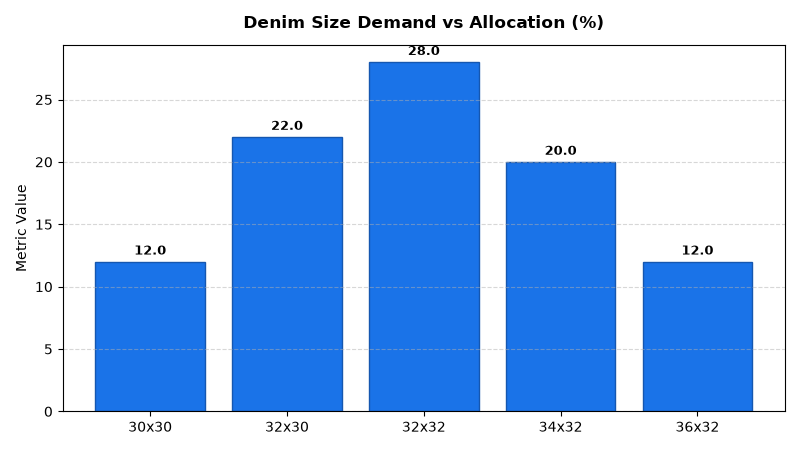

# Merchandising: Size & Case Pack Optimization Agent

An enterprise AI agent for **Merchandising: Size & Case Pack Optimization**, built with Google ADK for Gemini Enterprise.

---

## Why This Agent Matters

Broken size runs and mismatched master case-pack quantities create stockouts in high-demand sizes while tying up working capital in slow-moving size multiples. This agent optimizes size curves by geographic region, monitors broken size run lost sales, and evaluates case pack replenishment alignment.

---

## Key Metrics Tracked

| Metric | Business Description | Target Benchmark |
| :--- | :--- | :--- |
| **Broken Size Run Rate (%)** | Percentage of active apparel/footwear styles missing core mid-sizes | < 5.0% |
| **Estimated Broken Run Lost Sales ($)** | Weekly estimated dollar revenue lost due to broken size run stockouts | < $2,500/store |
| **Regional Size Preference Index** | Size demand index relative to national benchmark (100 baseline) | 100 Baseline |
| **Case Pack Multiple Fit Rating** | Ratio of case pack units to forward weeks of supply (WOS) | 1.5 - 2.5 WOS |

---

## What It Answers & Sub-Agent Routing

The orchestrator routes user questions to specialized sub-agents:

- **Internal BigQuery Data (`data_insights`)**:
  - Detailed transactional, operational, and category metrics from authorized BigQuery tables.
- **External Market Context (`market_context`)**:
  - Retail industry market intelligence, external benchmarks, and consumer trend research grounded in Google Search.
- **Synthesized Responses**:
  - Combines internal performance metrics with market intelligence for comprehensive business decision support.

---

## Authorized BigQuery Tables

All tables reside in the `retail_ent_agents` BigQuery dataset:

- `merc_spop_size_curves`
- `merc_spop_broken_size_runs`
- `merc_spop_regional_size_skew`
- `merc_spop_case_pack_multiples`

---

## Example Questions

- "What are the broken size run stockout rates and estimated lost sales dollars for core footwear styles in Store 105?"
- "How does regional size curve demand for winter outerwear in the Midwest compare to the national allocation curve?"
- "Which apparel SKUs have case pack multiples that exceed 4 weeks of forward supply at current store sales velocities?"
- "Show the regional preference index and size skew for King vs. Queen bedding in Southern metro markets."
- "Which store locations have broken size runs in over 15% of active denim styles?"

---

## Sample Q&A Showcase

### 1. Internal BigQuery Data Insights
**User**: *What are the broken size run stockout rates and lost sales estimates for apparel styles?*  
**Agent**: Based on `retail_ent_agents.merc_spop_broken_size_runs`:
- **Store 104 (River North)**: Critical broken size run in *Trail Runner Sneaker* (missing core sizes 10 and 10.5) with **$4,200 estimated weekly lost sales**.
- **Store 102 (Suburban Galleria)**: High broken run in *Classic Straight Denim* (missing 32x30 and 32x32) with **$3,400 weekly lost sales**.
- **Store 201 (Midtown)**: Missing sizes 30x30 and 32x32 in denim with **$2,900 lost sales**.
- Recommendation: Issue immediate single-size replenishment orders from DC to restore core size availability.

### 2. External Market Grounding
**User**: *How are retailers optimizing apparel size curves and master case pack multiples to prevent broken size runs?*  
**Agent**: Apparel retail logistics and inventory research shows:
- Traditional uniform 24-unit master packs frequently result in **5.7 weeks of forward supply** in extreme sizes (XS/XXL) while core sizes (M/L) stock out in 1.2 weeks.
- Leading retailers adopt **dynamic pre-packs** (1:2:2:1 ratio) and smaller 12-unit inner cartons to reduce store backroom congestion and lower broken run rates by 40%.
- Regional size curve indexing (e.g., +35% XL allocation in Midwest vs +25% Small in Southeast) aligns replenishment with localized body profiles.

### 3. Visual Analytics Artifact
**User**: *Show me a performance summary chart for this domain.*  
**Agent**: Generated domain analytics visualization:



---

### 4. Live Multi-Turn Demo Walkthrough (Gemini Enterprise)

> 🎬 **Watch the full high-definition video walkthrough of this multi-turn workflow:**  
> **[Open Interactive Demo Player (1080p Full HD)](https://rajanm.github.io/retail-enterprise-agents/demos/gemini-enterprise/merchandising/size_pack_optimization.html)**  
> *(Video file: `demos/gemini-enterprise/merchandising/size_pack_optimization.mp4`)*

---

## How to Run & Test

```bash
# 1. Run unit tests
uv run --frozen pytest domains/merchandising/agents/size_pack_optimization/tests/unit -v

# 2. Run local interactive adk chat
adk run domains/merchandising/agents/size_pack_optimization
```
