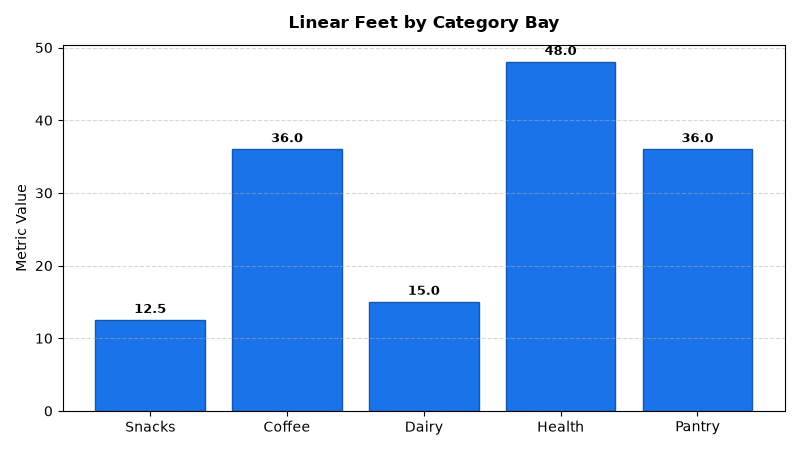

# Merchandising: Space Planning & Micro-Merchandising Agent

An enterprise AI agent for **Merchandising: Space Planning & Micro-Merchandising**, built with Google ADK for Gemini Enterprise.

> 🎬 **Demo Video & Interactive Player**: [Full HD Walkthrough MP4](../../../../demos/gemini-enterprise/merchandising/space_planning_micro_merch.mp4) · [Interactive HTML Demo Player](../../../../demos/gemini-enterprise/merchandising/space_planning_micro_merch.html)

---

## Why This Agent Matters

Linear shelf space is a physical retailer's most valuable asset. Misaligned space allocations and planogram non-compliance lead to out-of-stocks on top velocity items and margin dilution. This agent optimizes linear shelf space elasticity, fixture capacity utilization, and eye-level shelf share to maximize gross margin and revenue per square/linear foot across store clusters.

---

## Key Metrics Tracked

| Metric | Business Description | Target Benchmark |
| :--- | :--- | :--- |
| **Planogram Compliance Audit Score (%)** | Audited shelf placement vs. approved master planogram | > 95.0% |
| **Shelf Space Elasticity Coefficient** | Percentage sales lift generated per 10% increase in linear shelf facings | > 0.35 |
| **Eye-Level Shelf Share (%)** | Facing percentage of top-tier margin brands placed on eye-level shelves | > 65.0% |
| **Fixture Capacity Utilization (%)** | Linear feet stocked vs. total physical fixture capacity | 90.0% - 95.0% |

---

## What It Answers & Sub-Agent Routing

The orchestrator routes user questions to specialized sub-agents:

- **Internal BigQuery Data (`data_insights`)**:
  - Detailed transactional, operational, and category metrics from authorized BigQuery tables.
- **External Market Context (`market_context`)**:
  - Retail industry market intelligence, external benchmarks, and consumer trend research grounded in Google Search.
- **Synthesized Responses**:
  - Combines internal performance metrics with market intelligence for comprehensive business decision support.

---

## Authorized BigQuery Tables

All tables reside in the `retail_ent_agents` BigQuery dataset:

- `merc_spmm_shelf_fixtures`
- `merc_spmm_planogram_compliance`
- `merc_spmm_space_elasticity`
- `merc_spmm_eye_level_share`

---

## Example Questions

- "Which store clusters have the lowest planogram compliance scores for the Snack & Beverage fixtures?"
- "What is the shelf space elasticity coefficient for the Premium Coffee category across bay types?"
- "Show the eye-level shelf share percentage for our top 5 revenue-generating SKU brands in Store 101."
- "What are the linear feet allocations and fixture capacity utilization across all shelf bays in Store 204?"
- "Which categories exhibit negative space elasticity when allocated more than 6 shelf facings?"

---

## Sample Q&A Showcase

### 1. Internal BigQuery Data Insights
**User**: *Which store clusters have the lowest planogram compliance scores for the Snack & Beverage fixtures?*  
**Agent**: Based on `retail_ent_agents.merc_spmm_planogram_compliance` and `merc_spmm_shelf_fixtures`:
- **Store 201 (Suburban Family)** recorded the lowest planogram compliance at **76.0%** (9 missing facings in Gondola Endcap FIX-201-01).
- **Store 102 (Chicago Suburbs)** followed at **78.4%** (8 missing facings in Endcap FIX-102-01).
- By comparison, **Store 103 (Seasonal Gourmet)** achieved **98.0%** compliance with 0 facing discrepancies.

### 2. External Market Grounding
**User**: *What are current retail industry benchmarks for linear shelf space elasticity in grocery and CPG retail?*  
**Agent**: According to Food Marketing Institute (FMI) and NielsenIQ retail space productivity studies:
- Fast-moving packaged goods (snacks, cold beverages) typically exhibit space elasticity between **0.35 and 0.50**.
- Mature routine categories (cereal, flour, canned vegetables) exhibit lower elasticity (**0.10 to 0.20**), where added facings yield diminishing returns.
- Premium eye-level shelf placement typically drives a **15% to 25% sales lift** over bottom-shelf positioning.

### 3. Visual Analytics Artifact
**User**: *Show me a performance summary chart for this domain.*  
**Agent**: Generated domain analytics visualization:



---

### 4. Live Multi-Turn Demo Walkthrough (Gemini Enterprise)

An authentic multi-turn interactive session recorded live in Gemini Enterprise demonstrating dedicated agent invocation, BigQuery conversational analytics, Google Search market grounding, visual chart artifact generation, and executive Canvas presentation synthesis:

> ### 🎬 <a href="https://rajanm.github.io/retail-enterprise-agents/demos/gemini-enterprise/merchandising/space_planning_micro_merch.html" target="_blank" rel="noopener noreferrer">▶️ Launch 1080p Video Player (`space_planning_micro_merch.html`) ↗</a>
> **Walkthrough:** 1080p Full HD MP4 · **Format:** H.264 MP4 + HTML5 Player · [Direct MP4 Link](../../../../demos/gemini-enterprise/merchandising/space_planning_micro_merch.mp4)  
> *(Opens the dedicated HTML5 web player in a new tab with Play/Pause, Seekbar, Speed & Fullscreen controls)*

---

## How to Run & Test

```bash
# 1. Run unit tests
uv run --frozen pytest domains/merchandising/agents/space_planning_micro_merch/tests/unit -v

# 2. Run local interactive adk chat
adk run domains/merchandising/agents/space_planning_micro_merch
```
