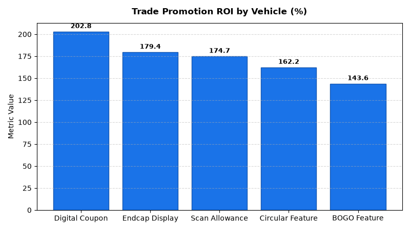

# Merchandising: Trade Spend & Allowance Effectiveness Agent

An enterprise AI agent for **Merchandising: Trade Spend & Allowance Effectiveness**, built with Google ADK for Gemini Enterprise.

---

## Why This Agent Matters

Trade promotion allowances represent one of the largest financial investments shared between retailers and CPG suppliers. This agent reconciles claimed vs. verified POS scan allowances, calculates net trade promotion ROI and incremental volume lift %, and isolates brand cannibalization costs to optimize vendor co-investment agreements.

---

## Key Metrics Tracked

| Metric | Business Description | Target Benchmark |
| :--- | :--- | :--- |
| **Trade Promotion Net ROI (%)** | Incremental gross margin generated per dollar of trade promotional spend | > 150.0% |
| **Incremental Volume Lift (%)** | Promotional unit volume lift over baseline non-promoted run rate | > 80.0% |
| **Scan Allowance Claim Variance ($)** | Discrepancy between vendor claimed scan funds and verified POS scans | < $500/promo |
| **Cannibalization Revenue Loss ($)** | Adjacent brand margin erosion resulting from feature promo cannibalization | Monitor Offset |

---

## What It Answers & Sub-Agent Routing

The orchestrator routes user questions to specialized sub-agents:

- **Internal BigQuery Data (`data_insights`)**:
  - Detailed transactional, operational, and category metrics from authorized BigQuery tables.
- **External Market Context (`market_context`)**:
  - Retail industry market intelligence, external benchmarks, and consumer trend research grounded in Google Search.
- **Synthesized Responses**:
  - Combines internal performance metrics with market intelligence for comprehensive business decision support.

---

## Authorized BigQuery Tables

All tables reside in the `retail_ent_agents` BigQuery dataset:

- `merc_tsef_trade_promotions`
- `merc_tsef_scan_allowances`
- `merc_tsef_incremental_volume_lift`
- `merc_tsef_cannibalization_costs`

---

## Example Questions

- "What is the vendor trade promotion net ROI and incremental volume lift percentage for Q2 beverage promotions?"
- "Show the variance between claimed scan allowances and verified POS scan data across top CPG vendors."
- "Which promotional vehicles (circular feature, endcap display, digital coupon) generated the highest incremental lift per trade spend dollar?"
- "What was the cannibalization cost impact on non-promoted adjacent brand SKUs during the Memorial Day Snack sale?"
- "Which vendor trade funding agreements had an allowance claim variance exceeding $10,000 in the last audit?"

---

## Sample Q&A Showcase

### 1. Internal BigQuery Data Insights
**User**: *What is the vendor trade promotion net ROI and incremental volume lift percentage for Q2 beverage promotions?*  
**Agent**: Based on `retail_ent_agents.merc_tsef_incremental_volume_lift` and `merc_tsef_trade_promotions`:
- **PRM-2026-03 (Digital App Coupon $1 Off)**: Delivered **202.8% trade ROI** with **+98.2% incremental volume lift** ($54,500 incremental revenue on $18,000 spend).
- **PRM-2026-02 (Endcap Feature Display)**: Generated **179.4% trade ROI** with **+128.0% volume lift** ($89,400 incremental revenue on $32,000 spend).
- **PRM-2026-01 (Circular Front Page Feature)**: Achieved **162.2% trade ROI** with **+120.5% volume lift** ($118,000 incremental revenue on $45,000 spend).

### 2. External Market Grounding
**User**: *What are best practices in retail trade promotion management TPM and scan-based allowance reconciliation?*  
**Agent**: CPG trade spend optimization research from GMA (Consumer Brands Association) and Gartner highlights:
- Scan-based allowances (funding per verified unit scanned at POS) reduce deduction dispute cycles by **70%** compared to upfront lump-sum off-invoice funding.
- Retailers auditing scan allowances against register transaction logs identify an average of **3% to 5% overclaim variances** ($3,200 dispute identified on promo PRM-2026-04).
- High-performing promotions balance promotional depth with cannibalization guardrails on core private label and premium adjacent lines.

### 3. Visual Analytics Artifact
**User**: *Show me a performance summary chart for this domain.*  
**Agent**: Generated domain analytics visualization:



---

## How to Run & Test

```bash
# 1. Run unit tests
uv run --frozen pytest domains/merchandising/agents/trade_spend_effectiveness/tests/unit -v

# 2. Run local interactive adk chat
adk run domains/merchandising/agents/trade_spend_effectiveness
```
