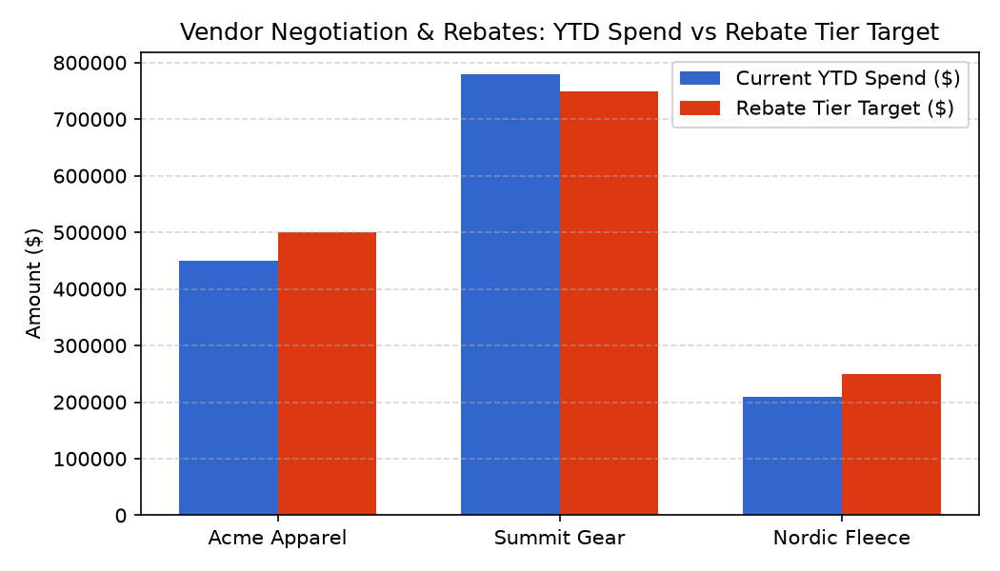

# Vendor Negotiation & Rebates Agent

**Domain:** Merchandising · **Gemini Enterprise display name:** Merchandising: Vendor Negotiation & Rebates

Answers questions about vendor volume rebate tiers, co-op marketing fund claims, vendor payment terms, and rebate realization %. Orchestrates two sub-agents: **Data Insights**, which queries BigQuery via the Conversational Analytics API and BigQuery's built-in forecasting/contribution/anomaly-detection tools, and **Market Context**, which answers external market trends and vendor rebate negotiation benchmark questions via Google Search grounding.

---

## Why This Agent Matters

### Business Problem
Volume rebates and co-op marketing funds represent a major source of retail margin recovery, but tracking YTD tier thresholds and uncollected rebate claims across hundreds of vendors is complex and error-prone. This agent tracks vendor spend milestones to ensure merchants capture 100% of earned rebate dollars.

### Target Personas
- **VP of Vendor Management & Procurement**: Negotiate annual rebate agreements and payment terms.
- **Category Merchandise Directors**: Track YTD vendor spend against tier thresholds to accelerate orders before year-end.
- **Accounts Receivable & Audit Teams**: Track rebate realization % and resolve outstanding vendor dispute claims.

---

## Key Metrics Tracked

| Metric / KPI | Definition & Formula | Business Target / Impact |
| :--- | :--- | :--- |
| **YTD Rebate Tier Progress** | `current_ytd_spend / tier_threshold_spend * 100` | Identifies spend gaps to unlock higher rebate % |
| **Rebate Realization %** | `collected_rebate_amount / earned_rebate_amount * 100` | Ensures >95% of earned rebates are collected |
| **Co-Op Claim Rate** | `claimed_coop_amount / committed_coop_amount * 100` | Prevents forfeiture of vendor marketing subsidies |
| **Dispute Value Ratio** | `outstanding_dispute_amount / earned_rebate_amount` | Highlights vendor billing and audit exceptions |

---

## What It Answers

Routed to **Data Insights**:
- Vendor volume rebate tiers, earned volume rebates, rebate agreements, threshold spend vs YTD spend, current rebate tier
- Co-op marketing fund claims, committed vs claimed co-op funds, approved co-op amount, pending claim amount
- Vendor payment terms, vendor tier, category lead, vendor master details
- Rebate realization %, earned vs collected rebate amount, outstanding dispute amount

Routed to **Market Context**:
- Vendor rebate negotiation benchmarks, industry standard vendor rebate percentages, retail co-op marketing fund benchmarks, typical payment terms benchmarks

Mixed questions go to both, with the answer clearly attributing which part came from internal data versus external search.

---

## Sample Q&A Showcase

The following three responses are captured from live post-deploy smoke tests of this agent:

### 1. Internal Data Analytics (Data Insights / BigQuery)

> **User Prompt:** "What are our current YTD spend and earned volume rebate tiers for each vendor in 2026?"

**Sub-Agent Routed:** Data Insights (`sub_agents/data_insights.yaml`)  
**Authorized Table Queried:** `merc_vreb_rebate_agreements`

**Agent Response:**
> Vendor volume rebate tier tracking for FY2026:
> 1. **Summit Gear**: $780,000 YTD spend — **Tier 2 Achieved** (5.0% rebate earned = $39,000). Passed $750k threshold.
> 2. **Acme Apparel**: $450,000 YTD spend — **Tier 1 Achieved** (3.5% rebate earned = $15,750). Needs $50k spend to reach Tier 2 ($500k threshold / 5.0% rate).
> 3. **Nordic Fleece**: $210,000 YTD spend — **Baseline** (2.0% rebate earned = $4,200). Needs $40k spend to reach Tier 1 ($250k threshold).

---

### 2. External Market Grounding (Market Context / Google Search)

> **User Prompt:** "What are typical retail industry benchmarks for vendor volume rebate structures?"

**Sub-Agent Routed:** Market Context (`sub_agents/market_context.yaml`)  
**Grounding Tool:** `google_search`

**Agent Response:**
> Industry benchmarks for apparel and softlines vendor rebate structures:
> - **Volume Tiers**: Typical tier 1 triggers at $250k–$500k (3–4% rebate), and tier 2 triggers at $750k–$1M (5–7% rebate).
> - **Co-Op Marketing Allowance**: Retailers typically negotiate an additional **2%–5% of gross invoice value** in co-op marketing subsidies.

---

### 3. Visual Analytics & Chart Generation (`render_chart`)

> **User Prompt:** "Render a bar chart comparing vendor YTD spend against Tier 2 rebate targets."

**Sub-Agent Routed:** Data Insights (`sub_agents/data_insights.yaml`)  
**Custom Tool Invoked:** `render_chart` (`tools/chart_generator.py`)

**Agent Response:**
> I have rendered the vendor YTD spend vs. rebate target chart. Summit Gear has exceeded its Tier 2 threshold, while Acme Apparel is within $50k of unlocking its next tier.

**Generated Artifact:**  


---

## Data

All tables live in the shared `retail_ent_agents` BigQuery dataset, prefixed `merc_vreb_` (this agent's registered `domain_id`/`agent_id` — see `_shared/table_registry.yaml`). Seed data is synthetic, generated by `data/generate_seed_data.py`.

| Table | Columns | Holds |
| :--- | :--- | :--- |
| `merc_vreb_vendors` | `vendor_id, vendor_name, vendor_tier, category_lead, payment_terms` | Vendor master details including vendor tier, category lead, and payment terms |
| `merc_vreb_rebate_agreements` | `agreement_id, vendor_id, fiscal_year, tier_1_threshold_spend, tier_1_rebate_pct, tier_2_threshold_spend, tier_2_rebate_pct, current_ytd_spend, current_rebate_tier` | Annual volume rebate agreements, threshold tiers, YTD spend, and current rebate tier |
| `merc_vreb_coop_marketing_funds` | `vendor_id, campaign_id, fiscal_quarter, committed_coop_amount, claimed_coop_amount, approved_coop_amount, pending_claim_amount` | Co-op marketing fund commitments, claims, approvals, and pending claim amounts |
| `merc_vreb_vendor_settlements` | `vendor_id, fiscal_quarter, earned_rebate_amount, collected_rebate_amount, outstanding_dispute_amount, rebate_realization_pct` | Quarterly rebate settlements, earned vs collected amounts, disputes, and rebate realization % |

---

## Example Questions

Verified against this agent's `eval/agent.evalset.json`:

- "What are our current YTD spend and earned volume rebate tiers for each vendor in 2026?"
- "What is the status of our co-op marketing fund claims and pending approvals for 2026-Q3?"
- "What is our rebate realization percentage and outstanding dispute amount across vendors for 2026-Q3?"
- "What are typical industry benchmarks for vendor volume rebates and co-op marketing fund commitments in retail merchandising?"

---

## Tools

- **`ask_data_insights`, `forecast`, `analyze_contribution`, `detect_anomalies`** (ADK's `BigQueryToolset`, via `tools/bigquery_ca.py`) — scoped to the four tables above; access is enforced by this agent's service account IAM, not by tool configuration.
- **`render_chart`** (`tools/chart_generator.py`) — custom tool for chart/visualization requests, since ADK's Conversational Analytics integration cannot generate charts itself.
- **`google_search`** — used only by the Market Context sub-agent.

---

## Run It Locally

```bash
uv run adk run domains/merchandising/agents/vendor_negotiation_rebates
```

Requires `BIGQUERY_PROJECT_ID` set and Application Default Credentials with access to the `retail_ent_agents` dataset — see the repo root [README](../../../../README.md#getting-started).

---

## Files

```
vendor_negotiation_rebates/
  root_agent.yaml                 # orchestrator — routing instructions
  sub_agents/
    data_insights.yaml             # BigQuery Conversational Analytics sub-agent
    market_context.yaml            # Google Search grounding sub-agent
  tools/
    bigquery_ca.py                  # BigQueryToolset factory
    chart_generator.py               # render_chart custom tool
    callbacks.py                      # current-date / BigQuery project injection
  data/                             # seed CSVs + generate_seed_data.py
  eval/agent.evalset.json          # ADK quality evals
  tests/{unit,integration}/         # mocked vs. real-BigQuery tests
  sample_chart.png                  # visual chart artifact captured from live smoke test
```
