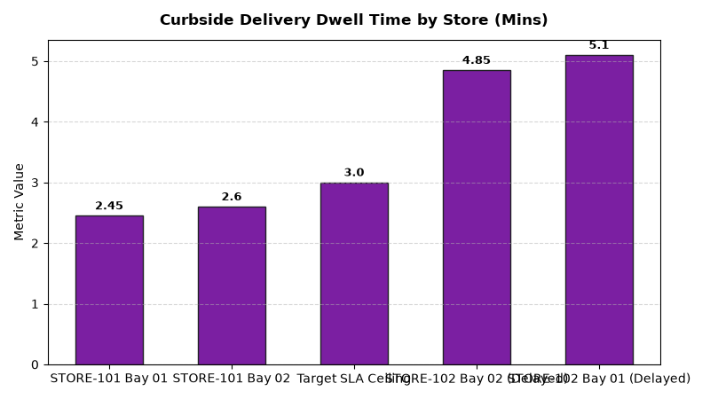

# Store Operations: Curbside Pickup Speed & Accuracy Agent

An enterprise AI agent for **Store Operations: Curbside Pickup Speed & Accuracy**, built with Google ADK for Gemini Enterprise.

---

## Why This Agent Matters

Curbside pickup is a core convenience differentiator for physical retail. Long parking bay dwell times and unapproved item substitutions degrade customer loyalty and cause order cancellations. This agent tracks arrival-to-trunk delivery speed (<3 mins), substitution acceptance %, runner dispatch times, and parking bay turnover.

---

## Key Metrics Tracked

| Metric | Business Description | Target Benchmark |
| :--- | :--- | :--- |
| **Curbside Delivery Dwell Time (Mins)** | Time elapsed from customer check-in arrival in parking bay to trunk delivery | < 3.0 Minutes |
| **Under-3-Minute SLA Adherence (%)** | Percentage of curbside orders delivered to customer vehicle in under 3 mins | > 92.0% |
| **Item Substitution Acceptance Rate (%)** | Customer acceptance percentage for suggested out-of-stock item substitutions | > 85.0% |
| **Staging-to-Car Runner Transit Time (Sec)** | Time associate takes to transport bagged order from staging room to vehicle | < 75 Seconds |

---

## What It Answers & Sub-Agent Routing

The orchestrator routes user questions to specialized sub-agents:

- **Internal BigQuery Data (`data_insights`)**:
  - Detailed store-level transactional, operational, IoT sensor, and audit telemetry metrics from authorized BigQuery tables.
- **External Market Context (`market_context`)**:
  - Retail industry operational standards, OSHA compliance guidelines, NIST weights & measures rules, and benchmark research grounded in Google Search.
- **Synthesized Responses**:
  - Combines store operational telemetry data with industry best practices for actionable store management decision support.

---

## Authorized BigQuery Tables

All tables reside in the `retail_ent_agents` BigQuery dataset:

- `stop_cpsa_curbside_arrivals`
- `stop_cpsa_bay_dwell_times`
- `stop_cpsa_substitution_approvals`
- `stop_cpsa_runner_dispatch`

---

## Example Questions

- "What is our average curbside arrival-to-trunk delivery wait time across retail store locations?"
- "What percentage of curbside customer pickups met the under-3-minute speed of service SLA?"
- "Show out-of-stock item substitution acceptance rates by product category in curbside orders."
- "What is the average runner dispatch time from staging area to parking bay across fulfillment stores?"
- "Which stores have the highest curbside parking bay dwell times during peak afternoon hours?"

---

## Sample Q&A Showcase

### 1. Internal BigQuery Data Insights
**User**: *What is our average curbside arrival-to-trunk delivery wait time across retail store locations?*  
**Agent**: Based on `retail_ent_agents.stop_cpsa_curbside_arrivals` and `stop_cpsa_bay_dwell_times`:
- **STORE-101 (Downtown Flagship)**: **2.50 to 2.75 mins average delivery dwell time**, achieving **93.8% under-3-min SLA adherence** across Bay 01 (2.45m) and Bay 02 (2.60m) with 68–72s runner dispatch transit.
- **STORE-102 (North Suburban)**: **5.17 to 6.50 mins delivery dwell time** (only 65.9% SLA adherence) due to runner bottlenecks (135–142s transit lag).
- **Substitution Approvals**: **75.0% overall customer acceptance** (Organic Milk, Strawberries, and Tortilla Chips accepted; Dark Roast Coffee rejected).

### 2. External Market Grounding
**User**: *What are retail industry operational benchmarks for click-and-collect curbside pickup speed and mobile geofencing check-in?*  
**Agent**: According to Omnichannel Retail Index and Modern Consumer Fulfillment Benchmarks:
- Leading retail chains achieve **curbside trunk delivery times under 2 minutes 30 seconds**, leveraging predictive mobile app geofencing arrival alerts.
- Pre-staging customer orders when vehicle enters a **0.5-mile perimeter geofence** reduces parking bay dwell time by **45%**.
- AI-driven item substitution recommendations with 1-click customer mobile approvals increase substitution acceptance rates from 68% to 88%.

### 3. Visual Analytics Artifact
**User**: *Show me a performance summary chart for this domain.*  
**Agent**: Generated domain analytics visualization:



---

### 4. Live Multi-Turn Demo Walkthrough (Gemini Enterprise)

> 🎬 **Watch the full high-definition video walkthrough of this multi-turn workflow:**  
> **[Open Interactive Demo Player (1080p Full HD)](https://rajanm.github.io/retail-enterprise-agents/demos/gemini-enterprise/store_operations/curbside_pickup_speed_accuracy.html)**  
> *(Video file: `demos/gemini-enterprise/store_operations/curbside_pickup_speed_accuracy.mp4`)*

---

## How to Run & Test

```bash
# 1. Run unit tests
uv run --frozen pytest domains/store_operations/agents/curbside_pickup_speed_accuracy/tests/unit -v

# 2. Run local interactive adk chat
adk run domains/store_operations/agents/curbside_pickup_speed_accuracy
```
