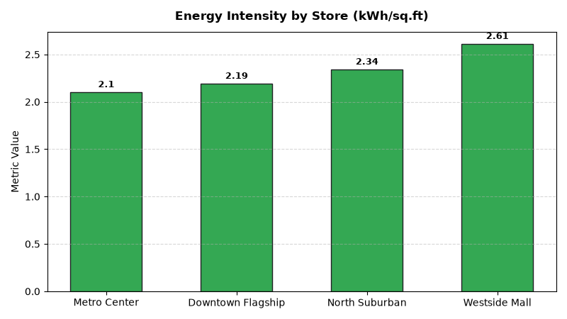

# Store Operations: Store Energy & Facilities Maintenance Agent

An enterprise AI agent for **Store Operations: Store Energy & Facilities Maintenance**, built with Google ADK for Gemini Enterprise.

---

## Why This Agent Matters

Energy consumption and facility maintenance represent major controllable store operating expenses. HVAC inefficiencies and refrigeration temperature excursions cause costly product spoilage and inflated utility bills. This agent monitors IoT refrigeration sensors, tracks work order Mean Time to Repair (MTTR), and manages facility OpEx budgets.

---

## Key Metrics Tracked

| Metric | Business Description | Target Benchmark |
| :--- | :--- | :--- |
| **Store Energy Intensity (kWh/sq.ft)** | Total monthly electricity consumption normalized by gross store square footage | < 2.20 kWh/sq.ft |
| **Refrigeration Critical Alarm Frequency** | IoT cold case sensor temperature excursions exceeding safety thresholds | 0 Alarms |
| **Maintenance Work Order MTTR (Hours)** | Average Mean Time to Repair from work order creation to vendor resolution | < 24.0 Hours |
| **Facility Maintenance OpEx Variance (%)** | Actual facility repair and utility spending relative to quarterly budget | < ±5.0% |

---

## What It Answers & Sub-Agent Routing

The orchestrator routes user questions to specialized sub-agents:

- **Internal BigQuery Data (`data_insights`)**:
  - Detailed store-level transactional, operational, IoT sensor, and audit telemetry metrics from authorized BigQuery tables.
- **External Market Context (`market_context`)**:
  - Retail industry operational standards, OSHA compliance guidelines, NIST weights & measures rules, and benchmark research grounded in Google Search.
- **Synthesized Responses**:
  - Combines store operational telemetry data with industry best practices for actionable store management decision support.

---

## Authorized BigQuery Tables

All tables reside in the `retail_ent_agents` BigQuery dataset:

- `stop_efma_energy_consumption_kwh`
- `stop_efma_refrigeration_sensors`
- `stop_efma_workorders_maintenance`
- `stop_efma_facility_budgets`

---

## Example Questions

- "What is our energy consumption intensity (kWh per square foot) across retail store locations?"
- "Which store refrigeration sensor nodes triggered critical temperature excursion alarms this month?"
- "Show average maintenance work order Mean Time to Repair (MTTR) and repair costs by equipment type."
- "What is the store facility maintenance OpEx budget variance across store fleet in Q3 2026?"
- "Which stores have the highest electricity and utility expense per square foot?"

---

## Sample Q&A Showcase

### 1. Internal BigQuery Data Insights
**User**: *What is our energy consumption intensity (kWh per square foot) across retail store locations?*  
**Agent**: Based on `retail_ent_agents.stop_efma_energy_consumption_kwh` and `stop_efma_facility_budgets`:
- **Metro Center (STORE-103)**: **2.10 kWh/sq.ft** ($23,520 utility cost across 80,000 sq.ft, -3.27% under budget).
- **Downtown Flagship (STORE-101)**: **2.19 kWh/sq.ft** ($19,950 utility cost across 65,000 sq.ft, -6.44% under budget).
- **North Suburban (STORE-102)**: **2.34 kWh/sq.ft** ($13,748 utility cost across 42,000 sq.ft, +13.75% over budget due to refrigeration emergency).
- **Westside Mall (STORE-104)**: **2.61 kWh/sq.ft** ($18,810 utility cost across 48,000 sq.ft, +17.89% over budget due to lighting overhaul).

### 2. External Market Grounding
**User**: *What are retail energy management benchmarks for supermarket and department store kWh intensity and HVAC predictive maintenance?*  
**Agent**: According to ENERGY STAR Commercial Buildings and Department of Energy (DOE) Retail Energy Studies:
- Best-in-class retail properties achieve energy intensities between **1.9 and 2.2 kWh/sq.ft/month**, using smart LED retrofits and variable frequency HVAC drives.
- Automated IoT refrigeration monitoring with automated defrost scheduling reduces compressor energy draw by **18%** and prevents 95% of catastrophic cooler failures.
- Predictive maintenance programs lower emergency contractor dispatch rates by 35% compared to reactive repair models.

### 3. Visual Analytics Artifact
**User**: *Show me a performance summary chart for this domain.*  
**Agent**: Generated domain analytics visualization:



---

## How to Run & Test

```bash
# 1. Run unit tests
uv run --frozen pytest domains/store_operations/agents/energy_facilities_maintenance/tests/unit -v

# 2. Run local interactive adk chat
adk run domains/store_operations/agents/energy_facilities_maintenance
```
