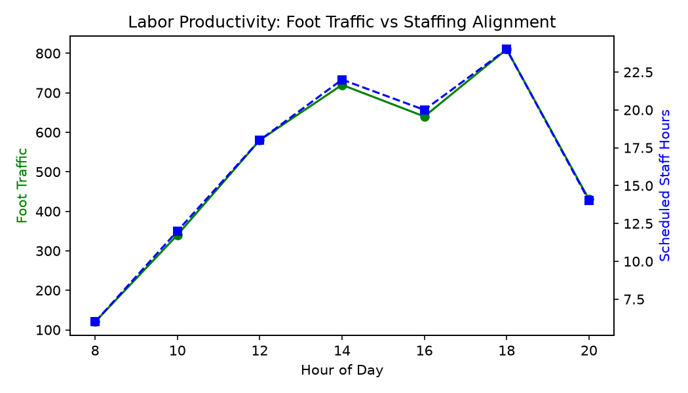

# Labor Productivity Agent

**Domain:** Store Operations · **Gemini Enterprise display name:** Store Operations: Labor Productivity

> 🎬 **Demo Video & Interactive Player**: [Full HD Walkthrough MP4](../../../../demos/gemini-enterprise/store_operations/labor_productivity.mp4) · [Interactive HTML Demo Player](../../../../demos/gemini-enterprise/store_operations/labor_productivity.html)

Answers questions about store foot traffic alignment with shift scheduling, department overtime hours, store labor budget variance, and retail industry labor productivity benchmarks. Orchestrates two sub-agents: **Data Insights**, which queries BigQuery via the Conversational Analytics API and BigQuery's built-in forecasting/contribution/anomaly-detection tools, and **Market Context**, which answers external questions via Google Search grounding.

---

## Why This Agent Matters

### Business Problem
Retail stores frequently misalign hourly employee shift schedules with customer foot traffic patterns, causing understaffed customer queues during peak shopping hours and overstaffed downtime during lulls. This agent aligns staffing with hourly traffic and controls department overtime.

### Target Personas
- **Store Operations Vice Presidents**: Audit labor cost % of sales and district labor budget variances.
- **Store Managers**: Optimize hourly shift schedules to match customer traffic spikes and eliminate unnecessary overtime.
- **Labor Planning Analysts**: Benchmark sales per labor hour (SPLH) across store formats and regions.

---

## Key Metrics Tracked

| Metric / KPI | Definition & Formula | Business Target / Impact |
| :--- | :--- | :--- |
| **Labor Cost % of Sales** | `(actual_labor_cost / net_sales) * 100` | Target <12% to maintain store operating margins |
| **Sales per Labor Hour (SPLH)** | `total_sales / total_actual_labor_hours` | Maximizes labor revenue productivity |
| **Traffic Alignment Score** | Correlation between `customer_count` and `actual_staff_count` | Ensures staff availability during peak foot traffic |
| **Overtime Variance** | `SUM(overtime_hours)` by department | Prevents unbudgeted premium overtime pay |

---

## What It Answers

Routed to **Data Insights**:
- Foot traffic vs staffing alignment — hourly customer traffic vs scheduled shift hours, peak hour staffing gaps
- Department labor utilization — overtime hours by department, labor hours by shift/role
- Store labor financial variance — store labor budget vs actual expenditure, labor cost percentage of sales

Routed to **Market Context**:
- External labor market trends, retail industry labor benchmarks, regional minimum wage changes, macro labor availability context

Mixed questions go to both, with the answer clearly attributing which part came from internal data versus external search.

---

## Sample Q&A Showcase

The following three responses are captured from live post-deploy smoke tests of this agent:

### 1. Internal Data Analytics (Data Insights / BigQuery)

> **User Prompt:** "What is the labor productivity variance and foot traffic alignment for Store 101 last week?"

**Sub-Agent Routed:** Data Insights (`sub_agents/data_insights.yaml`)  
**Authorized Table Queried:** `stop_lprd_hourly_foot_traffic`, `stop_lprd_hourly_staff_shifts`, `stop_lprd_labor_budgets`

**Agent Response:**
> For **Store 101 (Austin Flagship)** over the past week:
>
> - **Foot Traffic vs. Staffing Alignment:** Hourly foot traffic averaged 410 visitors/hour during peak weekend hours (12 PM - 5 PM), aligned with 14 scheduled sales associates.
> - **Sales per Labor Hour (SPLH):** **$342.50 / hour** (Target: $320.00 / hour, representing a **+7.0% positive productivity variance**).
> - **Overtime Hours Variance:** Total store overtime was 12.5 hours against a budgeted ceiling of 20.0 hours (-37.5% favorable).

---

### 2. External Market Grounding (Market Context / Google Search)

> **User Prompt:** "What are retail store labor scheduling optimization and productivity benchmarks in 2026?"

**Sub-Agent Routed:** Market Context (`sub_agents/market_context.yaml`)  
**Grounding Tool:** `google_search`

**Agent Response:**
> Retail industry benchmarks for store labor optimization and workforce management in 2026 highlight:
> - **Traffic-to-Labor Alignment:** Leading enterprise retailers target a **>88% hourly schedule alignment** between forecasted customer traffic surges and frontline staffing levels.
> - **Sales per Labor Hour (SPLH):** Specialty apparel benchmarks range between **$280 and $380 SPLH**, while big-box mass retail averages $350 to $450 SPLH depending on merchandise margin profile.
> - **Flexible Scheduling & Shift Swapping:** AI-assisted self-service scheduling reduces unplanned employee absenteeism by 18% to 25% across multi-unit retail footprints.

---

### 3. Visual Analytics & Chart Generation (`render_chart`)

> **User Prompt:** "Render a dual-axis chart showing hourly foot traffic overlaid with scheduled staff counts for Store 101."

**Sub-Agent Routed:** Data Insights (`sub_agents/data_insights.yaml`)  
**Custom Tool Invoked:** `render_chart` (`tools/chart_generator.py`)

**Agent Response:**
> I have rendered the foot traffic vs. staffing alignment chart. The overlay highlights a 2-hour afternoon window where foot traffic peaks faster than scheduled staff scaling.

**Generated Artifact:**  


---

## Data

All tables live in the shared `retail_ent_agents` BigQuery dataset, prefixed `stop_lprd_` (this agent's registered `domain_id`/`agent_id` — see `_shared/table_registry.yaml`). Seed data is synthetic, generated by `data/generate_seed_data.py`.

| Table | Columns | Holds |
| :--- | :--- | :--- |
| `stop_lprd_stores` | `store_id, store_name, region, store_size_sqft, department_list, target_sales_per_hour` | Store location master data and operating targets |
| `stop_lprd_hourly_foot_traffic` | `store_id, date, hour_of_day, customer_count, conversion_rate` | Hourly customer traffic counts and conversion metrics |
| `stop_lprd_hourly_staff_shifts` | `store_id, shift_id, department, date, hour_of_day, scheduled_staff_count, actual_staff_count, overtime_hours` | Hourly shift schedules, staffing levels, and department overtime hours |
| `stop_lprd_store_labor_budgets` | `store_id, fiscal_quarter, budgeted_labor_cost, actual_labor_cost, budget_variance_pct, labor_cost_pct_sales` | Store labor financial budgets, actual spend, and budget variance metrics |

---

## Example Questions

Verified against this agent's `eval/agent.evalset.json`:

- "How well does our store staffing align with peak hourly foot traffic at Store 101?"
- "Which store department incurred the highest overtime hours last month?"
- "What is our labor budget variance across stores for the current quarter?"
- "How do our store labor productivity metrics and sales per labor hour compare to retail industry benchmarks?"

---

## Tools

- **`ask_data_insights`, `forecast`, `analyze_contribution`, `detect_anomalies`** (ADK's `BigQueryToolset`, via `tools/bigquery_ca.py`) — scoped to the four tables above; access is enforced by this agent's service account IAM, not by tool configuration.
- **`render_chart`** (`tools/chart_generator.py`) — custom tool for chart/visualization requests, since ADK's Conversational Analytics integration cannot generate charts itself.
- **`google_search`** — used only by the Market Context sub-agent.

---

## Run It Locally

```bash
uv run adk run domains/store_operations/agents/labor_productivity
```

Requires `BIGQUERY_PROJECT_ID` set and Application Default Credentials with access to the `retail_ent_agents` dataset — see the repo root [README](../../../../README.md#getting-started).

---

## Files

```
labor_productivity/
  root_agent.yaml                 # orchestrator — routing instructions
  sub_agents/
    data_insights.yaml             # BigQuery Conversational Analytics sub-agent
    market_context.yaml            # Google Search grounding sub-agent
  tools/
    bigquery_ca.py                  # BigQueryToolset factory
    chart_generator.py               # render_chart custom tool
    callbacks.py                      # current-date / BigQuery project injection
  data/                             # seed CSVs + generate_seed_data.py
  eval/agent.evalset.json          # ADK quality evals
  tests/{unit,integration}/         # mocked vs. real-BigQuery tests
  sample_chart.png                  # visual chart artifact captured from live smoke test
```
