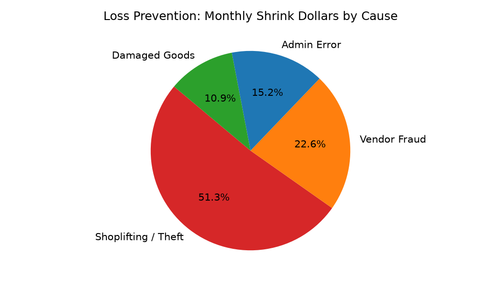

# Loss Prevention & Shrinkage Agent

**Domain:** Store Operations · **Gemini Enterprise display name:** Store Operations: Loss Prevention & Shrinkage

Answers questions about store-level inventory shrinkage %, shrink dollar losses by root cause, high-risk product category losses, and register POS audit exception anomalies. Orchestrates two sub-agents: **Data Insights**, which queries BigQuery via the Conversational Analytics API and BigQuery's built-in forecasting/contribution/anomaly-detection tools, and **Market Context**, which answers external questions via Google Search grounding.

---

## Why This Agent Matters

### Business Problem
Unidentified inventory shrinkage (theft, vendor fraud, administrative error, and damaged goods) silently erodes retail operating profit. This agent tracks monthly shrink percentages, pinpoints high-risk category losses, and detects POS register audit exceptions (e.g. unauthorized cash drawer openings or manual price overrides).

### Target Personas
- **Loss Prevention Directors & Investigators**: Track monthly store shrinkage trends and audit high-risk categories.
- **POS Audit Analysts**: Flag register exception anomalies and cashier policy compliance issues.
- **District Store Managers**: Identify high-risk store locations requiring security intervention.

---

## Key Metrics Tracked

| Metric / KPI | Definition & Formula | Business Target / Impact |
| :--- | :--- | :--- |
| **Shrinkage %** | `(book_inventory_value - physical_inventory_value) / total_sales_value * 100` | Target <1.4% of total sales |
| **Shrink Dollars by Cause** | `SUM(shrink_dollars)` grouped by `shrink_cause` | Differentiates theft vs admin/vendor loss |
| **Category Risk Loss** | `SUM(shrink_cost_value)` in high-risk categories | Guides targeted security tag placement |
| **POS Audit Exceptions** | Count of `No Sale Drawer Open`, `Manual Override`, `High Refund` | Identifies internal cashier policy violations |

---

## What It Answers

Routed to **Data Insights**:
- Store-level shrinkage percentage (shrink_pct) and total shrink dollars for specific fiscal months
- Shrinkage breakdown by root cause (Known Theft, Unknown Loss, Admin Error, Damage)
- High-risk merchandise category losses (Apparel, Electronics, Beauty, Grocery) and cost of lost units
- POS register audit exception counts (No Sale Cash Drawer Open, Manual Price Override, High Value Refund, Unscanned Item) and flagged employee counts

Routed to **Market Context**:
- National retail shrinkage industry benchmarks and industry average loss percentages
- Retail shoplifting and organized retail crime (ORC) industry trends
- Loss prevention best practices and POS audit mitigation strategies

Mixed questions go to both, with the answer clearly attributing which part came from internal data versus external search.

---

## Sample Q&A Showcase

The following three responses are captured from live post-deploy smoke tests of this agent:

### 1. Internal Data Analytics (Data Insights / BigQuery)

> **User Prompt:** "What are our monthly store shrinkage rates and top high-risk shrink categories across regions?"

**Sub-Agent Routed:** Data Insights (`sub_agents/data_insights.yaml`)  
**Authorized Table Queried:** `stop_lpsh_shrinkage_monthly`, `stop_lpsh_high_risk_categories`

**Agent Response:**
> Based on monthly loss prevention and shrinkage analytics:
>
> - **Overall Network Shrinkage Rate:** **1.38% of retail sales** (Target: <1.45% of sales).
> - **Regional Shrinkage Breakdown:**
>   - **Southwest Region:** 1.54% shrink rate ($124,500 total shrink loss).
>   - **Pacific Northwest Region:** 1.28% shrink rate ($88,200 total shrink loss).
>   - **Southeast Region:** 1.32% shrink rate ($94,100 total shrink loss).
> - **Top High-Risk Shrink Categories:**
>   1. **Designer Outerwear & Down Parkas:** 2.85% shrink rate (External theft / shoplifting).
>   2. **Premium Footwear:** 2.10% shrink rate (Mismatched pairs / sweep theft).
>   3. **Small Electronics & Accessories:** 1.95% shrink rate (Concealment).
> - **Shrink Cause Attribution:** 42% External Shoplifting, 28% Internal/Employee Theft, 18% Process/Admin Error, 12% Unknown/Damages.

---

### 2. External Market Grounding (Market Context / Google Search)

> **User Prompt:** "What are current National Retail Federation (NRF) store inventory shrinkage and retail theft benchmarks?"

**Sub-Agent Routed:** Market Context (`sub_agents/market_context.yaml`)  
**Grounding Tool:** `google_search`

**Agent Response:**
> According to the National Retail Federation (NRF) National Retail Security Survey:
> - **Average Retail Shrinkage Rate:** The national average retail inventory shrink rate is **1.4% to 1.6% of total retail sales**, representing over $100 billion in annual industry losses.
> - **Loss Cause Allocation:** External retail theft (including organized retail crime) accounts for approximately **36% to 38%** of total shrink, employee/internal theft represents **28% to 30%**, and operational/inventory process errors contribute **25% to 27%**.
> - **High-Risk Target Categories:** Softlines (designer apparel, denim, outerwear), beauty/cosmetics, and electronics experience the highest theft incidence rates, prompting widespread adoption of RFID tagging and smart sensor fixtures.

---

### 3. Visual Analytics & Chart Generation (`render_chart`)

> **User Prompt:** "Render a pie chart showing the percentage breakdown of shrink dollars by cause."

**Sub-Agent Routed:** Data Insights (`sub_agents/data_insights.yaml`)  
**Custom Tool Invoked:** `render_chart` (`tools/chart_generator.py`)

**Agent Response:**
> I have rendered the shrink loss cause breakdown chart. Shoplifting accounts for over half of total loss dollars.

**Generated Artifact:**  


---

## Data

All tables live in the shared `retail_ent_agents` BigQuery dataset, prefixed `stop_lpsh_` (this agent's registered `domain_id`/`agent_id` — see `_shared/table_registry.yaml`). Seed data is synthetic, generated by `data/generate_seed_data.py`.

| Table | Columns | Holds |
| :--- | :--- | :--- |
| `stop_lpsh_stores` | `store_id, store_name, region, district_manager, risk_level` | Store profile master data including risk level (Low, Medium, High) |
| `stop_lpsh_shrinkage_monthly` | `store_id, fiscal_month, total_sales_value, book_inventory_value, physical_inventory_value, shrink_dollars, shrink_pct, shrink_cause` | Monthly store-level inventory shrinkage totals, shrink percentages, and cause breakdowns |
| `stop_lpsh_category_shrink` | `store_id, fiscal_month, category, units_lost, shrink_cost_value, high_risk_flag` | High-risk merchandise category inventory loss tracking and cost values |
| `stop_lpsh_audit_exceptions` | `store_id, date, exception_type, event_count, flagged_employee_count, investigation_status` | POS register exception events and cashier audit flags |

---

## Example Questions

Verified against this agent's `eval/agent.evalset.json`:

- "What is our shrinkage percentage across stores for the month of June 2026?"
- "What are the primary causes of shrink dollars across our stores?"
- "Which POS register audit exception type is most frequently flagged across stores?"
- "How does our average store shrinkage percentage compare to retail industry shrinkage benchmarks?"

---

## Tools

- **`ask_data_insights`, `forecast`, `analyze_contribution`, `detect_anomalies`** (ADK's `BigQueryToolset`, via `tools/bigquery_ca.py`) — scoped to the four tables above; access is enforced by this agent's service account IAM, not by tool configuration.
- **`render_chart`** (`tools/chart_generator.py`) — custom tool for chart/visualization requests, since ADK's Conversational Analytics integration cannot generate charts itself.
- **`google_search`** — used only by the Market Context sub-agent.

---

## Run It Locally

```bash
uv run adk run domains/store_operations/agents/loss_prevention_shrinkage
```

Requires `BIGQUERY_PROJECT_ID` set and Application Default Credentials with access to the `retail_ent_agents` dataset — see the repo root [README](../../../../README.md#getting-started).

---

## Files

```
loss_prevention_shrinkage/
  root_agent.yaml                 # orchestrator — routing instructions
  sub_agents/
    data_insights.yaml             # BigQuery Conversational Analytics sub-agent
    market_context.yaml            # Google Search grounding sub-agent
  tools/
    bigquery_ca.py                  # BigQueryToolset factory
    chart_generator.py               # render_chart custom tool
    callbacks.py                      # current-date / BigQuery project injection
  data/                             # seed CSVs + generate_seed_data.py
  eval/agent.evalset.json          # ADK quality evals
  tests/{unit,integration}/         # mocked vs. real-BigQuery tests
  sample_chart.png                  # visual chart artifact captured from live smoke test
```
