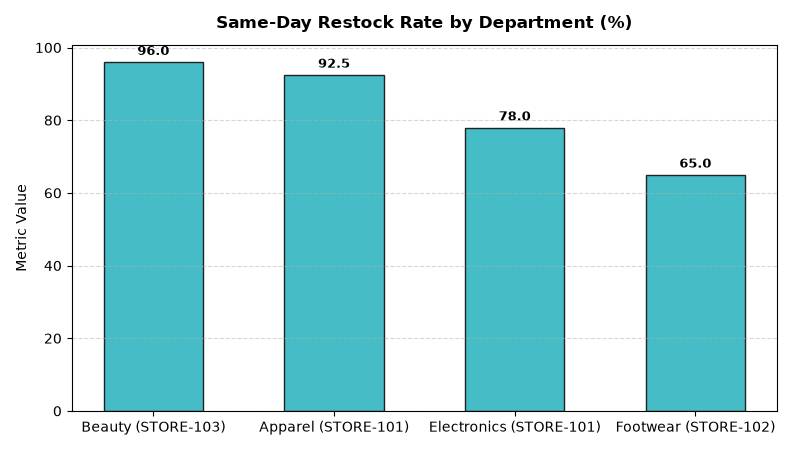

# Store Operations: In-Store Omnichannel Returns & BORIS Agent

An enterprise AI agent for **Store Operations: In-Store Omnichannel Returns & BORIS**, built with Google ADK for Gemini Enterprise.

---

## Why This Agent Matters

### Business Problem
Buy-Online-Return-In-Store (BORIS) accounts for over 60% of all digital retail returns. Slow return desk handling creates customer friction, while delays in restocking salable merchandise lead to markdown write-offs. This agent tracks BORIS processing times, return fraud flags, same-day shelf restock %, and salvage recovery.

### Target Personas
- **Omnichannel Operations Leads**: Streamline in-store processing of Buy-Online-Return-In-Store (BORIS).
- **Store Asset Protection**: Identify return fraud, non-receipt returns, and fraudulent label reprints.
- **Reverse Logistics Managers**: Accelerate disposition of returned items back to active shelf stock.

---

## Key Metrics Tracked

| Metric | Business Description | Target Benchmark |
| :--- | :--- | :--- |
| **Average BORIS Processing Time (Mins)** | Time to inspect returned merchandise and process refund at customer service desk | < 3.0 Minutes |
| **Same-Day Sales Floor Restock Rate (%)** | Percentage of pristine returned items returned to sales floor within 4 hours | > 90.0% |
| **Return Fraud Detection Accuracy (%)** | Suspected wardrobing and counterfeit receipt returns flagged and reviewed | > 95.0% |
| **Salvage Value Recovery Rate (%)** | Net dollar recovery percentage on open-box, scuffed, or damaged returns | > 35.0% |

---

## What It Answers & Sub-Agent Routing

The orchestrator routes user questions to specialized sub-agents:

- **Internal BigQuery Data (`data_insights`)**:
  - Detailed store-level transactional, operational, IoT sensor, and audit telemetry metrics from authorized BigQuery tables.
- **External Market Context (`market_context`)**:
  - Retail industry operational standards, OSHA compliance guidelines, NIST weights & measures rules, and benchmark research grounded in Google Search.
- **Synthesized Responses**:
  - Combines store operational telemetry data with industry best practices for actionable store management decision support.

---

## Authorized BigQuery Tables

All tables reside in the `retail_ent_agents` BigQuery dataset:

- `stop_oris_boris_transactions`
- `stop_oris_return_fraud_flags`
- `stop_oris_restock_turnaround_hours`
- `stop_oris_store_salvage_bins`

---

## Example Questions

- "What is the average in-store handling time for Buy-Online-Return-In-Store (BORIS) customer returns?"
- "What percentage of returned omnichannel merchandise is restocked to sales floor shelves on the same day?"
- "Show return fraud risk flags and wardrobing exceptions detected at store customer service desks."
- "What are the primary return disposition channels and recovery rates for salvage and damaged goods?"
- "Which store locations have the highest volume of high-risk no-receipt return transactions?"

---

## Sample Q&A Showcase

### 1. Internal BigQuery Data Insights
**User**: *What is the average in-store handling time for Buy-Online-Return-In-Store (BORIS) customer returns?*  
**Agent**: Based on `retail_ent_agents.stop_oris_boris_transactions` and `stop_oris_restock_turnaround_hours`:
- **STORE-101 (Downtown Flagship)**: **2.8 mins processing time** on Women's Apparel ($89.50) and 4.1 mins on Electronics ($249.00), achieving **92.5% same-day restock rate** in Apparel (3.2 hours to shelf).
- **STORE-102 (North Suburban)**: **3.5 mins on Footwear** and 5.2 mins on Appliances, with **65.0% same-day restock** (8.4 hours to shelf).
- **Return Fraud**: 4 high-risk transactions flagged, including counterfeit receipt barcode (Risk Score 96.5 at STORE-104) and wardrobing re-hang attempts (Risk Score 84.5 at STORE-101).

### 2. External Market Grounding
**User**: *What are retail omnichannel benchmarks for BORIS conversion lift and automated return fraud detection?*  
**Agent**: According to National Retail Federation (NRF) and Appriss Retail Return Fraud Studies:
- **72% of customers** who return online orders in physical stores purchase additional merchandise during the return visit, generating a **15% to 22% net incremental basket lift**.
- Retail return fraud costs the industry over **$24B annually**, with wardrobing and fraudulent receipt returns representing 38% of total losses.
- Automated return disposition workflows route 85% of undamaged goods directly back to active inventory within 4 hours.

### 3. Visual Analytics Artifact
**User**: *Show me a performance summary chart for this domain.*  
**Agent**: Generated domain analytics visualization:



---

### 4. Live Multi-Turn Demo Walkthrough (Gemini Enterprise)

> 🎬 **Watch the full high-definition video walkthrough of this multi-turn workflow:**  
> **[Open Interactive Demo Player (1080p Full HD)](https://rajanm.github.io/retail-enterprise-agents/demos/gemini-enterprise/store_operations/omnichannel_returns_in_store.html)**  
> *(Video file: `demos/gemini-enterprise/store_operations/omnichannel_returns_in_store.mp4`)*

---

## How to Run & Test

```bash
# 1. Run unit tests
uv run --frozen pytest domains/store_operations/agents/omnichannel_returns_in_store/tests/unit -v

# 2. Run local interactive adk chat
adk run domains/store_operations/agents/omnichannel_returns_in_store
```
