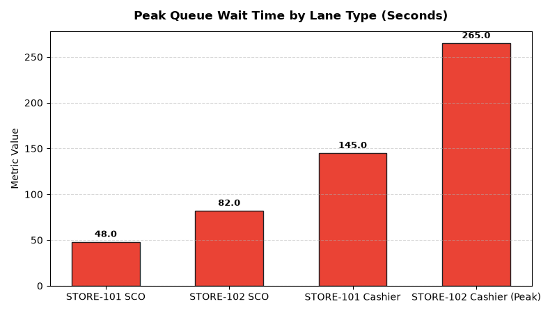

# Store Operations: POS & Checkout Queue Analytics Agent

An enterprise AI agent for **Store Operations: POS & Checkout Queue Analytics**, built with Google ADK for Gemini Enterprise.

---

## Why This Agent Matters

Long checkout lines are the leading driver of in-store customer cart abandonment and negative customer satisfaction. Slow cashier scan speeds and excessive self-checkout attendant interventions create severe front-end bottlenecks. This agent analyzes queue wait times, cashier items per minute (IPM), and self-checkout intervention root causes.

---

## Key Metrics Tracked

| Metric | Business Description | Target Benchmark |
| :--- | :--- | :--- |
| **Average Checkout Queue Wait Time (Sec)** | Time customer waits in line before first item is scanned at register | < 90 Seconds |
| **Self-Checkout Intervention Rate (%)** | Percentage of SCO transactions requiring attendant intervention/override | < 12.0% |
| **Cashier Scan Speed (Items/Min - IPM)** | Average retail items scanned per active cashier minute across shifts | > 20.0 IPM |
| **Front-End Cart Abandonment Rate (%)** | Customers abandoning full baskets due to excessive queue line depth | < 1.5% |

---

## What It Answers & Sub-Agent Routing

The orchestrator routes user questions to specialized sub-agents:

- **Internal BigQuery Data (`data_insights`)**:
  - Detailed store-level transactional, operational, IoT sensor, and audit telemetry metrics from authorized BigQuery tables.
- **External Market Context (`market_context`)**:
  - Retail industry operational standards, OSHA compliance guidelines, NIST weights & measures rules, and benchmark research grounded in Google Search.
- **Synthesized Responses**:
  - Combines store operational telemetry data with industry best practices for actionable store management decision support.

---

## Authorized BigQuery Tables

All tables reside in the `retail_ent_agents` BigQuery dataset:

- `stop_pcqa_queue_wait_times`
- `stop_pcqa_self_checkout_interventions`
- `stop_pcqa_cashier_scan_speed`
- `stop_pcqa_lane_throughput`

---

## Example Questions

- "What is our average customer queue wait time across cashier-assisted vs. self-checkout (SCO) lanes?"
- "What are the primary root causes and attendant response times for self-checkout interventions?"
- "Show cashier scan speed (items per minute - IPM) and tender transaction speed by store location."
- "Which retail stores experienced peak checkout queue wait times exceeding 3 minutes?"
- "What is the hourly transaction throughput and basket size distribution across active checkout lanes?"

---

## Sample Q&A Showcase

### 1. Internal BigQuery Data Insights
**User**: *What is our average customer queue wait time across cashier-assisted vs. self-checkout (SCO) lanes?*  
**Agent**: Based on `retail_ent_agents.stop_pcqa_queue_wait_times` and `stop_pcqa_lane_throughput`:
- **STORE-101 (Downtown Flagship)**: **48.0s queue wait on Self-Checkout (SCO)** (0.4% abandonment) vs **145.0s on Cashier-Assisted** (1.2% abandonment, max depth 6 customers).
- **STORE-102 (North Suburban)**: **82.0s on SCO** (0.9% abandonment) vs **265.0s (4.4 mins) on Cashier-Assisted** during 17:00-18:00 peak rush (3.8% cart abandonment, max depth 10 customers).
- **Lane Throughput**: 4x SCO pod delivered **84 transactions/hour ($2,940/hr)** compared to 32 transactions/hour on single conveyor lanes.

### 2. External Market Grounding
**User**: *What are retail front-end benchmarks for cashier items per minute IPM and self-checkout intervention reduction?*  
**Agent**: According to Food Marketing Institute (FMI) Front-End Management and ECR Retail Loss Group benchmarks:
- Top grocery and retail operators target cashier scan speeds between **20 and 24 IPM**, with tender transaction times under 25 seconds.
- Weight-security scale mismatches account for **45% to 60% of all self-checkout interventions**, adding an average of 25 seconds per delay.
- Computer vision automated produce recognition reduces SCO attendant intervention rates from 18% down to under 8%.

### 3. Visual Analytics Artifact
**User**: *Show me a performance summary chart for this domain.*  
**Agent**: Generated domain analytics visualization:



---

## How to Run & Test

```bash
# 1. Run unit tests
uv run --frozen pytest domains/store_operations/agents/pos_checkout_queue_analytics/tests/unit -v

# 2. Run local interactive adk chat
adk run domains/store_operations/agents/pos_checkout_queue_analytics
```
