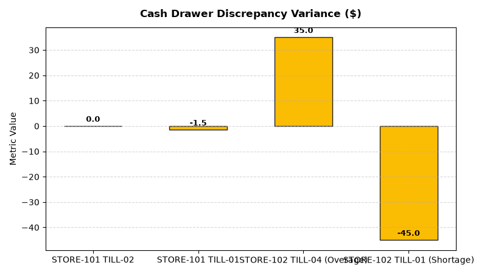

# Store Operations: Store Cash Management & Till Balancing Agent

An enterprise AI agent for **Store Operations: Store Cash Management & Till Balancing**, built with Google ADK for Gemini Enterprise.

---

## Why This Agent Matters

Unreconciled cash drawer overages and shortages mask cashier errors, drawer skimming, and till theft. Delayed armored car deposit reconciliation inflates store cash loss liability. This agent tracks end-of-shift drawer reconciliation variances, logs surprise till audits, and verifies bank deposit clearing.

---

## Key Metrics Tracked

| Metric | Business Description | Target Benchmark |
| :--- | :--- | :--- |
| **Daily Till Cash Discrepancy ($)** | Net dollar variance between POS system recorded cash vs counted cash drawer | < $5.00/till |
| **Cash Drawer Variance Incident Rate (%)** | Percentage of cash drawer shifts with over/short exceeding $10 tolerance | < 2.0% |
| **Armored Car Deposit Reconciliation (%)** | Store safe deposits collected and verified by armored carrier on schedule | 100% |
| **Counterfeit Interception Rate (%)** | Counterfeit currency intercepted at POS prior to deposit bag packing | 100% Interception |

---

## What It Answers & Sub-Agent Routing

The orchestrator routes user questions to specialized sub-agents:

- **Internal BigQuery Data (`data_insights`)**:
  - Detailed store-level transactional, operational, IoT sensor, and audit telemetry metrics from authorized BigQuery tables.
- **External Market Context (`market_context`)**:
  - Retail industry operational standards, OSHA compliance guidelines, NIST weights & measures rules, and benchmark research grounded in Google Search.
- **Synthesized Responses**:
  - Combines store operational telemetry data with industry best practices for actionable store management decision support.

---

## Authorized BigQuery Tables

All tables reside in the `retail_ent_agents` BigQuery dataset:

- `stop_scmt_cash_drawer_reconciliation`
- `stop_scmt_over_short_events`
- `stop_scmt_armored_car_deposits`
- `stop_scmt_till_audits`

---

## Example Questions

- "What is our total cash drawer over/short variance across store locations in 2026 YTD?"
- "Which cashier IDs have recorded multiple cash drawer discrepancy events exceeding $20?"
- "Show armored car deposit pickup schedules and bank reconciliation confirmation statuses."
- "What are the results of surprise cash room and register till audits across retail districts?"
- "How many counterfeit bills have been intercepted and logged at store POS cash drawers?"

---

## Sample Q&A Showcase

### 1. Internal BigQuery Data Insights
**User**: *What is our total cash drawer over/short variance across store locations in 2026 YTD?*  
**Agent**: Based on `retail_ent_agents.stop_scmt_cash_drawer_reconciliation` and `stop_scmt_over_short_events`:
- **STORE-101 (Downtown Flagship)**: **-$1.50 net variance** across drawers (TILL-01: -$1.50, TILL-02: $0.00 exact balance), passed clean.
- **STORE-102 (North Suburban)**: **-$10.00 net variance** with significant individual swings: TILL-01 had **-$45.00 shortage** (Cashier EMP-9021 miscounted $50 bill on split tender) and TILL-04 had **+$35.00 overage** (unrecorded cash pickup).
- **Armored Deposits**: All 4 store deposits ($90,900 total) cleared 100% with Brink's, Loomis, and GardaWorld.

### 2. External Market Grounding
**User**: *What are retail industry best practices for cash office drawer reconciliation and smart safe automation?*  
**Agent**: According to Association for Financial Professionals (AFP) and Retail Cash Management benchmarks:
- Implementing automated smart cash recyclers in backroom cash offices reduces daily till preparation and reconciliation labor by **70%**.
- Enforcing mandatory dual-custody drawer counts when discrepancies exceed **$20.00** resolves 85% of cashier tender errors within 24 hours.
- UV and optical sensor counterfeit bill validators eliminate 98% of fake note chargeback liabilities from commercial banks.

### 3. Visual Analytics Artifact
**User**: *Show me a performance summary chart for this domain.*  
**Agent**: Generated domain analytics visualization:



---

## How to Run & Test

```bash
# 1. Run unit tests
uv run --frozen pytest domains/store_operations/agents/store_cash_management_tills/tests/unit -v

# 2. Run local interactive adk chat
adk run domains/store_operations/agents/store_cash_management_tills
```
