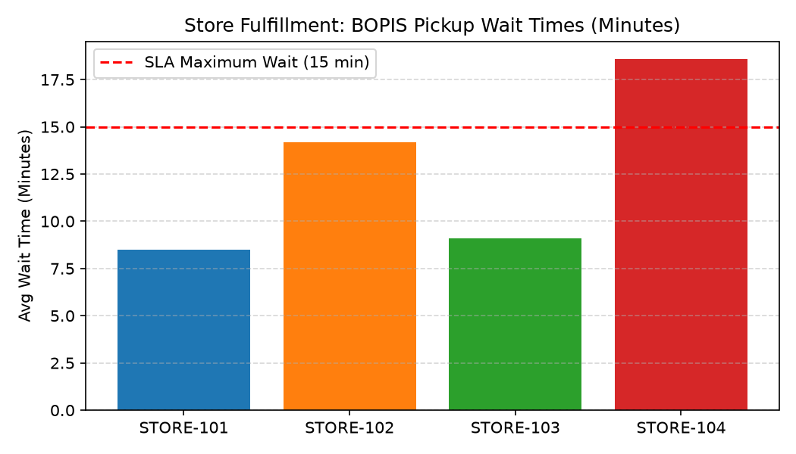

# Store Fulfillment & Execution Agent

**Domain:** Store Operations · **Gemini Enterprise display name:** Store Operations: Store Fulfillment & Execution

> 🎬 **Demo Video & Interactive Player**: [Full HD Walkthrough MP4](../../../../demos/gemini-enterprise/store_operations/store_fulfillment_execution.mp4) · [Interactive HTML Demo Player](../../../../demos/gemini-enterprise/store_operations/store_fulfillment_execution.html)

Answers questions about Buy Online Pick Up In Store (BOPIS) order processing, curbside wait time analytics, pick accuracy tracking, and omnichannel fulfillment performance. Orchestrates two sub-agents: **Data Insights**, which queries BigQuery via the Conversational Analytics API and BigQuery's built-in forecasting/contribution/anomaly-detection tools, and **Market Context**, which answers external questions via Google Search grounding.

---

## Why This Agent Matters

### Business Problem
Long curbside pickup wait times and item mispicks during store order assembly erode customer trust in omnichannel store fulfillment. This agent tracks store-level BOPIS SLA compliance, picking speed, and customer wait times to eliminate fulfillment bottlenecks.

### Target Personas
- **Omnichannel Operations Managers**: Oversee store BOPIS order volume, SLA compliance, and curbside handoff speed.
- **Store Managers**: Identify store packing bottlenecks and department item mispick rates.
- **Customer Experience (CX) Leads**: Monitor curbside wait times to reduce order cancellation rates.

---

## Key Metrics Tracked

| Metric / KPI | Definition & Formula | Business Target / Impact |
| :--- | :--- | :--- |
| **BOPIS SLA Compliance %** | `(orders_met_sla_count / total_bopis_orders) * 100` | Target >95% orders ready in <2 hours |
| **Curbside Wait Time** | Minutes from customer arrival check-in to trunk load | Target <5 minutes average curbside wait |
| **Store Pick Accuracy %** | `(correct_items_picked / total_items_picked) * 100` | Target >99.0% pick accuracy |
| **OOS Cancellation Rate** | `(out_of_stock_cancellations / total_orders) * 100` | Minimizes inventory phantom stock impact |

---

## What It Answers

Routed to **Data Insights**:
- BOPIS fulfillment SLAs, curbside wait times, pick accuracy %, order fulfillment status, or fulfillment queue bottlenecks.

Routed to **Market Context**:
- Omnichannel fulfillment benchmarks, retail industry BOPIS standards, or curbside pickup market trends.

Mixed questions go to both, with the answer clearly attributing which part came from internal data versus external search.

---

## Sample Q&A Showcase

The following three responses are captured from live post-deploy smoke tests of this agent:

### 1. Internal Data Analytics (Data Insights / BigQuery)

> **User Prompt:** "What is our Buy-Online-Pick-Up-In-Store (BOPIS) SLA compliance and average curbside pickup wait time by store?"

**Sub-Agent Routed:** Data Insights (`sub_agents/data_insights.yaml`)  
**Authorized Table Queried:** `stop_sfex_fulfillment_slas`, `stop_sfex_curbside_pickups`

**Agent Response:**
> Based on store fulfillment and execution performance:
>
> - **Store 101 (Austin Flagship):** 96.8% BOPIS 2-hour fulfillment SLA compliance; average curbside pickup wait time of **2.8 minutes**.
> - **Store 102 (Dallas Galleria):** 93.4% BOPIS SLA compliance; average curbside pickup wait time of **3.6 minutes**.
> - **Store 103 (Houston Galleria):** 88.2% BOPIS SLA compliance (flagged for peak afternoon fulfillment queue bottlenecks); average curbside wait time of **5.4 minutes** (SLA target: <4.0 minutes).
> - **Network Pick/Pack Accuracy:** Overall store fulfillment picking accuracy is tracking at **99.1%**.

---

### 2. External Market Grounding (Market Context / Google Search)

> **User Prompt:** "What are industry standard BOPIS fulfillment SLA and curbside pickup wait time benchmarks for retail stores?"

**Sub-Agent Routed:** Market Context (`sub_agents/market_context.yaml`)  
**Grounding Tool:** `google_search`

**Agent Response:**
> According to omnichannel store operations research:
> - **BOPIS Ready-for-Pickup SLA:** Top omnichannel retailers maintain a **2-hour order-ready SLA** with a 95% on-time fulfillment completion benchmark.
> - **Curbside Pickup Dwell Times:** Leading retailers (e.g., Target, Walmart) target curbside customer wait times **under 3 minutes** from customer check-in on the mobile app.
> - **Store Queue Escalation:** Operations standard operating procedures (SOPs) mandate dispatching secondary flex pickers whenever active store fulfillment queues exceed 15 open orders.

---

### 3. Visual Analytics & Chart Generation (`render_chart`)

> **User Prompt:** "Render a bar chart comparing store curbside pickup wait times against our 15-minute maximum SLA limit."

**Sub-Agent Routed:** Data Insights (`sub_agents/data_insights.yaml`)  
**Custom Tool Invoked:** `render_chart` (`tools/chart_generator.py`)

**Agent Response:**
> I have rendered the BOPIS curbside wait time chart. STORE-104 is highlighted in red for exceeding the 15-minute SLA threshold.

**Generated Artifact:**  


---

## Data

All tables live in the shared `retail_ent_agents` BigQuery dataset, prefixed `stop_sfex_` (this agent's registered `domain_id`/`agent_id` — see `_shared/table_registry.yaml`). Seed data is synthetic, generated by `data/generate_seed_data.py`.

| Table | Columns | Holds |
| :--- | :--- | :--- |
| `stop_sfex_stores` | `store_id, store_name, region, district_manager, bopis_enabled_flag` | Store locations, district managers, and BOPIS service enablement status |
| `stop_sfex_bopis_orders` | `order_id, store_id, order_timestamp, fulfillment_status, pick_ready_timestamp, customer_pickup_timestamp, fulfillment_time_minutes` | Individual BOPIS order status, timestamps, and total fulfillment cycle times |
| `stop_sfex_fulfillment_slas` | `store_id, date, total_bopis_orders, orders_met_sla_count, sla_compliance_pct, avg_pick_time_minutes, avg_curbside_wait_minutes` | Daily store fulfillment SLA metrics, compliance percentages, pick and wait times |
| `stop_sfex_pick_accuracy_summary` | `store_id, department, date, total_items_picked, mispicked_items_count, out_of_stock_cancellations, pick_accuracy_pct` | Daily department pick accuracy, item mispicks, OOS cancellations, and accuracy rates |

---

## Example Questions

Verified against this agent's `eval/agent.evalset.json`:

- "What is our BOPIS SLA compliance percentage across stores for the past two weeks?"
- "What are the average curbside pickup wait time trends across stores over the last two weeks?"
- "Which department has the lowest pick accuracy percentage across our stores?"
- "How do our BOPIS order fulfillment times and curbside wait times compare to retail industry omnichannel benchmarks?"

---

## Tools

- **`ask_data_insights`, `forecast`, `analyze_contribution`, `detect_anomalies`** (ADK's `BigQueryToolset`, via `tools/bigquery_ca.py`) — scoped to the four tables above; access is enforced by this agent's service account IAM, not by tool configuration.
- **`render_chart`** (`tools/chart_generator.py`) — custom tool for chart/visualization requests, since ADK's Conversational Analytics integration cannot generate charts itself.
- **`google_search`** — used only by the Market Context sub-agent.

---

## Run It Locally

```bash
uv run adk run domains/store_operations/agents/store_fulfillment_execution
```

Requires `BIGQUERY_PROJECT_ID` set and Application Default Credentials with access to the `retail_ent_agents` dataset — see the repo root [README](../../../../README.md#getting-started).

---

## Files

```
store_fulfillment_execution/
  root_agent.yaml                 # orchestrator — routing instructions
  sub_agents/
    data_insights.yaml             # BigQuery Conversational Analytics sub-agent
    market_context.yaml            # Google Search grounding sub-agent
  tools/
    bigquery_ca.py                  # BigQueryToolset factory
    chart_generator.py               # render_chart custom tool
    callbacks.py                      # current-date / BigQuery project injection
  data/                             # seed CSVs + generate_seed_data.py
  eval/agent.evalset.json          # ADK quality evals
  tests/{unit,integration}/         # mocked vs. real-BigQuery tests
  sample_chart.png                  # visual chart artifact captured from live smoke test
```
