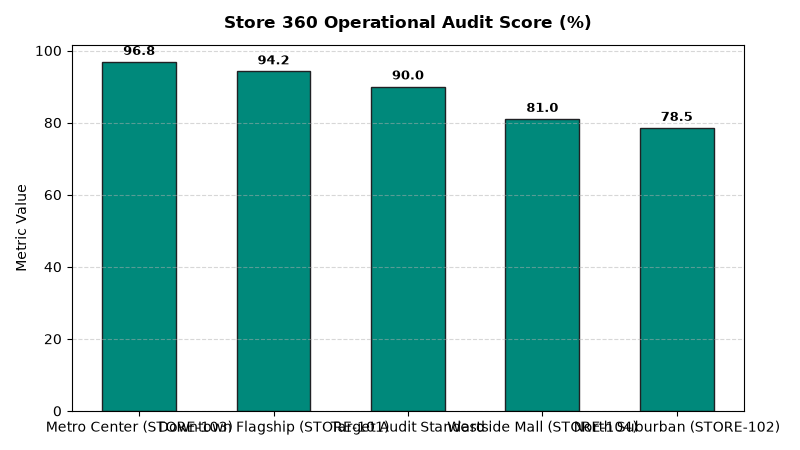

# Store Operations: Store Manager Operational Audits Agent

An enterprise AI agent for **Store Operations: Store Manager Operational Audits**, built with Google ADK for Gemini Enterprise.

---

## Why This Agent Matters

Consistent store operational execution across cleanliness, backroom safety, pricing accuracy, and health inspection readiness directly drives sales and brand reputation. This agent analyzes District Director 360 audit scorecards, backroom clutter safety indices, shelf price scan accuracy, and public health inspection grades.

---

## Key Metrics Tracked

| Metric | Business Description | Target Benchmark |
| :--- | :--- | :--- |
| **Store 360 Operational Audit Score (%)** | Composite score across customer readiness, safety compliance, and inventory | > 90.0% |
| **Backroom Cleanliness & Safety Index (%)** | Backroom audit score evaluating unobstructed fire aisles and pallet safety | > 92.0% |
| **Shelf Price Tag Scan Accuracy (%)** | Audited shelf tags matching active POS system checkout database price | > 99.0% |
| **Health & Food Safety Inspection Grade** | Official municipal health department sanitation and food safety rating | Grade A (100%) |

---

## What It Answers & Sub-Agent Routing

The orchestrator routes user questions to specialized sub-agents:

- **Internal BigQuery Data (`data_insights`)**:
  - Detailed store-level transactional, operational, IoT sensor, and audit telemetry metrics from authorized BigQuery tables.
- **External Market Context (`market_context`)**:
  - Retail industry operational standards, OSHA compliance guidelines, NIST weights & measures rules, and benchmark research grounded in Google Search.
- **Synthesized Responses**:
  - Combines store operational telemetry data with industry best practices for actionable store management decision support.

---

## Authorized BigQuery Tables

All tables reside in the `retail_ent_agents` BigQuery dataset:

- `stop_smoa_store_audit_scores`
- `stop_smoa_backroom_clutter_index`
- `stop_smoa_price_tag_accuracy`
- `stop_smoa_health_inspections`

---

## Example Questions

- "What are the overall store manager operational audit scores across retail districts in 2026 YTD?"
- "Which stores failed their backroom clutter and safety aisle inspection standards?"
- "Show shelf price tag scan audit accuracy percentages and overcharge/undercharge error rates."
- "What are the latest public health department food safety inspection grades across store locations?"
- "Which store locations have scheduled follow-up reinspections due to critical audit violations?"

---

## Sample Q&A Showcase

### 1. Internal BigQuery Data Insights
**User**: *What are the overall store manager operational audit scores across retail districts in 2026 YTD?*  
**Agent**: Based on `retail_ent_agents.stop_smoa_store_audit_scores` and `stop_smoa_backroom_clutter_index`:
- **STORE-103 (Metro Center)**: **96.8% overall audit score** (98.5% customer readiness, 97.0% safety, 98.0% backroom cleanliness, Grade A 100/100 health inspection).
- **STORE-101 (Downtown Flagship)**: **94.2% overall audit score** (96.0% readiness, 95.0% backroom cleanliness, Grade A 98/100).
- **STORE-104 (Westside Mall)**: **81.0% overall score** (Moderate clutter risk with 1 blocked fire aisle, 93.89% price tag accuracy, Grade A 92/100).
- **STORE-102 (North Suburban)**: **78.5% overall score** (High clutter risk with 2 blocked fire aisles, 93.0% price tag accuracy, Grade B 84/100 requiring follow-up health reinspection).

### 2. External Market Grounding
**User**: *What are enterprise retail standards for district manager store audits, weights & measures price tag accuracy, and health inspections?*  
**Agent**: According to National Institute of Standards and Technology (NIST) Handbook 130 and National Environmental Health Association (NEHA):
- Weights & Measures regulatory bodies enforce a mandatory **98.0% minimum pricing accuracy threshold**, assessing severe penalties for scanner overcharges.
- District Manager digital audit checklists with real-time photographic evidence increase operational audit compliance by **24%** across store chains.
- Eliminating backroom fire aisle blockages ensures complete compliance with OSHA 1910.37 emergency egress regulations.

### 3. Visual Analytics Artifact
**User**: *Show me a performance summary chart for this domain.*  
**Agent**: Generated domain analytics visualization:



---

## How to Run & Test

```bash
# 1. Run unit tests
uv run --frozen pytest domains/store_operations/agents/store_manager_operational_audit/tests/unit -v

# 2. Run local interactive adk chat
adk run domains/store_operations/agents/store_manager_operational_audit
```
