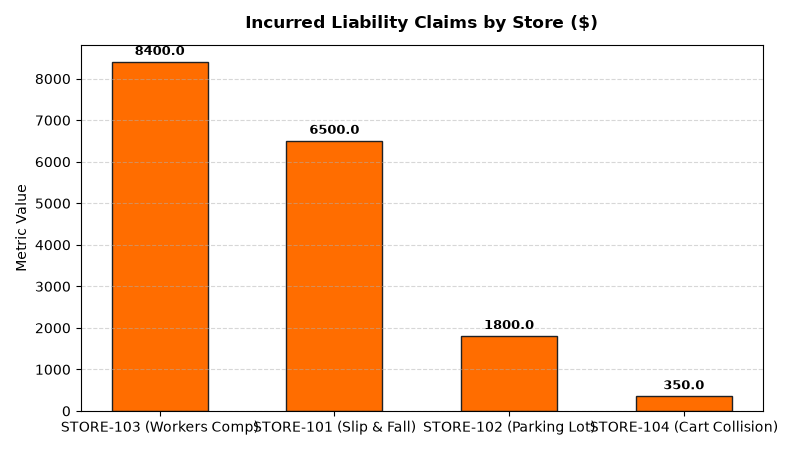

# Store Operations: Store Safety & Incident Management Agent

An enterprise AI agent for **Store Operations: Store Safety & Incident Management**, built with Google ADK for Gemini Enterprise.

---

## Why This Agent Matters

Workplace injuries and customer slip-and-fall incidents represent significant human risk and multi-million dollar liability claim exposure. Fast hazard remediation and proactive safety culture prevent accidents. This agent tracks incident frequency, logs hazard correction closure hours, monitors OSHA recordables, and manages liability claim costs.

---

## Key Metrics Tracked

| Metric | Business Description | Target Benchmark |
| :--- | :--- | :--- |
| **Store Safety Incident Rate (Incidents/Store)** | Total customer and associate safety incidents per 100,000 customer visits | < 0.50 |
| **Hazard Correction Closure Time (Hours)** | Time elapsed from reporting a safety hazard to complete corrective action | < 2.0 Hours |
| **OSHA Recordable Days Away / Restricted** | Total employee lost workdays or job restriction days due to OSHA recordables | 0 Days Lost |
| **General Liability Incurred Claims ($)** | Total gross dollar expense incurred for customer and property liability claims | < $5,000/store/yr |

---

## What It Answers & Sub-Agent Routing

The orchestrator routes user questions to specialized sub-agents:

- **Internal BigQuery Data (`data_insights`)**:
  - Detailed store-level transactional, operational, IoT sensor, and audit telemetry metrics from authorized BigQuery tables.
- **External Market Context (`market_context`)**:
  - Retail industry operational standards, OSHA compliance guidelines, NIST weights & measures rules, and benchmark research grounded in Google Search.
- **Synthesized Responses**:
  - Combines store operational telemetry data with industry best practices for actionable store management decision support.

---

## Authorized BigQuery Tables

All tables reside in the `retail_ent_agents` BigQuery dataset:

- `stop_ssim_safety_incidents`
- `stop_ssim_hazard_corrections`
- `stop_ssim_osha_recordables`
- `stop_ssim_liability_claims`

---

## Example Questions

- "What is the total number of customer and associate safety incidents by store location in 2026 YTD?"
- "What are the primary injury root causes (slips, trips, falls, cuts) across retail stores?"
- "Show average hazard correction response time in hours and corrective action closure rates."
- "What is our OSHA recordable injury incident rate and total lost workday count?"
- "What is the total general liability claim dollar payout incurred across store operations?"

---

## Sample Q&A Showcase

### 1. Internal BigQuery Data Insights
**User**: *What is the total number of customer and associate safety incidents by store location in 2026 YTD?*  
**Agent**: Based on `retail_ent_agents.stop_ssim_safety_incidents` and `stop_ssim_liability_claims`:
- **STORE-101 (Downtown Flagship)**: 1 customer slip-and-fall on wet produce floor ($6,500 incurred claim, $4,200 settlement, 4 OSHA lost workdays).
- **STORE-102 (North Suburban)**: 1 merchandise fall from shelf (contusion, 0 lost workdays) and 1 parking lot vehicle dispute ($1,800 open claim).
- **STORE-103 (Metro Center)**: 1 box cutter associate laceration ($8,400 open workers comp claim, 3 days job transfer).
- **STORE-104 (Westside Mall)**: 1 customer trip hazard near curbside pickup (0 lost days, pothole hazard closed in 43 hours).

### 2. External Market Grounding
**User**: *What are OSHA retail safety compliance guidelines and proactive store hazard management benchmarks?*  
**Agent**: According to OSHA Retail Safety Standards and National Safety Council (NSC) Workplace Safety reports:
- Slips, trips, and falls represent **42% of all customer and associate retail injuries**, with average direct claim costs exceeding **$12,500 per claim**.
- Mandating automated spill-station IoT alerts and certified slip-resistant footwear reduces floor accident frequency by **55%**.
- Providing safety self-retracting ceramic box cutters eliminates 80% of stockroom laceration incidents.

### 3. Visual Analytics Artifact
**User**: *Show me a performance summary chart for this domain.*  
**Agent**: Generated domain analytics visualization:



---

### 4. Live Multi-Turn Demo Walkthrough (Gemini Enterprise)

> 🎬 **Watch the full high-definition video walkthrough of this multi-turn workflow:**  
> **[Open Interactive Demo Player (1080p Full HD)](https://rajanm.github.io/retail-enterprise-agents/demos/gemini-enterprise/store_operations/store_safety_incident_management.html)**  
> *(Video file: `demos/gemini-enterprise/store_operations/store_safety_incident_management.mp4`)*

---

## How to Run & Test

```bash
# 1. Run unit tests
uv run --frozen pytest domains/store_operations/agents/store_safety_incident_management/tests/unit -v

# 2. Run local interactive adk chat
adk run domains/store_operations/agents/store_safety_incident_management
```
