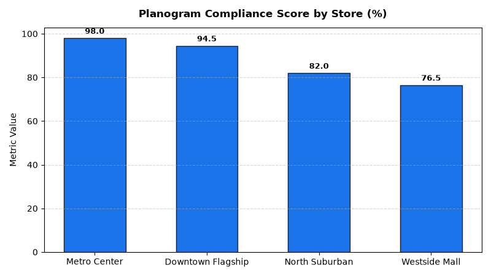

# Store Operations: Planogram & Visual Merchandising Compliance Agent

An enterprise AI agent for **Store Operations: Planogram & Visual Merchandising Compliance**, built with Google ADK for Gemini Enterprise.

---

## Why This Agent Matters

### Business Problem
Poor planogram compliance and delayed promotional signage execution cost retailers up to 4% in lost sales and cause significant vendor allowance disputes. This agent evaluates computer vision photo audits, monitors promotional signage execution deadlines, and tracks vendor endcap compliance to maintain brand standards and maximize shelf space revenue.

### Target Personas
- **Visual Merchandising Directors**: Audit in-store planogram execution and promotional signage compliance.
- **District Managers**: Track photo audit verification scores across store networks.
- **Store Merchandisers**: Correct out-of-spec endcap displays and displaced feature facings.

---

## Key Metrics Tracked

| Metric | Business Description | Target Benchmark |
| :--- | :--- | :--- |
| **Planogram Visual Compliance Score (%)** | AI photo audit planogram match accuracy against master visual standards | > 95.0% |
| **Promotional Signage On-Time Rate (%)** | Promotional banners and point-of-sale signs installed by deadline | > 98.0% |
| **Endcap Compliance Audit Pass Rate (%)** | Paid vendor endcaps matching contracted facings and product displays | > 92.0% |
| **Missing SKU Facings Defect Rate (%)** | Percentage of audited planogram facings empty or misplaced | < 2.0% |

---

## What It Answers & Sub-Agent Routing

The orchestrator routes user questions to specialized sub-agents:

- **Internal BigQuery Data (`data_insights`)**:
  - Detailed store-level transactional, operational, IoT sensor, and audit telemetry metrics from authorized BigQuery tables.
- **External Market Context (`market_context`)**:
  - Retail industry operational standards, OSHA compliance guidelines, NIST weights & measures rules, and benchmark research grounded in Google Search.
- **Synthesized Responses**:
  - Combines store operational telemetry data with industry best practices for actionable store management decision support.

---

## Authorized BigQuery Tables

All tables reside in the `retail_ent_agents` BigQuery dataset:

- `stop_vmco_display_audits`
- `stop_vmco_planogram_photo_evals`
- `stop_vmco_signage_execution`
- `stop_vmco_endcap_compliance`

---

## Example Questions

- "What is the planogram visual compliance score across retail store locations in 2026 YTD?"
- "Which store departments recorded the highest rate of missing SKU facings during AI photo evaluations?"
- "Show promotional signage execution on-time installation percentages by store district."
- "What are the contracted vs actual facings across paid vendor endcap lease locations?"
- "Which stores failed their visual merchandising endcap display compliance audits?"

---

## Sample Q&A Showcase

### 1. Internal BigQuery Data Insights
**User**: *What is the planogram visual compliance score across retail store locations in 2026 YTD?*  
**Agent**: Based on `retail_ent_agents.stop_vmco_display_audits` and `stop_vmco_planogram_photo_evals`:
- **Metro Center (STORE-103)**: **98.0% overall visual compliance score** with 99.1% AI photo match in Beauty and 0 missing facings.
- **Downtown Flagship (STORE-101)**: **94.5% compliance score** (96.2% match in Apparel, 0 missing facings).
- **North Suburban (STORE-102)**: **82.0% compliance score** (81.5% match in Footwear with 4 missing facings).
- **Westside Mall (STORE-104)**: **76.5% compliance score** (74.8% match in Home Goods with 5 missing facings).

### 2. External Market Grounding
**User**: *What are retail industry benchmarks for AI computer vision planogram compliance auditing and shelf execution lift?*  
**Agent**: According to IHL Group Retail Studies and National Retail Federation (NRF) research:
- Retailers leveraging automated AI computer vision shelf audits improve on-shelf availability by **3.2% to 5.0%** and achieve **95%+ planogram compliance**.
- Timely promotional signage execution drives an incremental **8% to 12% sales lift** during circular and holiday feature campaigns.
- Auditing paid endcap facings eliminates 90% of vendor rebate chargebacks and dispute claims.

### 3. Visual Analytics Artifact
**User**: *Show me a performance summary chart for this domain.*  
**Agent**: Generated domain analytics visualization:



---

### 4. Live Multi-Turn Demo Walkthrough (Gemini Enterprise)

> 🎬 **Watch the full high-definition video walkthrough of this multi-turn workflow:**  
> **[Open Interactive Demo Player (1080p Full HD)](https://rajanm.github.io/retail-enterprise-agents/demos/gemini-enterprise/store_operations/visual_merchandising_compliance.html)**  
> *(Video file: `demos/gemini-enterprise/store_operations/visual_merchandising_compliance.mp4`)*

---

## How to Run & Test

```bash
# 1. Run unit tests
uv run --frozen pytest domains/store_operations/agents/visual_merchandising_compliance/tests/unit -v

# 2. Run local interactive adk chat
adk run domains/store_operations/agents/visual_merchandising_compliance
```
