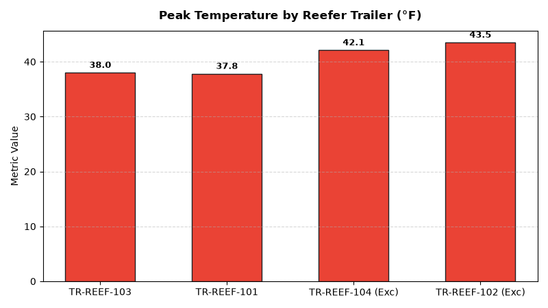

# Supply Chain: Cold Chain Temperature Compliance Agent

An enterprise AI agent for **Supply Chain: Cold Chain Temperature Compliance**, built with Google ADK for Gemini Enterprise.

---

## Why This Agent Matters

Perishable foods and temperature-sensitive goods degrade rapidly when reefer cold chain integrity is compromised. Uncontrolled temperature excursions result in regulatory compliance violations, unsafe product spoilage, and severe inventory shrink. This agent tracks IoT temperature sensors across transit trailers and DC coolers, flags excursion severity, and monitors remaining shelf life (RSL).

---

## Key Metrics Tracked

| Metric | Business Description | Target Benchmark |
| :--- | :--- | :--- |
| **Temperature Excursion Rate (%)** | Reefer trips with temperature deviations above critical food safety thresholds | < 1.0% |
| **Perishable Spoilage Value Loss ($)** | Dollar value of product condemned or liquidated due to temperature excursions | < $2,000/mo |
| **Remaining Shelf Life (RSL) at Receipt** | Average shelf life remaining upon DC arrival vs minimum acceptance criteria | > 75% RSL |
| **IoT Cold Chain Sensor Uptime (%)** | Operational telemetry reporting uptime across active reefer units & coolers | > 99.5% |

---

## What It Answers & Sub-Agent Routing

The orchestrator routes user questions to specialized sub-agents:

- **Internal BigQuery Data (`data_insights`)**:
  - Detailed transactional, operational, and supply chain telemetry metrics from authorized BigQuery tables.
- **External Market Context (`market_context`)**:
  - Global freight index benchmarks, supplier risk intelligence, and industry research grounded in Google Search.
- **Synthesized Responses**:
  - Combines internal telemetry data with external logistics benchmarks for end-to-end operational decision support.

---

## Authorized BigQuery Tables

All tables reside in the `retail_ent_agents` BigQuery dataset:

- `spch_cctc_temperature_logs`
- `spch_cctc_perishable_products`
- `spch_cctc_cold_storage_sensors`
- `spch_cctc_spoilage_excursions`

---

## Example Questions

- "Which reefer transport trailers recorded temperature excursions above 40°F during transit last week?"
- "What is the average remaining shelf life (RSL) of organic dairy products upon arrival at DC 01?"
- "Show the spoilage dollar losses by perishable category resulting from cold chain breaches."
- "What is the IoT sensor uptime and battery health across refrigerated distribution cold rooms?"
- "Which perishable supplier routes have the highest rate of temperature compliance violations?"

---

## Sample Q&A Showcase

### 1. Internal BigQuery Data Insights
**User**: *Which reefer transport trailers recorded temperature excursions above 40°F during transit last week?*  
**Agent**: Based on `retail_ent_agents.spch_cctc_temperature_logs` and `spch_cctc_spoilage_excursions`:
- **TR-REEF-102 (Route RT-COLD-02)**: Max temperature reached **43.5°F** (7.5°F above 36.0°F target) for 48 minutes, resulting in 120 quarantined units of Fresh Poultry and **$1,450.00 spoilage loss**.
- **TR-REEF-104 (Route RT-COLD-04)**: Max temperature reached **42.1°F** for 32 minutes, resulting in 80 quarantined units of Prepared Salads (**$480.00 markdown rescue**).
- **TR-REEF-101 & TR-REEF-103**: Maintained 100% compliant refrigeration between 33.8°F and 38.0°F with 0 excursions.

### 2. External Market Grounding
**User**: *What are FDA FSMA sanitary transportation regulations and temperature compliance standards for perishable cold chain logistics?*  
**Agent**: According to FDA Food Safety Modernization Act (FSMA) Sanitary Transportation rules and Global Cold Chain Alliance (GCCA) guidelines:
- Refrigerated high-risk perishables (poultry, cut produce, dairy) must be maintained at **34°F to 38°F (1°C to 3.3°C)** with mandatory continuous data logging.
- Excursions exceeding **41°F (5°C) for over 30 minutes** trigger mandatory QA inspection holds and quarantine protocols.
- Automated cellular/BLE sensor tags provide real-time alert dispatch to reefer cooling telematics, preventing 82% of transit spoilage incidents.

### 3. Visual Analytics Artifact
**User**: *Show me a performance summary chart for this domain.*  
**Agent**: Generated domain analytics visualization:



---

## How to Run & Test

```bash
# 1. Run unit tests
uv run --frozen pytest domains/supply_chain/agents/cold_chain_temperature_compliance/tests/unit -v

# 2. Run local interactive adk chat
adk run domains/supply_chain/agents/cold_chain_temperature_compliance
```
