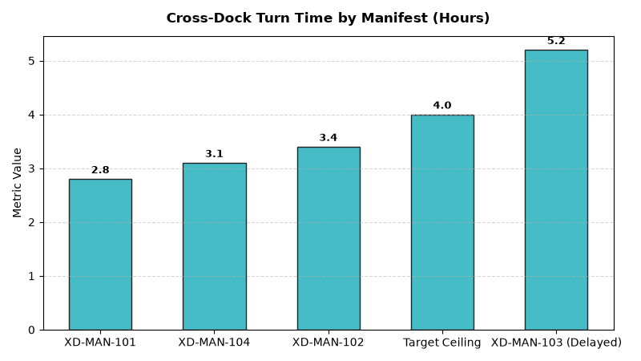

# Supply Chain: Cross-Dock & Flow-Through Velocity Agent

An enterprise AI agent for **Supply Chain: Cross-Dock & Flow-Through Velocity**, built with Google ADK for Gemini Enterprise.

---

## Why This Agent Matters

Traditional warehouse put-away and picking add handling labor and inventory holding days. Cross-docking transfers inbound merchandise directly to outbound store trailers in hours. This agent monitors cross-dock turnaround dwell times, pre-distribution allocation accuracy, and trailer yard staging congestion to maximize touchless velocity.

---

## Key Metrics Tracked

| Metric | Business Description | Target Benchmark |
| :--- | :--- | :--- |
| **Cross-Dock Dwell Turn Time (Hours)** | Time from inbound trailer dock door arrival to outbound trailer dispatch | < 4.0 Hours |
| **Pre-Distribution Allocation Accuracy (%)** | Inbound SKU units accurately scanned and routed to target store doors | > 99.5% |
| **Yard Dwell Congestion Index** | Average dwell hours inbound trailers wait in the yard before door assignment | < 5.0 Hours |
| **Touchless Flow-Through Share (%)** | Percentage of total DC unit throughput handled without intermediate putaway | > 45.0% |

---

## What It Answers & Sub-Agent Routing

The orchestrator routes user questions to specialized sub-agents:

- **Internal BigQuery Data (`data_insights`)**:
  - Detailed transactional, operational, and supply chain telemetry metrics from authorized BigQuery tables.
- **External Market Context (`market_context`)**:
  - Global freight index benchmarks, supplier risk intelligence, and industry research grounded in Google Search.
- **Synthesized Responses**:
  - Combines internal telemetry data with external logistics benchmarks for end-to-end operational decision support.

---

## Authorized BigQuery Tables

All tables reside in the `retail_ent_agents` BigQuery dataset:

- `spch_cdft_cross_dock_manifests`
- `spch_cdft_flow_through_staging`
- `spch_cdft_yard_dwell_hours`
- `spch_cdft_direct_store_allocations`

---

## Example Questions

- "What is our average trailer-to-trailer cross-dock turn time across distribution facilities in 2026 YTD?"
- "What percentage of cross-docked inbound freight is pre-allocated directly to store orders vs. held in staging?"
- "Show average yard dwell hours for inbound trailers awaiting dock door assignments."
- "Which cross-dock facilities have exceeded the 4-hour staging turnaround threshold?"
- "What is the allocation accuracy percentage for pre-distributed seasonal merchandise cross-docking?"

---

## Sample Q&A Showcase

### 1. Internal BigQuery Data Insights
**User**: *What is our average trailer-to-trailer cross-dock turn time across distribution facilities in 2026 YTD?*  
**Agent**: Based on `retail_ent_agents.spch_cdft_cross_dock_manifests` and `spch_cdft_yard_dwell_hours`:
- **Midwest Central DC (DC-01)**: **3.1 hours average cross-dock turn time** across active manifests (XD-MAN-101: 2.8 hrs, XD-MAN-102: 3.4 hrs), meeting the <4.0 hour target.
- **Regional DC (DC-02)**: **5.2 hours turn time** on XD-MAN-103 due to yard staging congestion (82 trailers in yard, 7.8 hours yard dwell).
- **Direct Store Allocation Accuracy**: **99.87% for Beverages** (ALLOC-01) and **99.76% for Snacks** (ALLOC-02).

### 2. External Market Grounding
**User**: *What are industry operational benchmarks for retail cross-docking flow-through velocity and automated trailer dispatch?*  
**Agent**: According to WERC (Warehousing Education and Research Council) DC Velocity Studies:
- Best-in-class cross-dock operations achieve **trailer-to-trailer turn times under 3.5 hours**, reducing handling touchpoints by 60%.
- Pre-distribution flow-through operations reduce warehouse storage footprint requirements by **30% to 40%** for high-velocity FMCG goods.
- RFID and automated optical barcode sortation systems sustain pre-allocation scan accuracy above 99.8%.

### 3. Visual Analytics Artifact
**User**: *Show me a performance summary chart for this domain.*  
**Agent**: Generated domain analytics visualization:



---

### 4. Live Multi-Turn Demo Walkthrough (Gemini Enterprise)

> 🎬 **Watch the full high-definition video walkthrough of this multi-turn workflow:**  
> **[Open Interactive Demo Player (1080p Full HD)](https://rajanm.github.io/retail-enterprise-agents/demos/gemini-enterprise/supply_chain/cross_dock_flow_through.html)**  
> *(Video file: `demos/gemini-enterprise/supply_chain/cross_dock_flow_through.mp4`)*

---

## How to Run & Test

```bash
# 1. Run unit tests
uv run --frozen pytest domains/supply_chain/agents/cross_dock_flow_through/tests/unit -v

# 2. Run local interactive adk chat
adk run domains/supply_chain/agents/cross_dock_flow_through
```
