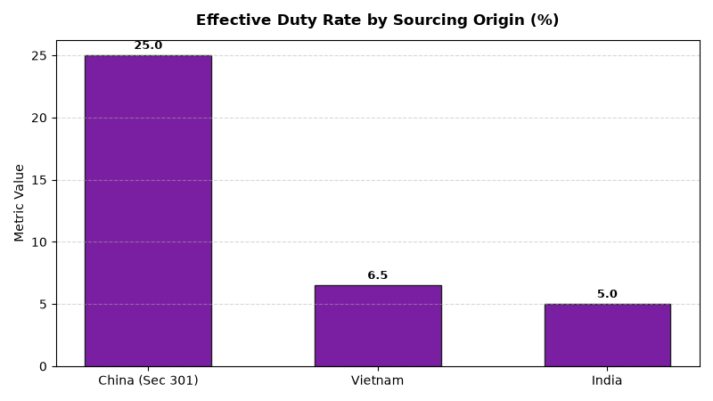

# Supply Chain: Customs & Import Tariff Compliance Agent

An enterprise AI agent for **Supply Chain: Customs & Import Tariff Compliance**, built with Google ADK for Gemini Enterprise.

---

## Why This Agent Matters

Importing international merchandise requires strict compliance with US Customs and Border Protection (CBP) regulations. Inaccurate Harmonized Tariff Schedule (HTS) classifications cause costly import inspection holds, punitive Section 301 tariffs, and missed duty drawback recovery funds. This agent tracks import entries, effective tariff rates, and customs hold root causes.

---

## Key Metrics Tracked

| Metric | Business Description | Target Benchmark |
| :--- | :--- | :--- |
| **HTS Code Classification Accuracy (%)** | Import entry tariff codes validated and verified against CBP schedules | 100% |
| **Average Customs Clearance Hold (Hours)** | Duration import entries remain under CBP or Partner Agency inspection | < 12.0 Hours |
| **Duty Drawback Claim Recovery ($)** | Customs duties reclaimed on re-exported or destroyed merchandise | > $500,000/yr |
| **Effective Import Tariff Rate (%)** | Total customs duty and Section 301 expense divided by commercial value | Track & Minimize |

---

## What It Answers & Sub-Agent Routing

The orchestrator routes user questions to specialized sub-agents:

- **Internal BigQuery Data (`data_insights`)**:
  - Detailed transactional, operational, and supply chain telemetry metrics from authorized BigQuery tables.
- **External Market Context (`market_context`)**:
  - Global freight index benchmarks, supplier risk intelligence, and industry research grounded in Google Search.
- **Synthesized Responses**:
  - Combines internal telemetry data with external logistics benchmarks for end-to-end operational decision support.

---

## Authorized BigQuery Tables

All tables reside in the `retail_ent_agents` BigQuery dataset:

- `spch_citc_import_entries`
- `spch_citc_hts_tariff_schedules`
- `spch_citc_customs_duties_paid`
- `spch_citc_port_clearance_holds`

---

## Example Questions

- "What is our total customs duty and tariff expense paid by country of origin in 2026 YTD?"
- "Which import shipments experienced customs border clearance hold times exceeding 24 hours?"
- "What is our HTS code tariff classification audit accuracy percentage across imported merchandise lines?"
- "Show total duty drawback recovery claims filed vs. refunded by US Customs and Border Protection (CBP)."
- "Which product categories are subject to Section 301 punitive tariffs and what is their effective duty rate?"

---

## Sample Q&A Showcase

### 1. Internal BigQuery Data Insights
**User**: *What is our total customs duty and tariff expense paid by country of origin in 2026 YTD?*  
**Agent**: Based on `retail_ent_agents.spch_citc_customs_duties_paid` and `spch_citc_import_entries`:
- **China**: **$3,550,000 total duties paid** on $14.2M declared value ($710k general duty + **$2,840,000 in Section 301 tariffs — 25.0% effective duty rate**).
- **Vietnam**: **$552,500 total duties paid** on $8.5M declared value (6.5% effective rate with $0 Section 301 tariffs).
- **India**: **$240,000 duties paid** on $4.8M declared value (5.0% effective rate).
- **Inspection Holds**: Entry CBP-ENT-904 experienced a 36.5-hour Partner Agency review hold in Los Angeles ($450 demurrage).

### 2. External Market Grounding
**User**: *What are recent developments in US Customs Trade Partnership Against Terrorism (CTPAT) and Section 301 tariff management?*  
**Agent**: According to US Customs and Border Protection (CBP) and International Trade Administration trade bulletins:
- CTPAT Tier 3 certified importers receive **50% faster green-lane border clearance** and 4x fewer random container exam holds.
- Shifting sourcing from China to Southeast Asia (Vietnam, India) avoids Section 301 25% tariff surcharges on consumer electronics and home furnishings.
- Accelerated Automated Commercial Environment (ACE) duty drawback filings recover up to 99% of original duties on eligible returns.

### 3. Visual Analytics Artifact
**User**: *Show me a performance summary chart for this domain.*  
**Agent**: Generated domain analytics visualization:



---

### 4. Live Multi-Turn Demo Walkthrough (Gemini Enterprise)

> 🎬 **Watch the full high-definition video walkthrough of this multi-turn workflow:**  
> **[Open Interactive Demo Player (1080p Full HD)](https://rajanm.github.io/retail-enterprise-agents/demos/gemini-enterprise/supply_chain/customs_import_tariff_compliance.html)**  
> *(Video file: `demos/gemini-enterprise/supply_chain/customs_import_tariff_compliance.mp4`)*

---

## How to Run & Test

```bash
# 1. Run unit tests
uv run --frozen pytest domains/supply_chain/agents/customs_import_tariff_compliance/tests/unit -v

# 2. Run local interactive adk chat
adk run domains/supply_chain/agents/customs_import_tariff_compliance
```
