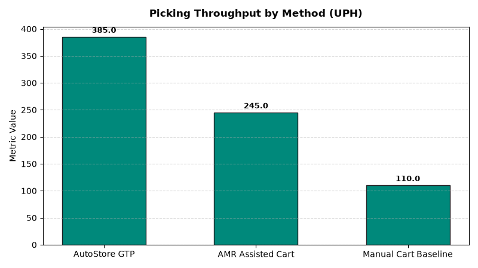

# Supply Chain: DC Automation & Robotics KPIs Agent

An enterprise AI agent for **Supply Chain: DC Automation & Robotics KPIs**, built with Google ADK for Gemini Enterprise.

---

## Why This Agent Matters

Modern distribution centers rely on automated storage and retrieval systems (ASRS), autonomous mobile robots (AMRs), and robotic goods-to-person (GTP) picking cells. System downtime or mechanical jams immediately halt outbound trailer shipping schedules. This agent monitors robotic pick rates (UPH), equipment uptime %, maintenance work orders, and mean time between failures (MTBF).

---

## Key Metrics Tracked

| Metric | Business Description | Target Benchmark |
| :--- | :--- | :--- |
| **ASRS & Robotic System Uptime (%)** | Operational uptime percentage across cranes, AMRs, and sorters | > 98.5% |
| **Robotic Picking Throughput (UPH)** | Units picked per hour per robotic cell compared to manual baseline | > 350.0 UPH |
| **Mean Time Between Failures MTBF (Hours)** | Average operating hours between unexpected equipment stoppages | > 100.0 Hours |
| **Automated Sortation Error Rate (%)** | Mis-diverted or jammed items on high-speed conveyor sortation loops | < 0.05% |

---

## What It Answers & Sub-Agent Routing

The orchestrator routes user questions to specialized sub-agents:

- **Internal BigQuery Data (`data_insights`)**:
  - Detailed transactional, operational, and supply chain telemetry metrics from authorized BigQuery tables.
- **External Market Context (`market_context`)**:
  - Global freight index benchmarks, supplier risk intelligence, and industry research grounded in Google Search.
- **Synthesized Responses**:
  - Combines internal telemetry data with external logistics benchmarks for end-to-end operational decision support.

---

## Authorized BigQuery Tables

All tables reside in the `retail_ent_agents` BigQuery dataset:

- `spch_dark_automation_systems`
- `spch_dark_asrs_uptime_logs`
- `spch_dark_robotic_pick_rates`
- `spch_dark_maintenance_workorders`

---

## Example Questions

- "What is the average robotic picking speed in units per hour (UPH) across automated fulfillment cells?"
- "What is the operational uptime percentage for Automated Storage and Retrieval Systems (ASRS) in DC 01?"
- "Show preventative vs. corrective maintenance work orders and mean time between failures (MTBF)."
- "Which robotic shuttle aisles recorded the highest sortation error rates and payload jam occurrences?"
- "How does automated goods-to-person (GTP) picking throughput compare to traditional manual cart pick lanes?"

---

## Sample Q&A Showcase

### 1. Internal BigQuery Data Insights
**User**: *What is the average robotic picking speed in units per hour (UPH) across automated fulfillment cells?*  
**Agent**: Based on `retail_ent_agents.spch_dark_robotic_pick_rates` and `spch_dark_automation_systems`:
- **AutoStore Goods-to-Person (GTP)**: Achieved **385.0 units/hour (UPH)** vs target of 350.0 UPH (**+10.0% outperformance, 99.92% pick accuracy**, saving 420 weekly labor hours).
- **AMR Assisted Cart Pick (Locus Robotics)**: **245.0 UPH** (target: 220.0 UPH, 99.85% accuracy).
- **Manual Pick Cart Baseline**: **110.0 UPH** (AutoStore achieves 3.5x throughput multiplier over manual operations).
- **System Uptime**: Dematic ASRS Pallet Crane logged **99.4% uptime** with 167.4 hours MTBF.

### 2. External Market Grounding
**User**: *What are current warehouse robotics industry productivity benchmarks for Goods-to-Person GTP vs manual picking?*  
**Agent**: According to MHI Industry Report and LogisticsIQ Warehouse Automation market studies:
- Goods-to-Person (GTP) robotic cubic storage systems (AutoStore, Exotec) routinely achieve **350 to 450 lines per hour**, compared to **80–120 lines/hr** in manual walking picker operations.
- Autonomous Mobile Robots (AMRs) collaborative cart picking yields a **2x to 2.5x productivity increase** with payback periods under 18 months.
- Predictive vibration and thermal sensor IoT maintenance programs reduce unplanned ASRS downtime by 40%.

### 3. Visual Analytics Artifact
**User**: *Show me a performance summary chart for this domain.*  
**Agent**: Generated domain analytics visualization:



---

## How to Run & Test

```bash
# 1. Run unit tests
uv run --frozen pytest domains/supply_chain/agents/dc_automation_robotics_kpis/tests/unit -v

# 2. Run local interactive adk chat
adk run domains/supply_chain/agents/dc_automation_robotics_kpis
```
