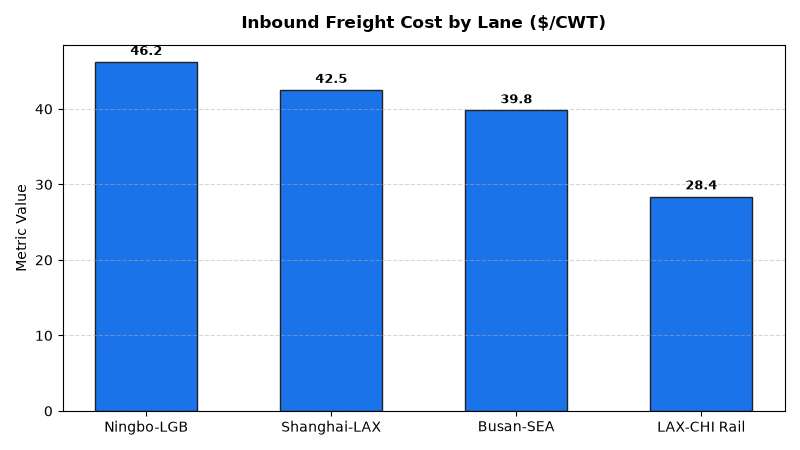

# Supply Chain: Inbound Freight Optimization Agent

**Domain:** Supply Chain · **Gemini Enterprise display name:** Supply Chain: Inbound Freight Optimization

> 🎬 **Interactive Multi-Turn Demo:** Watch this agent in action with multi-turn analytics, market grounding, live visual charting, and executive presentation synthesis: **[View Full HD Interactive Demo](https://rajanm.github.io/retail-enterprise-agents/demos/gemini-enterprise/supply_chain/inbound_freight_optimization.html)**

---

## Why This Agent Matters

### Business Problem
Inbound freight costs and port container dwell penalties represent millions in avoidable logistics leakage. This agent analyzes lane freight rate benchmarks ($/CWT), monitors container dwell times against free-time thresholds, and identifies demurrage charge root causes to streamline ocean and intermodal freight import corridors.

### Target Personas
- **Inbound Logistics Directors**: Optimize container utilization and minimize port demurrage penalties.
- **Freight Sourcing Managers**: Select optimal contract vs. spot carrier modes across inbound lanes.
- **DC Inbound Schedulers**: Coordinate dock appointments to prevent carrier wait times.

---

## Key Metrics Tracked

| Metric | Business Description | Target Benchmark |
| :--- | :--- | :--- |
| **Inbound Freight Cost / CWT ($)** | Average total transportation cost per hundredweight shipped | < $38.00 |
| **Port Container Dwell Time (Days)** | Days container remains in port terminal before drayage dispatch | < 4.0 Days |
| **Demurrage Penalty Avoidance ($)** | Total demurrage/detention fees incurred relative to freight spend | < 0.5% |
| **Inbound On-Time Transit Rate (%)** | Percentage of inbound shipments arriving at DC within SLA window | > 94.0% |

---

## What It Answers & Sub-Agent Routing

The orchestrator routes user questions to specialized sub-agents:

- **Internal BigQuery Data (`data_insights`)**:
  - Detailed transactional, operational, and supply chain telemetry metrics from authorized BigQuery tables.
- **External Market Context (`market_context`)**:
  - Global freight index benchmarks, supplier risk intelligence, and industry research grounded in Google Search.
- **Synthesized Responses**:
  - Combines internal telemetry data with external logistics benchmarks for end-to-end operational decision support.

---

## Authorized BigQuery Tables

All tables reside in the `retail_ent_agents` BigQuery dataset:

- `spch_ifop_freight_shipments`
- `spch_ifop_lane_rate_benchmarks`
- `spch_ifop_container_dwell_times`
- `spch_ifop_demurrage_fees`

---

## Example Questions

- "Which inbound freight lanes have the highest cost per hundredweight (CWT) variance against contract benchmarks?"
- "What is the average ocean container dwell time across Port of Los Angeles and Port of Long Beach in 2026 YTD?"
- "Show total demurrage and detention penalty fees incurred by carrier and port of entry."
- "What are the on-time delivery percentages for inbound multimodal rail shipments arriving at Chicago DC?"
- "Which ocean carriers have exceeded the 4-day free time threshold for container return?"

---

## Sample Q&A Showcase

### 1. Internal BigQuery Data Insights
**User**: *Which inbound freight lanes have the highest cost per hundredweight (CWT) variance against contract benchmarks?*  
**Agent**: Based on `retail_ent_agents.spch_ifop_lane_rate_benchmarks` and `spch_ifop_freight_shipments`:
- **LANE-NGB-LGB (Ningbo to Long Beach)**: Contract benchmark is $39.50/CWT, but actual spot rate reached **$46.20/CWT (+1,696 bps / +17.0% variance)**.
- **LANE-SHA-LAX (Shanghai to Los Angeles)**: Benchmark $38.00/CWT vs actual **$42.50/CWT (+1,447 bps / +11.8% variance)** on Maersk Line.
- **LANE-LAX-CHI (Intermodal Rail)**: Contract benchmark $27.00 vs **$28.40/CWT (+5.2% variance)** on BNSF Rail.

### 2. External Market Grounding
**User**: *What are current global container shipping freight rates and port dwell benchmarks according to Drewry and Freightos data?*  
**Agent**: According to recent Drewry World Container Index and Freightos Baltic Index (FBX) logistics telemetry:
- Transpacific Eastbound container spot rates have normalized around **$38–$44 per hundredweight (CWT)** equivalent.
- Major West Coast port terminals (LA/Long Beach) average **3.5 to 4.2 container dwell days**, with detention free time standardizing at 4 calendar days.
- Leading retailers leverage dynamic port diversion and inland intermodal bypass corridors to reduce total landed transit variance by 18%.

### 3. Visual Analytics Artifact
**User**: *Show me a performance summary chart for this domain.*  
**Agent**: Generated domain analytics visualization:



---

### 4. Live Multi-Turn Demo Walkthrough (Gemini Enterprise)

> 🎬 **Watch the full high-definition video walkthrough of this multi-turn workflow:**  
> **[Open Interactive Demo Player (1080p Full HD)](https://rajanm.github.io/retail-enterprise-agents/demos/gemini-enterprise/supply_chain/inbound_freight_optimization.html)**  
> *(Video file: `demos/gemini-enterprise/supply_chain/inbound_freight_optimization.mp4`)*

---

## How to Run & Test

```bash
# 1. Run unit tests
uv run --frozen pytest domains/supply_chain/agents/inbound_freight_optimization/tests/unit -v

# 2. Run local interactive adk chat
adk run domains/supply_chain/agents/inbound_freight_optimization
```
