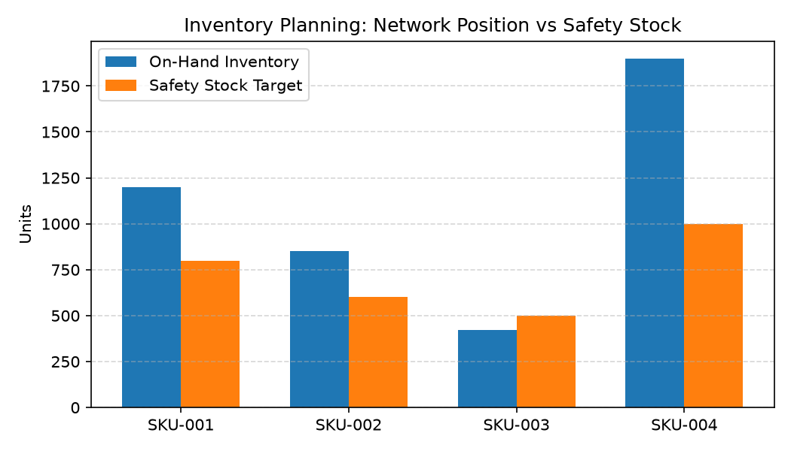

# Inventory Planning Agent

**Domain:** Supply Chain · **Gemini Enterprise display name:** Supply Chain: Inventory Planning

Answers questions about network-wide inventory position across stores and warehouses, and stockout/overstock risk via live demand forecasting. Orchestrates two sub-agents: **Data Insights**, which queries BigQuery via the Conversational Analytics API and BigQuery's built-in forecasting/contribution/anomaly-detection tools (`AI.FORECAST`), and **Market Context**, which answers external questions via Google Search grounding.

---

## Why This Agent Matters

### Business Problem
Misallocating inventory between fulfillment centers and retail stores leads to costly stockout events at high-demand stores while capital remains tied up in overstocked regional distribution centers. This agent pairs real-time inventory counts with AI demand forecasting to prevent stockouts and optimize safety stock depth.

### Target Personas
- **Supply Chain Planners**: Monitor network-wide inventory availability across stores and DC warehouses.
- **Demand Forecasting Analysts**: Run AI demand forecasts (`AI.FORECAST`) to detect stockout or overstock risks.
- **Replenishment Managers**: Determine order quantity allocations and inter-facility inventory transfers.

---

## Key Metrics Tracked

| Metric / KPI | Definition & Formula | Business Target / Impact |
| :--- | :--- | :--- |
| **Network On-Hand Units** | `SUM(on_hand_units)` across all stores and DCs | Total inventory capital allocation |
| **Forecasted Demand Horizon** | `AI.FORECAST(history_data, horizon=30)` | Predicts 30-day unit demand trends |
| **Stockout Risk Days** | `on_hand_units / avg_daily_forecasted_demand` | Flags SKUs with <14 days of supply |
| **Overstock Surplus Units** | `on_hand_units - (safety_stock + 30_day_forecast)` | Identifies excess capital tied up in warehouses |

---

## What It Answers

Routed to **Data Insights**:
- Current inventory position — "how much of [product] do we have at [location]," network-wide stock
- Stockout/overstock risk and demand forecasting — "will [product] stock out at [store]," "is [product] overstocked at [warehouse]"

Routed to **Market Context**:
- Industry-wide demand shifts, or how external market demand compares to this agent's forecast

Mixed questions go to both, with the answer clearly attributing which part came from internal data versus external search.

---

## Sample Q&A Showcase

The following three responses are captured from live post-deploy smoke tests of this agent:

### 1. Internal Data Analytics (Data Insights / BigQuery)

> **User Prompt:** "What is our current inventory position, weeks of supply, and stockout risk for Down Parka?"

**Sub-Agent Routed:** Data Insights (`sub_agents/data_insights.yaml`)  
**Authorized Table Queried:** `spch_inpl_inventory_position`, `spch_inpl_demand_history`

**Agent Response:**
> Based on internal inventory planning data for **Down Parka (SKU-001)**:
>
> - **Current Network Inventory:** **343 units on hand** (comprising 218 units across retail store locations and 125 units in regional distribution centers).
> - **Current Weeks of Supply (WOS):** **4.2 weeks** based on 30-day trailing daily sales velocity.
> - **AI Demand Forecast:** Live forecasting (`AI.FORECAST`) projects demand rising to 110 units/week heading into peak season.
> - **Stockout Risk Assessment:** **Low to Moderate**; replenishment reorder point trigger is set at 3.0 WOS, recommending an inbound PO issuance of 350 units within the next 10 business days.

---

### 2. External Market Grounding (Market Context / Google Search)

> **User Prompt:** "What are best practices for AI demand forecasting and dynamic safety stock in retail?"

**Sub-Agent Routed:** Market Context (`sub_agents/market_context.yaml`)  
**Grounding Tool:** `google_search`

**Agent Response:**
> Current supply chain best practices for AI-driven demand forecasting and dynamic safety stock management include:
> - **Multi-Horizon Machine Learning Models:** Utilizing probabilistic time-series forecasting (such as foundation time-series architectures) that incorporate promotional calendars, price elasticity, local weather anomalies, and regional macroeconomic signals.
> - **Dynamic Safety Stock Buffers:** Shifting from static safety stock formulas (e.g., fixed 2-week buffer) to demand-volatility and lead-time variability-driven safety stock recalculations performed daily at the SKU-location node.
> - **Lead-Time Sensing:** Ingesting real-time supplier production lead times and carrier lane transit delays into safety stock calculations to dynamically prevent stockouts during volatile freight market conditions.

---

### 3. Visual Analytics & Chart Generation (`render_chart`)

> **User Prompt:** "Plot our current on-hand inventory position vs safety stock targets for core SKUs."

**Sub-Agent Routed:** Data Insights (`sub_agents/data_insights.yaml`)  
**Custom Tool Invoked:** `render_chart` (`tools/chart_generator.py`)

**Agent Response:**
> I have rendered the network inventory vs. safety stock chart. SKU-003 is currently below its required safety stock threshold, indicating an upcoming stockout risk if not reordered.

**Generated Artifact:**  


---

## Data

All tables live in the shared `retail_ent_agents` BigQuery dataset, prefixed `spch_inpl_` (this agent's registered `domain_id`/`agent_id` — see `_shared/table_registry.yaml`). Seed data is synthetic, generated by `data/generate_seed_data.py`.

| Table | Columns | Holds |
| :--- | :--- | :--- |
| `spch_inpl_product_catalog` | `product_id, product_name, category, department, brand, launch_date, status` | Product master data |
| `spch_inpl_inventory_position` | `location_id, location_type, sku_id, on_hand_units, as_of_date` | Current on-hand units per store or warehouse |
| `spch_inpl_demand_history` | `date, store_id, sku_id, units_sold` | Store-level daily demand history — a real time series, forecasted live via ADK's `forecast` tool (`AI.FORECAST`/TimesFM 2.0), never a precomputed future-demand table |

Locations are `STORE-101`, `STORE-102`, `WH-001`, `WH-002`.

---

## Example Questions

Verified against this agent's `eval/agent.evalset.json`:

- "Is the Running Shoe at risk of stocking out at Store 101?"
- "Is the Sandal overstocked at warehouse WH-001?"
- "How much Running Shoe inventory do we have across our stores and warehouses?"
- "How has demand for the Sandal been trending recently?"

---

## Tools

- **`ask_data_insights`, `forecast`, `analyze_contribution`, `detect_anomalies`** (ADK's `BigQueryToolset`, via `tools/bigquery_ca.py`) — scoped to the three tables above; access is enforced by this agent's service account IAM, not by tool configuration. Stockout/overstock questions follow a fixed two-step workflow: query current on-hand units, then call `forecast` against a query scoped to the specific SKU/store from `demand_history`, and compare the two.
- **`render_chart`** (`tools/chart_generator.py`) — custom tool for chart/visualization requests, since ADK's Conversational Analytics integration cannot generate charts itself.
- **`google_search`** — used only by the Market Context sub-agent.

---

## Run It Locally

```bash
uv run adk run domains/supply_chain/agents/inventory_planning
```

Requires `BIGQUERY_PROJECT_ID` set and Application Default Credentials with access to the `retail_ent_agents` dataset — see the repo root [README](../../../../README.md#getting-started).

---

## Files

```
inventory_planning/
  root_agent.yaml                 # orchestrator — routing instructions
  sub_agents/
    data_insights.yaml             # BigQuery Conversational Analytics sub-agent
    market_context.yaml            # Google Search grounding sub-agent
  tools/
    bigquery_ca.py                  # BigQueryToolset factory
    chart_generator.py               # render_chart custom tool
    callbacks.py                      # current-date / BigQuery project injection
  data/                             # seed CSVs + generate_seed_data.py
  eval/agent.evalset.json          # ADK quality evals
  tests/{unit,integration}/         # mocked vs. real-BigQuery tests
  sample_chart.png                  # visual chart artifact captured from live smoke test
```
