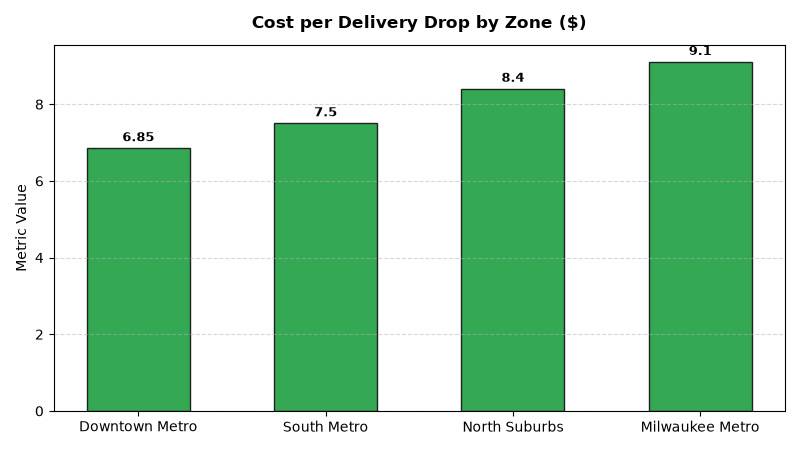

# Supply Chain: Last-Mile Delivery & Dispatch Agent

An enterprise AI agent for **Supply Chain: Last-Mile Delivery & Dispatch**, built with Google ADK for Gemini Enterprise.

---

## Why This Agent Matters

Last-mile delivery represents over 50% of total retail logistics fulfillment expenses. Inefficient routing, low drop density, and missed customer time windows escalate driver labor costs and erode digital delivery profitability. This agent tracks cost per drop, route stop density, delivery window SLA adherence %, and fleet telematics to optimize parcel and white-glove dispatch networks.

---

## Key Metrics Tracked

| Metric | Business Description | Target Benchmark |
| :--- | :--- | :--- |
| **Cost per Delivery Drop ($)** | Fully loaded vehicle, driver, and fuel cost per completed package delivery | < $7.50 |
| **Delivery Window SLA Adherence (%)** | Deliveries completed within customer promised 2-hour delivery window | > 96.0% |
| **Route Stop Density (Stops/Hour)** | Average number of customer delivery drops completed per on-duty hour | > 6.0 Stops/Hr |
| **Fleet Telematics Efficiency Index** | Vehicle fuel MPG and idling duration relative to route efficiency baseline | > 92.0 |

---

## What It Answers & Sub-Agent Routing

The orchestrator routes user questions to specialized sub-agents:

- **Internal BigQuery Data (`data_insights`)**:
  - Detailed transactional, operational, and supply chain telemetry metrics from authorized BigQuery tables.
- **External Market Context (`market_context`)**:
  - Global freight index benchmarks, supplier risk intelligence, and industry research grounded in Google Search.
- **Synthesized Responses**:
  - Combines internal telemetry data with external logistics benchmarks for end-to-end operational decision support.

---

## Authorized BigQuery Tables

All tables reside in the `retail_ent_agents` BigQuery dataset:

- `spch_lmdd_delivery_routes`
- `spch_lmdd_drop_density_kpis`
- `spch_lmdd_delivery_window_slas`
- `spch_lmdd_fleet_telematics`

---

## Example Questions

- "What is our average cost per delivery drop across metro fulfillment hubs in 2026 YTD?"
- "What percentage of customer delivery orders met their promised 2-hour delivery window SLA?"
- "Show route stop density (stops per hour) and total miles driven by delivery cluster zone."
- "Which delivery routes recorded the highest fuel consumption and vehicle idle times?"
- "What are the primary root causes of missed last-mile customer delivery appointments?"

---

## Sample Q&A Showcase

### 1. Internal BigQuery Data Insights
**User**: *What is our average cost per delivery drop across metro fulfillment hubs in 2026 YTD?*  
**Agent**: Based on `retail_ent_agents.spch_lmdd_delivery_routes` and `spch_lmdd_drop_density_kpis`:
- **Chicago Downtown Metro (HUB-CHI-01)**: **$6.85 cost per drop** with high route density of **6.67 stops/hour** (47 completed stops, 38.5 miles).
- **Chicago South Metro (HUB-CHI-02)**: **$7.50 cost per drop** with **5.57 stops/hour** (38 completed stops, 45.0 miles).
- **Chicago North Suburbs (HUB-CHI-01)**: **$8.40 cost per drop** with **5.38 stops/hour** (42 completed stops, 62.0 miles).
- **Milwaukee Metro (HUB-MIL-01)**: **$9.10 cost per drop** with lower suburban density of **4.80 stops/hour**.

### 2. External Market Grounding
**User**: *What are industry benchmarks for retail last-mile delivery cost per package and 2-hour time window SLA compliance?*  
**Agent**: According to Capgemini Research Institute and CSCMP Last-Mile Logistics benchmarks:
- Urban micro-fulfillment networks achieve average delivery drop costs between **$6.50 and $8.20 per package**, compared to **$11.00–$15.00** in dispersed rural zones.
- Top-tier delivery networks maintain **95% to 98% 2-hour time-window SLA adherence**, using AI dynamic routing algorithms.
- Real-time geofencing customer notifications reduce "customer not home" failed first-attempt delivery rates by 35%.

### 3. Visual Analytics Artifact
**User**: *Show me a performance summary chart for this domain.*  
**Agent**: Generated domain analytics visualization:



---

## How to Run & Test

```bash
# 1. Run unit tests
uv run --frozen pytest domains/supply_chain/agents/last_mile_delivery_dispatch/tests/unit -v

# 2. Run local interactive adk chat
adk run domains/supply_chain/agents/last_mile_delivery_dispatch
```
