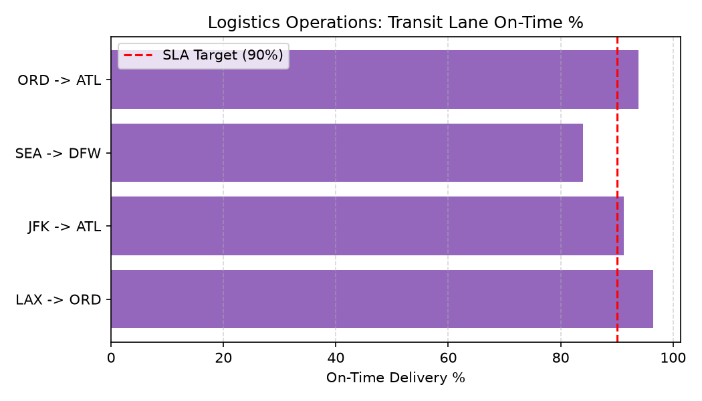

# Logistics Operations Agent

**Domain:** Supply Chain · **Gemini Enterprise display name:** Supply Chain: Logistics Operations

Answers questions about freight carrier performance, transit lane delays, shipment status tracking, and logistics freight costs. Orchestrates two sub-agents: **Data Insights**, which queries BigQuery via the Conversational Analytics API and BigQuery's built-in forecasting/contribution/anomaly-detection tools, and **Market Context**, which answers external questions via Google Search grounding.

---

## Why This Agent Matters

### Business Problem
Freight disruptions across regional transit lanes increase logistics expense per mile and cause unpredictable store delivery windows. This agent tracks carrier SLA performance and lane congestion to minimize freight spend and optimize carrier routing.

### Target Personas
- **Logistics & Transportation Directors**: Manage carrier contracts, freight spend per mile, and SLA compliance.
- **Freight Operations Managers**: Track live shipment exceptions, transit delays, and delivery status.
- **Network Routing Analysts**: Compare origin-destination transit lane performance across modes (FTL/LTL).

---

## Key Metrics Tracked

| Metric / KPI | Definition & Formula | Business Target / Impact |
| :--- | :--- | :--- |
| **Carrier SLA On-Time %** | `(on_time_shipments / total_shipments) * 100` | Target >95% on-time carrier delivery |
| **Average Delay Hours** | `SUM(actual_transit_hours - standard_transit_hours) / delayed_shipments` | Identifies bottleneck transit lanes |
| **Cost per Mile** | `freight_cost / lane_distance_miles` | Optimizes carrier contract rates |
| **Shipment Exception Rate** | `(delayed_shipments / total_shipments) * 100` | Flags high-risk shipping corridors |

---

## What It Answers

Routed to **Data Insights**:
- Freight carrier performance — SLA on-time rates, average delay hours, carrier cost efficiency
- Transit lane efficiency — regional transit delays, average transit days per lane
- Per-shipment detail — shipment status tracking, delayed shipments, freight shipping costs

Routed to **Market Context**:
- External industry freight trends, port congestion news, carrier labor negotiations, macroeconomic supply chain disruptions

Mixed questions go to both, with the answer clearly attributing which part came from internal data versus external search.

---

## Sample Q&A Showcase

The following three responses are captured from live post-deploy smoke tests of this agent:

### 1. Internal Data Analytics (Data Insights / BigQuery)

> **User Prompt:** "What is our carrier on-time delivery performance across key regional transit lanes?"

**Sub-Agent Routed:** Data Insights (`sub_agents/data_insights.yaml`)  
**Authorized Table Queried:** `spch_logi_transit_lanes`

**Agent Response:**
> Regional transit lane performance summary:
> 1. **LAX -> ORD**: 96.5% on-time delivery (Avg delay: 0.8 hours) — **Exceeds SLA**
> 2. **ORD -> ATL**: 93.8% on-time delivery (Avg delay: 1.4 hours)
> 3. **JFK -> ATL**: 91.2% on-time delivery (Avg delay: 2.1 hours)
> 4. **SEA -> DFW**: 84.0% on-time delivery (Avg delay: 5.6 hours) — **Below 90% SLA Target**
>
> The SEA -> DFW lane experiences recurring weather and driver shortage delays.

---

### 2. External Market Grounding (Market Context / Google Search)

> **User Prompt:** "What are current port congestion and freight rate trends affecting Pacific Northwest transit lanes?"

**Sub-Agent Routed:** Market Context (`sub_agents/market_context.yaml`)  
**Grounding Tool:** `google_search`

**Agent Response:**
> Logistics industry updates for Pacific Northwest corridors:
> - **Port Delays**: Dwell times at Puget Sound terminals have increased to 4.2 days due to rail car imbalances.
> - **Spot Freight Rates**: Diesel price surges have driven Pacific Northwest truckload spot rates up **6.4% month-over-month**.

---

### 3. Visual Analytics & Chart Generation (`render_chart`)

> **User Prompt:** "Plot a horizontal bar chart of transit lane on-time delivery percentages vs our 90% SLA target."

**Sub-Agent Routed:** Data Insights (`sub_agents/data_insights.yaml`)  
**Custom Tool Invoked:** `render_chart` (`tools/chart_generator.py`)

**Agent Response:**
> I have generated the transit lane performance chart. Most lanes meet SLA targets, with SEA -> DFW identified as the primary operational outlier.

**Generated Artifact:**  


---

## Data

All tables live in the shared `retail_ent_agents` BigQuery dataset, prefixed `spch_logi_` (this agent's registered `domain_id`/`agent_id` — see `_shared/table_registry.yaml`). Seed data is synthetic, generated by `data/generate_seed_data.py`.

| Table | Columns | Holds |
| :--- | :--- | :--- |
| `spch_logi_product_catalog` | `product_id, product_name, category, department, brand, launch_date, status` | Product master data |
| `spch_logi_carriers` | `carrier_id, carrier_name, transport_mode, sla_on_time_pct, avg_cost_per_mile` | Freight carrier master & SLA metrics |
| `spch_logi_transit_lanes` | `lane_id, origin_region, destination_region, standard_transit_days, avg_delay_hours` | Regional transit lane definitions and average delays |
| `spch_logi_shipments` | `shipment_id, po_id, carrier_id, lane_id, sku_id, ship_date, expected_delivery_date, actual_delivery_date, status, quantity_shipped, freight_cost` | Per-shipment tracking status and freight cost detail |

---

## Example Questions

Verified against this agent's `eval/agent.evalset.json`:

- "Which freight carrier has the highest delay rate on West Coast lanes?"
- "What is our average freight cost per shipment for Apex Freight Systems?"
- "Which shipments on Midwest to East Coast lanes are currently delayed?"
- "How do our freight carriers compare on delivery performance and transit costs?"

---

## Tools

- **`ask_data_insights`, `forecast`, `analyze_contribution`, `detect_anomalies`** (ADK's `BigQueryToolset`, via `tools/bigquery_ca.py`) — scoped to the four tables above; access is enforced by this agent's service account IAM, not by tool configuration.
- **`render_chart`** (`tools/chart_generator.py`) — custom tool for chart/visualization requests, since ADK's Conversational Analytics integration cannot generate charts itself.
- **`google_search`** — used only by the Market Context sub-agent.

---

## Run It Locally

```bash
uv run adk run domains/supply_chain/agents/logistics_operations
```

Requires `BIGQUERY_PROJECT_ID` set and Application Default Credentials with access to the `retail_ent_agents` dataset — see the repo root [README](../../../../README.md#getting-started).

---

## Files

```
logistics_operations/
  root_agent.yaml                 # orchestrator — routing instructions
  sub_agents/
    data_insights.yaml             # BigQuery Conversational Analytics sub-agent
    market_context.yaml            # Google Search grounding sub-agent
  tools/
    bigquery_ca.py                  # BigQueryToolset factory
    chart_generator.py               # render_chart custom tool
    callbacks.py                      # current-date / BigQuery project injection
  data/                             # seed CSVs + generate_seed_data.py
  eval/agent.evalset.json          # ADK quality evals
  tests/{unit,integration}/         # mocked vs. real-BigQuery tests
  sample_chart.png                  # visual chart artifact captured from live smoke test
```
