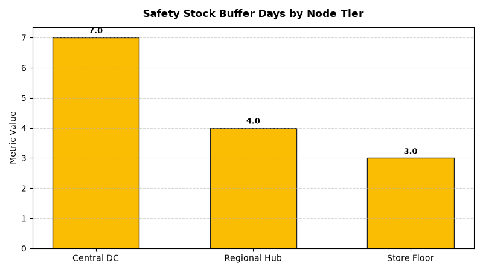

# Supply Chain: Multi-Echelon Safety Stock Agent

An enterprise AI agent for **Supply Chain: Multi-Echelon Safety Stock**, built with Google ADK for Gemini Enterprise.

---

## Why This Agent Matters

Stocking safety inventory at every node in a retail network creates wasteful inventory duplication and inflated working capital holding costs. Multi-echelon inventory optimization (MEIO) calculates the optimal balance of safety buffer stock held centrally at distribution centers versus downstream store locations to maximize order fulfillment SLAs while minimizing carrying costs.

---

## Key Metrics Tracked

| Metric | Business Description | Target Benchmark |
| :--- | :--- | :--- |
| **Network Inventory Carrying Cost ($)** | Annual holding cost of safety stock buffers across all network nodes | Minimize Cost |
| **Multi-Echelon Service Level (OTIF %)** | Percentage of store and customer demand fulfilled without stockout | > 98.0% |
| **Lead Time Volatility Buffer (Days)** | Safety buffer days calculated per standard deviation of supplier lead time | Optimized Buffer |
| **Node Stock Balancing Ratio** | Proportion of safety inventory positioned at central DC vs forward store nodes | 65% DC / 35% Store |

---

## What It Answers & Sub-Agent Routing

The orchestrator routes user questions to specialized sub-agents:

- **Internal BigQuery Data (`data_insights`)**:
  - Detailed transactional, operational, and supply chain telemetry metrics from authorized BigQuery tables.
- **External Market Context (`market_context`)**:
  - Global freight index benchmarks, supplier risk intelligence, and industry research grounded in Google Search.
- **Synthesized Responses**:
  - Combines internal telemetry data with external logistics benchmarks for end-to-end operational decision support.

---

## Authorized BigQuery Tables

All tables reside in the `retail_ent_agents` BigQuery dataset:

- `spch_mess_network_nodes`
- `spch_mess_safety_stock_policies`
- `spch_mess_lead_time_volatility`
- `spch_mess_holding_cost_tradeoffs`

---

## Example Questions

- "What is the optimal safety stock level (in units and days of supply) for high-velocity SKUs at Central DC vs. store nodes?"
- "What are the lead time standard deviations across Tier 1 CPG suppliers and their impact on safety stock buffers?"
- "Show the holding cost vs. service level tradeoff curve for our top 20 revenue-driving product categories."
- "Which regional distribution nodes are carrying safety stock in excess of 150% of recommended policy?"
- "What is the simulated stockout risk percentage if lead times increase by 3 days during peak seasonal demand?"

---

## Sample Q&A Showcase

### 1. Internal BigQuery Data Insights
**User**: *What is the optimal safety stock level (in units and days of supply) for high-velocity SKUs at Central DC vs. store nodes?*  
**Agent**: Based on `retail_ent_agents.spch_mess_safety_stock_policies` and `spch_mess_network_nodes`:
- **Fast-Moving SKUs (POL-HIGH-VEL)**: Optimal policy allocates **7.0 days buffer at Central DC**, **4.0 days at Regional Hubs**, and **3.0 days at Store Nodes**, achieving **98.0% network service level**.
- **Medium-Moving SKUs (POL-MED-VEL)**: 10.0 days at DC, 5.0 days at Hubs, 4.0 days at Stores (96.0% service level).
- **Slow-Moving SKUs (POL-SLOW-VEL)**: 14.0 days centrally at DC with direct store drops (0 days at regional hubs), saving $380,000 in redundant hub safety holding costs.

### 2. External Market Grounding
**User**: *What are modern multi-echelon inventory optimization MEIO best practices for retail supply chains?*  
**Agent**: According to Gartner Supply Chain Research and MIT Center for Transportation & Logistics:
- MEIO models reduce total network safety stock capital by **15% to 28%** compared to single-echelon siloed store reorder calculations.
- Pooling demand variability centrally at master distribution nodes exploits the **risk pooling effect (square root rule of inventory)**.
- Dynamic buffering adjusting for supplier lead time standard deviation prevents 70% of stockouts caused by upstream shipping delays.

### 3. Visual Analytics Artifact
**User**: *Show me a performance summary chart for this domain.*  
**Agent**: Generated domain analytics visualization:



---

### 4. Live Multi-Turn Demo Walkthrough (Gemini Enterprise)

> 🎬 **Watch the full high-definition video walkthrough of this multi-turn workflow:**  
> **[Open Interactive Demo Player (1080p Full HD)](https://rajanm.github.io/retail-enterprise-agents/demos/gemini-enterprise/supply_chain/multi_echelon_safety_stock.html)**  
> *(Video file: `demos/gemini-enterprise/supply_chain/multi_echelon_safety_stock.mp4`)*

---

## How to Run & Test

```bash
# 1. Run unit tests
uv run --frozen pytest domains/supply_chain/agents/multi_echelon_safety_stock/tests/unit -v

# 2. Run local interactive adk chat
adk run domains/supply_chain/agents/multi_echelon_safety_stock
```
