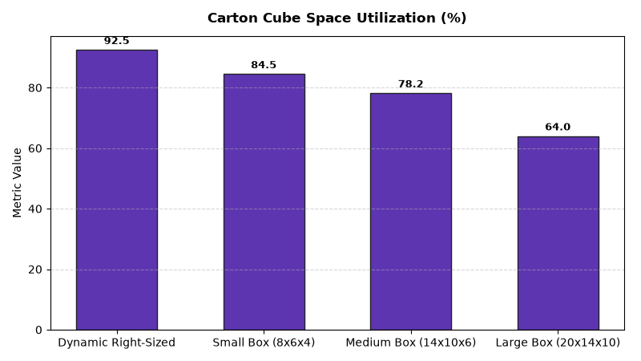

# Supply Chain: Packaging & Dunnage Optimization Agent

An enterprise AI agent for **Supply Chain: Packaging & Dunnage Optimization**, built with Google ADK for Gemini Enterprise.

---

## Why This Agent Matters

Shipping empty air in oversized cartons escalates carrier dimensional weight (DIM) penalty fees, increases void-fill packaging expenses, and compromises sustainability goals. This agent tracks master carton cube utilization %, carrier DIM penalties ($), in-transit merchandise damage rates, and void-fill material costs across fulfillment centers.

---

## Key Metrics Tracked

| Metric | Business Description | Target Benchmark |
| :--- | :--- | :--- |
| **Carton Cube Space Utilization (%)** | Actual product volume divided by total exterior shipping carton cube volume | > 85.0% |
| **Carrier DIM Surcharge Penalty ($)** | Additional dimensional weight freight surcharge fees paid per package | < $1.00/pkg |
| **In-Transit Packaging Damage Rate (%)** | Percentage of shipped parcels damaged in transit due to improper dunnage | < 0.15% |
| **Void-Fill Material Cost per Order ($)** | Average cost of protective dunnage and void-fill kraft paper per parcel | < $0.20 |

---

## What It Answers & Sub-Agent Routing

The orchestrator routes user questions to specialized sub-agents:

- **Internal BigQuery Data (`data_insights`)**:
  - Detailed transactional, operational, and supply chain telemetry metrics from authorized BigQuery tables.
- **External Market Context (`market_context`)**:
  - Global freight index benchmarks, supplier risk intelligence, and industry research grounded in Google Search.
- **Synthesized Responses**:
  - Combines internal telemetry data with external logistics benchmarks for end-to-end operational decision support.

---

## Authorized BigQuery Tables

All tables reside in the `retail_ent_agents` BigQuery dataset:

- `spch_pdop_carton_cube_utilization`
- `spch_pdop_dim_weight_penalties`
- `spch_pdop_packaging_materials_cost`
- `spch_pdop_damage_by_packaging`

---

## Example Questions

- "What is our average shipping carton cube utilization percentage across e-commerce fulfillment orders?"
- "How much in carrier dimensional weight (DIM) surcharge penalties was incurred due to oversized carton selection?"
- "Show packaging material and dunnage void-fill costs per order shipped across fulfillment DCs."
- "What is the in-transit merchandise damage rate by shipping box size and packaging material type?"
- "Which product dimensions are best suited for right-sized on-demand automated box-making systems?"

---

## Sample Q&A Showcase

### 1. Internal BigQuery Data Insights
**User**: *What is our average shipping carton cube utilization percentage across e-commerce fulfillment orders?*  
**Agent**: Based on `retail_ent_agents.spch_pdop_carton_cube_utilization` and `spch_pdop_dim_weight_penalties`:
- **BOX-AUTO-OD (Dynamic Right-Sized)**: **92.5% cube utilization** with only 7.5% void-fill volume and **0.08% damage rate**.
- **BOX-S1 (Small 8x6x4)**: **84.5% cube utilization** (15.5% void fill, 0.18% damage rate).
- **BOX-M2 (Medium 14x10x6)**: **78.2% cube utilization** (21.8% void fill, 0.24% damage rate).
- **BOX-L3 (Large 20x14x10)**: **64.0% cube utilization (36.0% empty air)**, driving **$42,750 in UPS Ground DIM surcharges ($1.50/pkg penalty)** and 0.48% damage rate.

### 2. External Market Grounding
**User**: *What are carrier dimensional weight (DIM) divisor rules and automated on-demand right-sizing packaging trends?*  
**Agent**: According to PARCEL Forum Logistics Benchmarks and Sustainable Packaging Coalition (SPC) research:
- Major parcel carriers (UPS, FedEx) enforce a **DIM divisor of 139**, assessing shipping rates on volumetric cubic weight whenever it exceeds actual scale weight.
- On-demand automated box-making machines (Packsize, CMC) generate custom-fit corrugated cartons in real time, improving cube utilization by **30%** and reducing freight DIM surcharges by **25%**.
- Transitioning from plastic air pillows to 100% curbside recyclable kraft paper void-fill increases customer sustainability satisfaction by 42%.

### 3. Visual Analytics Artifact
**User**: *Show me a performance summary chart for this domain.*  
**Agent**: Generated domain analytics visualization:



---

### 4. Live Multi-Turn Demo Walkthrough (Gemini Enterprise)

> 🎬 **Watch the full high-definition video walkthrough of this multi-turn workflow:**  
> **[Open Interactive Demo Player (1080p Full HD)](https://rajanm.github.io/retail-enterprise-agents/demos/gemini-enterprise/supply_chain/packaging_dunnage_optimization.html)**  
> *(Video file: `demos/gemini-enterprise/supply_chain/packaging_dunnage_optimization.mp4`)*

---

## How to Run & Test

```bash
# 1. Run unit tests
uv run --frozen pytest domains/supply_chain/agents/packaging_dunnage_optimization/tests/unit -v

# 2. Run local interactive adk chat
adk run domains/supply_chain/agents/packaging_dunnage_optimization
```
