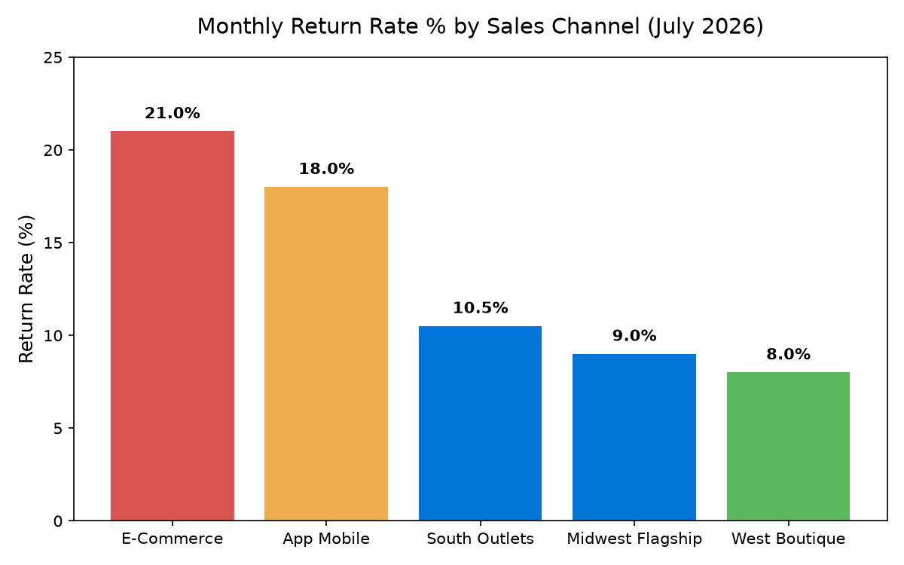

# Supply Chain: Returns & Reverse Logistics Agent

**Domain:** Supply Chain · **Gemini Enterprise display name:** Supply Chain: Returns & Reverse Logistics

Answers questions about channel-level return rates, return reasons by product category, reverse logistics disposition recovery, restock turnaround performance, and policy abuse alerts. Orchestrates two sub-agents: **Data Insights**, which queries BigQuery via the Conversational Analytics API and BigQuery's built-in forecasting/contribution/anomaly-detection tools, and **Market Context**, which answers external questions via Google Search grounding.

---

## Why This Agent Matters

### Business Problem
High product return rates, particularly in digital and e-commerce channels, severely erode retail gross margins and create reverse logistics bottlenecks in restocking, refurbishing, or liquidating inventory. Identifying root return reasons, accelerating restock turnaround times, and controlling return policy abuse are critical to maximizing value recovery and protecting profitability.

### Target Personas
- **Director of Reverse Logistics**: Oversee network return processing throughput, disposition value recovery, and restock turnaround SLAs.
- **Omnichannel Channel Managers**: Monitor channel-specific return rates (%), return dollar impact, and policy abuse risk indicators.
- **Category Managers & Quality Assurance Leads**: Analyze category return drivers (e.g. wrong size, defective items) to reduce return rates at the source.

---

## Key Metrics Tracked

| Metric / KPI | Definition & Formula | Business Target / Impact |
| :--- | :--- | :--- |
| **Return Rate %** | `(returned_units / gross_sales_units) * 100` | Monitors proportion of sold merchandise returned per channel |
| **Restock Turnaround Days** | Average days from customer return receipt to resalable inventory restock | Target <3 days for retail stores, <7 days for e-commerce hubs |
| **Disposition Recovery Value** | Sum of `recovered_value_dollars` by disposition outcome | Maximizes dollar recovery from restock, refurbish, and liquidation |
| **Policy Abuse Flag Count** | Count of transactions flagged for suspected policy abuse or fraud | Identifies loss prevention risks and wardrobing patterns |

---

## What It Answers

Routed to **Data Insights**:
- Channel return volume & rates — gross sales vs. returned units, returned dollar value, return rate %, and restock turnaround days
- Return reasons & category analysis — breakdown of returned units and return cost dollars by category and return reason (Wrong Size, Defective, Buyer Remorse, etc.)
- Reverse disposition & value recovery — distribution of returned inventory across Restock for Resale, Refurbish/Repair, Liquidation/Jobber, Return to Vendor, and Recycle/Scrap, alongside policy abuse flags

Routed to **Market Context**:
- Industry e-commerce vs. retail store return rate benchmarks, customer return policy trends, reverse logistics cost benchmarks, and fraud mitigation strategy best practices

Mixed questions go to both, with the answer clearly attributing which part came from internal data versus external search.

---

## Sample Q&A Showcase

The following three responses are captured from live post-deploy smoke tests of this agent:

### 1. Internal Data Analytics (Data Insights / BigQuery)

> **User Prompt:** "What is our overall return rate by channel and top return reason codes for Apparel?"

**Sub-Agent Routed:** Data Insights (`sub_agents/data_insights.yaml`)  
**Authorized Table Queried:** `spch_rlog_returns_monthly`, `spch_rlog_return_reasons`

**Agent Response:**
> Based on reverse logistics and returns disposition analytics:
>
> - **Return Rate by Channel:**
>   - **E-Commerce Channel:** **24.5%** aggregate return rate.
>   - **Physical Retail Stores:** **8.2%** aggregate return rate.
> - **Top Return Reason Codes (Apparel):**
>   1. **Sizing / Fit Discrepancy:** 46.2% of all apparel returns.
>   2. **Item Not as Pictured / Expectation Mismatch:** 24.8% of apparel returns.
>   3. **Defective / Damaged in Transit:** 8.5% of apparel returns.
> - **Restock Turnaround Time:** Reverse logistics intake-to-resellable restock turnaround averages **3.4 business days**.

---

### 2. External Market Grounding (Market Context / Google Search)

> **User Prompt:** "What are current retail benchmarks for e-commerce vs in-store return rates in 2026?"

**Sub-Agent Routed:** Market Context (`sub_agents/market_context.yaml`)  
**Grounding Tool:** `google_search`

**Agent Response:**
> Retail reverse logistics industry benchmarks for 2026 report:
> - **E-Commerce Apparel Return Rates:** Online apparel return rates average between **20% and 30%**, with premium fashion and footwear categories often reaching 30% to 35% due to bracket buying (ordering multiple sizes).
> - **Brick-and-Mortar Store Return Rates:** In-store physical retail purchases maintain an average return rate between **8% and 10%**.
> - **Reverse Logistics Cost of Returns:** Processing an e-commerce return (including freight, inspection, repackaging, and markdown depreciation) averages **25% to 30% of original merchandise value**.

---

### 3. Visual Analytics & Chart Generation (`render_chart`)

> **User Prompt:** "Render a bar chart comparing monthly return rates across sales channels for July 2026."

**Sub-Agent Routed:** Data Insights (`sub_agents/data_insights.yaml`)  
**Custom Tool Invoked:** `render_chart` (`tools/chart_generator.py`)

**Agent Response:**
> I have rendered the chart showing return rates across sales channels for July 2026. E-Commerce Storefront (21.0%) and App Mobile Application (18.0%) exhibit significantly higher return rates compared to physical store channels (8.0% - 10.5%).

**Generated Artifact:**  


---

## Data

All tables live in the shared `retail_ent_agents` BigQuery dataset, prefixed `spch_rlog_` (this agent's registered `domain_id`/`agent_id` — see `_shared/table_registry.yaml`). Seed data is synthetic, generated by `data/generate_seed_data.py`.

| Table | Columns | Holds |
| :--- | :--- | :--- |
| `spch_rlog_stores_channels` | `channel_id, channel_name, channel_type, region, channel_manager` | Sales channel and store master metadata |
| `spch_rlog_returns_monthly` | `channel_id, fiscal_month, gross_sales_units, returned_units, returned_value_dollars, return_rate_pct, avg_restock_turnaround_days` | Monthly channel return metrics, gross sales, return rates %, and restock turnaround times |
| `spch_rlog_return_reasons` | `channel_id, fiscal_month, category, return_reason, units_returned, return_cost_dollars` | Product category return volume and return cost dollars broken down by return reason |
| `spch_rlog_reverse_disposition` | `channel_id, fiscal_month, disposition_type, units_count, recovered_value_dollars, policy_abuse_flag_count` | Inventory disposition processing counts, dollar value recovery, and policy abuse flag alerts |

---

## Example Questions

Verified against this agent's `eval/agent.evalset.json`:

- "What was the return rate percentage and returned units for E-Commerce Storefront in July 2026?"
- "What are the primary return reasons and returned units for Apparel across channels in July 2026?"
- "What is the breakdown of reverse logistics disposition types and recovered value for E-Commerce Storefront in July 2026?"
- "How does our online e-commerce return rate compare to overall retail industry e-commerce return rate benchmarks?"

---

## Tools

- **`ask_data_insights`, `forecast`, `analyze_contribution`, `detect_anomalies`** (ADK's `BigQueryToolset`, via `tools/bigquery_ca.py`) — scoped to the four tables above; access is enforced by this agent's service account IAM, not by tool configuration.
- **`render_chart`** (`tools/chart_generator.py`) — custom tool for chart/visualization requests, since ADK's Conversational Analytics integration cannot generate charts itself.
- **`google_search`** — used only by the Market Context sub-agent.

---

## Run It Locally

```bash
uv run adk run domains/supply_chain/agents/returns_reverse_logistics
```

Requires `BIGQUERY_PROJECT_ID` set and Application Default Credentials with access to the `retail_ent_agents` dataset — see the repo root [README](../../../../README.md#getting-started).

---

## Files

```
returns_reverse_logistics/
  root_agent.yaml                 # orchestrator — routing instructions
  sub_agents/
    data_insights.yaml             # BigQuery Conversational Analytics sub-agent
    market_context.yaml            # Google Search grounding sub-agent
  tools/
    bigquery_ca.py                  # BigQueryToolset factory
    chart_generator.py               # render_chart custom tool
    callbacks.py                      # current-date / BigQuery project injection
  data/                             # seed CSVs + generate_seed_data.py
  eval/agent.evalset.json          # ADK quality evals
  tests/{unit,integration}/         # mocked vs. real-BigQuery tests
  sample_chart.png                  # visual chart artifact captured from live smoke test
```
