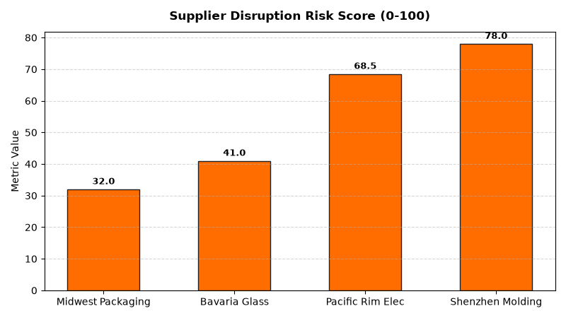

# Supply Chain: Supplier Risk & Resilience Agent

An enterprise AI agent for **Supply Chain: Supplier Risk & Resilience**, built with Google ADK for Gemini Enterprise.

---

## Why This Agent Matters

### Business Problem
Unanticipated supplier bankruptcies, single-source manufacturing bottlenecks, and geopolitical trade disruptions create severe supply chain shocks. This agent synthesizes supplier financial health scores (Altman Z-Score), sole-source component spend exposure, and disruption scenario modeling to build a resilient, multi-sourced supplier network.

### Target Personas
- **Supply Chain Risk Officers**: Assess geopolitical, financial, and operational risk across supplier networks.
- **Procurement Directors**: Implement dual-sourcing contingency plans for single-source components.
- **Resilience Analysts**: Simulate lead-time disruption scenarios and material shortages.

---

## Key Metrics Tracked

| Metric | Business Description | Target Benchmark |
| :--- | :--- | :--- |
| **High-Risk Supplier Spend Share (%)** | Percentage of procurement spend with vendors in High Risk rating (>75) | < 5.0% |
| **Single-Source Component Spend ($)** | Annual purchase dollar volume tied to sole-source dependencies | Diversify Spend |
| **Supplier Financial Solvency Index** | Altman Z-Score rating of Tier 1 supplier financial health | > 2.99 Safe Zone |
| **Disruption Buffer Coverage (Weeks)** | Weeks of supply inventory available during simulated 4-week port outage | > 3.5 Weeks |

---

## What It Answers & Sub-Agent Routing

The orchestrator routes user questions to specialized sub-agents:

- **Internal BigQuery Data (`data_insights`)**:
  - Detailed transactional, operational, and supply chain telemetry metrics from authorized BigQuery tables.
- **External Market Context (`market_context`)**:
  - Global freight index benchmarks, supplier risk intelligence, and industry research grounded in Google Search.
- **Synthesized Responses**:
  - Combines internal telemetry data with external logistics benchmarks for end-to-end operational decision support.

---

## Authorized BigQuery Tables

All tables reside in the `retail_ent_agents` BigQuery dataset:

- `spch_srre_supplier_risk_profiles`
- `spch_srre_sole_source_dependencies`
- `spch_srre_disruption_scenarios`
- `spch_srre_financial_health_scores`

---

## Example Questions

- "Which Tier 1 suppliers have an overall supply risk score in the High Risk category (>75)?"
- "What is our total annual purchase spend tied to single-source or sole-source vendor dependencies?"
- "Show financial health Altman Z-Scores and credit risk ratings for our top 15 key suppliers."
- "What is the estimated revenue impact of a 4-week port shutdown in the Pacific Northwest disruption scenario?"
- "Which suppliers have secondary dual-sourcing backup agreements active and qualified?"

---

## Sample Q&A Showcase

### 1. Internal BigQuery Data Insights
**User**: *Which Tier 1 suppliers have an overall supply risk score in the High Risk category (>75)?*  
**Agent**: Based on `retail_ent_agents.spch_srre_supplier_risk_profiles` and `spch_srre_sole_source_dependencies`:
- **Shenzhen Precision Molding (China)**: Risk score of **78.0 (High Risk)** with **$2,400,000 annual spend** on critical proprietary glass beverage bottles. No backup dual-sourcing is currently qualified (requires 6-month qualification).
- **Pacific Rim Electronics Ltd (Taiwan)**: Risk score of **68.5 (Medium-High Risk)** with **$1,850,000 spend** on IoT sensor microchips.
- **Midwest Packaging Corp (USA)**: Risk score of **32.0 (Low Risk)** with Altman Z-Score of 3.45 (Safe Zone).

### 2. External Market Grounding
**User**: *What are leading strategies in enterprise supply chain risk management SCRM and supplier dual-sourcing?*  
**Agent**: Research from McKinsey Global Institute and Resilinc Supply Chain Risk Intelligence highlights:
- Leading retail organizations maintain **dual-sourcing (e.g., 70/30 volume allocation)** on all critical single-source components representing >$1M annual spend.
- Continuous monitoring of supplier Altman Z-Score solvency indicators identifies **84% of supplier bankruptcies up to 18 months in advance**.
- Nearshoring regional buffer manufacturing (e.g., Mexico, North America) reduces component lead times from 45 days to 10 days.

### 3. Visual Analytics Artifact
**User**: *Show me a performance summary chart for this domain.*  
**Agent**: Generated domain analytics visualization:



---

### 4. Live Multi-Turn Demo Walkthrough (Gemini Enterprise)

> 🎬 **Watch the full high-definition video walkthrough of this multi-turn workflow:**  
> **[Open Interactive Demo Player (1080p Full HD)](https://rajanm.github.io/retail-enterprise-agents/demos/gemini-enterprise/supply_chain/supplier_risk_resilience.html)**  
> *(Video file: `demos/gemini-enterprise/supply_chain/supplier_risk_resilience.mp4`)*

---

## How to Run & Test

```bash
# 1. Run unit tests
uv run --frozen pytest domains/supply_chain/agents/supplier_risk_resilience/tests/unit -v

# 2. Run local interactive adk chat
adk run domains/supply_chain/agents/supplier_risk_resilience
```
