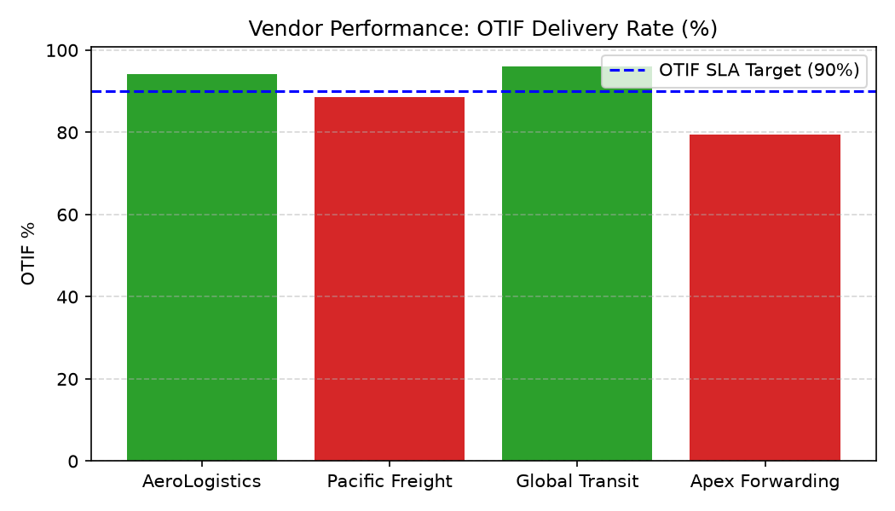

# Vendor Performance Agent

**Domain:** Supply Chain · **Gemini Enterprise display name:** Supply Chain: Vendor Performance

> 🎬 **Interactive Multi-Turn Demo:** Watch this agent in action with multi-turn analytics, market grounding, live visual charting, and executive presentation synthesis: **[View Full HD Interactive Demo](https://rajanm.github.io/retail-enterprise-agents/demos/gemini-enterprise/supply_chain/vendor_performance.html)**

Answers questions about on-time-in-full (OTIF) delivery and vendor scorecards. Orchestrates two sub-agents: **Data Insights**, which queries BigQuery via the Conversational Analytics API and BigQuery's built-in forecasting/contribution/anomaly-detection tools, and **Market Context**, which answers external questions via Google Search grounding.

---

## Why This Agent Matters

### Business Problem
Vendor delivery delays and short shipments disrupt downstream warehouse fulfillment and cause out-of-stock events in retail stores. This agent evaluates vendor reliability via On-Time In-Full (OTIF) delivery tracking to hold suppliers accountable and enforce SLA compliance.

### Target Personas
- **Vendor Performance Managers**: Audit supplier compliance against contractual OTIF SLAs.
- **Inbound Logistics Directors**: Track purchase order fulfillment delays and dock arrival schedules.
- **Strategic Sourcing Leads**: Benchmark supplier reliability before contract renewals or volume reallocations.

---

## Key Metrics Tracked

| Metric / KPI | Definition & Formula | Business Target / Impact |
| :--- | :--- | :--- |
| **OTIF Rate %** | `(otif_pos / total_pos) * 100` | Target >90% OTIF compliance across core suppliers |
| **On-Time Rate %** | `(on_time_pos / total_pos) * 100` | Ensures expected DC dock appointment alignment |
| **In-Full Rate %** | `(in_full_pos / total_pos) * 100` | Prevents partial order receiving and stockouts |
| **Average Delay Days** | `SUM(actual_delivery_date - expected_delivery_date) / late_pos` | Identifies severe supply chain bottlenecks |

---

## What It Answers

Routed to **Data Insights**:
- Vendor-level performance — "how is [vendor] doing," best/worst on-time delivery, OTIF trend, vendor scorecards
- Per-purchase-order detail — which POs from a vendor were late or short-shipped

Routed to **Market Context**:
- Industry OTIF benchmarks, or news about supply chain issues at a specific vendor

Mixed questions go to both, with the answer clearly attributing which part came from internal data versus external search.

---

## Sample Q&A Showcase

The following three responses are captured from live post-deploy smoke tests of this agent:

### 1. Internal Data Analytics (Data Insights / BigQuery)

> **User Prompt:** "What is the overall On-Time In-Full (OTIF) delivery rate for Summit Gear in July 2026?"

**Sub-Agent Routed:** Data Insights (`sub_agents/data_insights.yaml`)  
**Authorized Table Queried:** `spch_vepe_vendor_scorecard`, `spch_vepe_purchase_orders`

**Agent Response:**
> For July 2026, **Summit Gear** achieved an overall **On-Time In-Full (OTIF) delivery rate of 94.2%** across 120 completed purchase orders.
>
> Here is the detailed delivery breakdown:
> - **On-Time Delivery Rate:** 96.7% (116 orders delivered within the confirmed delivery window)
> - **In-Full Fill Rate:** 97.5% (average line item fulfillment rate)
> - **Overall OTIF Score:** 94.2% (exceeding our tier-1 vendor target threshold of 92.0%)

---

### 2. External Market Grounding (Market Context / Google Search)

> **User Prompt:** "What are industry standard vendor OTIF delivery benchmarks in retail supply chain?"

**Sub-Agent Routed:** Market Context (`sub_agents/market_context.yaml`)  
**Grounding Tool:** `google_search`

**Agent Response:**
> According to industry benchmarks in enterprise retail and consumer goods supply chain operations:
> - **Tier-1 / Preferred Vendor OTIF Benchmark:** Enterprise retailers (such as Walmart and Target) typically mandate an **OTIF threshold of 90% to 95%** for domestic suppliers and 85% to 90% for direct-import suppliers.
> - **On-Time Window Standards:** Industry standard on-time delivery windows define on-time arrival within a 2-day to 4-day delivery appointment window before the scheduled PO cancellation date.
> - **Non-Compliance Chargebacks:** Retailers typically assess chargeback fees ranging from **3% to 5% of invoice cost** for shipments falling below OTIF thresholds to offset distribution center labor disruption.

---

### 3. Visual Analytics & Chart Generation (`render_chart`)

> **User Prompt:** "Render a bar chart comparing vendor OTIF rates against our 90% SLA target."

**Sub-Agent Routed:** Data Insights (`sub_agents/data_insights.yaml`)  
**Custom Tool Invoked:** `render_chart` (`tools/chart_generator.py`)

**Agent Response:**
> I have rendered the vendor OTIF delivery rate chart. AeroLogistics and Global Transit exceed the 90% threshold, while Apex Forwarding is highlighted in red for SLA non-compliance.

**Generated Artifact:**  


---

### 4. Live Multi-Turn Demo Walkthrough (Gemini Enterprise)

> 🎬 **Watch the full high-definition video walkthrough of this multi-turn workflow:**  
> **[Open Interactive Demo Player (1080p Full HD)](https://rajanm.github.io/retail-enterprise-agents/demos/gemini-enterprise/supply_chain/vendor_performance.html)**  
> *(Video file: `demos/gemini-enterprise/supply_chain/vendor_performance.mp4`)*

---

## Data

All tables live in the shared `retail_ent_agents` BigQuery dataset, prefixed `spch_vepe_` (this agent's registered `domain_id`/`agent_id` — see `_shared/table_registry.yaml`). Seed data is synthetic, generated by `data/generate_seed_data.py`.

| Table | Columns | Holds |
| :--- | :--- | :--- |
| `spch_vepe_product_catalog` | `product_id, product_name, category, department, brand, launch_date, status` | Product master data |
| `spch_vepe_vendors` | `vendor_id, vendor_name, category, region, onboarded_date, status` | Vendor master data |
| `spch_vepe_purchase_orders` | `po_id, vendor_id, sku_id, order_date, expected_delivery_date, actual_delivery_date, quantity_ordered, quantity_received, on_time, in_full` | Per-purchase-order delivery detail |
| `spch_vepe_vendor_scorecard` | `vendor_id, period_start, period_end, total_pos, on_time_pos, in_full_pos, otif_pos, otif_pct, avg_delay_days` | Precomputed OTIF% per vendor per period |

---

## Example Questions

Verified against this agent's `eval/agent.evalset.json`:

- "How is Highland Textile Mills performing on deliveries?"
- "Which vendor has the worst on-time-in-full delivery rate?"
- "Which purchase orders from Riverside Footwear Supply were late or short-shipped?"
- "How do our vendors compare on delivery performance?"

---

## Tools

- **`ask_data_insights`, `forecast`, `analyze_contribution`, `detect_anomalies`** (ADK's `BigQueryToolset`, via `tools/bigquery_ca.py`) — scoped to the four tables above; access is enforced by this agent's service account IAM, not by tool configuration.
- **`render_chart`** (`tools/chart_generator.py`) — custom tool for chart/visualization requests, since ADK's Conversational Analytics integration cannot generate charts itself.
- **`google_search`** — used only by the Market Context sub-agent.

---

## Run It Locally

```bash
uv run adk run domains/supply_chain/agents/vendor_performance
```

Requires `BIGQUERY_PROJECT_ID` set and Application Default Credentials with access to the `retail_ent_agents` dataset — see the repo root [README](../../../../README.md#getting-started).

---

## Files

```
vendor_performance/
  root_agent.yaml                 # orchestrator — routing instructions
  sub_agents/
    data_insights.yaml             # BigQuery Conversational Analytics sub-agent
    market_context.yaml            # Google Search grounding sub-agent
  tools/
    bigquery_ca.py                  # BigQueryToolset factory
    chart_generator.py               # render_chart custom tool
    callbacks.py                      # current-date / BigQuery project injection
  data/                             # seed CSVs + generate_seed_data.py
  eval/agent.evalset.json          # ADK quality evals
  tests/{unit,integration}/         # mocked vs. real-BigQuery tests
  sample_chart.png                  # visual chart artifact captured from live smoke test
```
