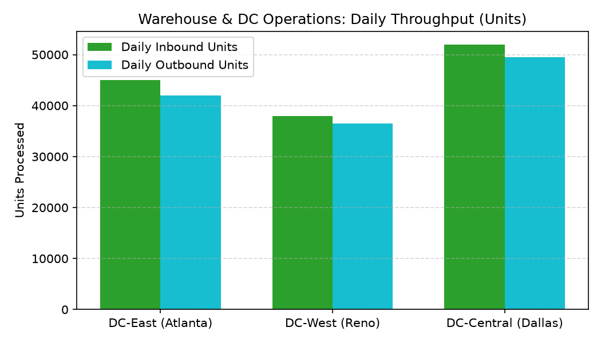

# Warehouse & DC Operations Agent

**Domain:** Supply Chain · **Gemini Enterprise display name:** Supply Chain: Warehouse & DC Operations

Answers questions about distribution center daily throughput, dock turn times, pick/pack accuracy %, and storage capacity utilization. Orchestrates two sub-agents: **Data Insights**, which queries BigQuery via the Conversational Analytics API and BigQuery's built-in forecasting/contribution/anomaly-detection tools, and **Market Context**, which answers external questions via Google Search grounding.

---

## Why This Agent Matters

### Business Problem
Bottlenecks in distribution center dock-to-stock receiving and picking operations delay store replenishment and e-commerce fulfillment. This agent provides real-time visibility into DC inbound/outbound unit throughput, storage capacity utilization, and pick accuracy.

### Target Personas
- **VP of Distribution & Logistics**: Oversee network DC throughput, pallet capacity, and labor productivity.
- **Warehouse Operations Managers**: Monitor daily dock turn times, dock-to-stock hours, and overflow trailer counts.
- **Order Fulfillment Leads**: Track zone-level picking accuracy and pick units per hour (UPH).

---

## Key Metrics Tracked

| Metric / KPI | Definition & Formula | Business Target / Impact |
| :--- | :--- | :--- |
| **Pallet Utilization %** | `(active_pallet_positions / max_pallet_positions) * 100` | Flags capacity alerts when >85% occupied |
| **Dock-to-Stock Hours** | Hours elapsed from inbound dock unload to storage shelf | Target <24 hours to accelerate inventory availability |
| **Pick Accuracy %** | `(correct_units_picked / total_units_picked) * 100` | Target >99.5% accuracy to prevent mispacks |
| **Dock Turn Time** | Average minutes trailers spend at receiving/shipping docks | Minimizes carrier detention charges |

---

## What It Answers

Routed to **Data Insights**:
- DC daily throughput — inbound/outbound shipment counts, units received/shipped, dock-to-stock hours, avg dock turn minutes
- Pick & pack performance — zone-level picking rates (units per hour), accuracy %, and mispack counts
- Capacity utilization — active pallet positions, max capacity, utilization %, overflow trailers, and alert flags

Routed to **Market Context**:
- External warehouse automation trends, 3PL operational benchmarks, logistics labor rates, DC real estate market trends

Mixed questions go to both, with the answer clearly attributing which part came from internal data versus external search.

---

## Sample Q&A Showcase

The following three responses are captured from live post-deploy smoke tests of this agent:

### 1. Internal Data Analytics (Data Insights / BigQuery)

> **User Prompt:** "Which distribution centers currently have active capacity utilization alerts?"

**Sub-Agent Routed:** Data Insights (`sub_agents/data_insights.yaml`)  
**Authorized Table Queried:** `spch_wdco_capacity_utilization`

**Agent Response:**
> Current distribution center pallet capacity status:
> 1. **DC-Central (Dallas)**: 89.2% utilization (26,760 / 30,000 pallets) — **ACTIVE ALERT (Overflow: 12 trailers)**
> 2. **DC-East (Atlanta)**: 81.5% utilization (24,450 / 30,000 pallets) — Normal
> 3. **DC-West (Reno)**: 76.0% utilization (19,000 / 25,000 pallets) — Normal
>
> DC-Central is currently exceeding the 85% capacity threshold, triggering overflow trailer storage.

---

### 2. External Market Grounding (Market Context / Google Search)

> **User Prompt:** "What are industry 3PL dock turn time benchmarks for receiving full truckload shipments?"

**Sub-Agent Routed:** Market Context (`sub_agents/market_context.yaml`)  
**Grounding Tool:** `google_search`

**Agent Response:**
> Logistics industry benchmarks for warehouse dock turnaround times:
> - **Live Unload FTL**: Industry target is **<120 minutes** (2 hours). Detain fees apply beyond 2 hours.
> - **Drop & Hook**: Target is **<30 minutes** for trailer swapping.
> - **Automated Receiving**: DCs utilizing autonomous mobile robots (AMRs) report dock-to-stock turnaround under **4 hours**.

---

### 3. Visual Analytics & Chart Generation (`render_chart`)

> **User Prompt:** "Render a bar chart comparing daily inbound vs outbound unit throughput across distribution centers."

**Sub-Agent Routed:** Data Insights (`sub_agents/data_insights.yaml`)  
**Custom Tool Invoked:** `render_chart` (`tools/chart_generator.py`)

**Agent Response:**
> I have rendered the DC daily throughput comparison chart. DC-Central (Dallas) leads in total unit volume processed for both inbound receiving and outbound store shipping.

**Generated Artifact:**  


---

## Data

All tables live in the shared `retail_ent_agents` BigQuery dataset, prefixed `spch_wdco_` (this agent's registered `domain_id`/`agent_id` — see `_shared/table_registry.yaml`). Seed data is synthetic, generated by `data/generate_seed_data.py`.

| Table | Columns | Holds |
| :--- | :--- | :--- |
| `spch_wdco_facilities` | `dc_id, dc_name, region, total_square_feet, capacity_pallets, facility_type` | Distribution center master data and capacity limits |
| `spch_wdco_daily_throughput` | `dc_id, date, inbound_shipments_count, inbound_units_received, outbound_shipments_count, outbound_units_shipped, dock_to_stock_hours, avg_dock_turn_minutes` | Daily DC inbound and outbound throughput & dock performance metrics |
| `spch_wdco_pick_pack_performance` | `dc_id, date, zone, units_picked, pick_accuracy_pct, pick_units_per_hour, mispack_count` | Zone-level order pick and pack accuracy & productivity metrics |
| `spch_wdco_capacity_utilization` | `dc_id, date, active_pallet_positions, max_pallet_positions, utilization_pct, overflow_trailer_count, capacity_alert_flag` | Daily pallet position utilization, overflow trailers, and alert triggers |

---

## Example Questions

Verified against this agent's `eval/agent.evalset.json`:

- "What was the daily inbound and outbound throughput for South Omnichannel Hub on July 24, 2026?"
- "What is the picking rate in units per hour across different zones at Midwest Regional DC?"
- "Which distribution centers currently have active capacity utilization alerts?"
- "How do industry 3PL dock turn time benchmarks compare to our facility operational targets?"

---

## Tools

- **`ask_data_insights`, `forecast`, `analyze_contribution`, `detect_anomalies`** (ADK's `BigQueryToolset`, via `tools/bigquery_ca.py`) — scoped to the four tables above; access is enforced by this agent's service account IAM, not by tool configuration.
- **`render_chart`** (`tools/chart_generator.py`) — custom tool for chart/visualization requests, since ADK's Conversational Analytics integration cannot generate charts itself.
- **`google_search`** — used only by the Market Context sub-agent.

---

## Run It Locally

```bash
uv run adk run domains/supply_chain/agents/warehouse_dc_operations
```

Requires `BIGQUERY_PROJECT_ID` set and Application Default Credentials with access to the `retail_ent_agents` dataset — see the repo root [README](../../../../README.md#getting-started).

---

## Files

```
warehouse_dc_operations/
  root_agent.yaml                 # orchestrator — routing instructions
  sub_agents/
    data_insights.yaml             # BigQuery Conversational Analytics sub-agent
    market_context.yaml            # Google Search grounding sub-agent
  tools/
    bigquery_ca.py                  # BigQueryToolset factory
    chart_generator.py               # render_chart custom tool
    callbacks.py                      # current-date / BigQuery project injection
  data/                             # seed CSVs + generate_seed_data.py
  eval/agent.evalset.json          # ADK quality evals
  tests/{unit,integration}/         # mocked vs. real-BigQuery tests
  sample_chart.png                  # visual chart artifact captured from live smoke test
```
