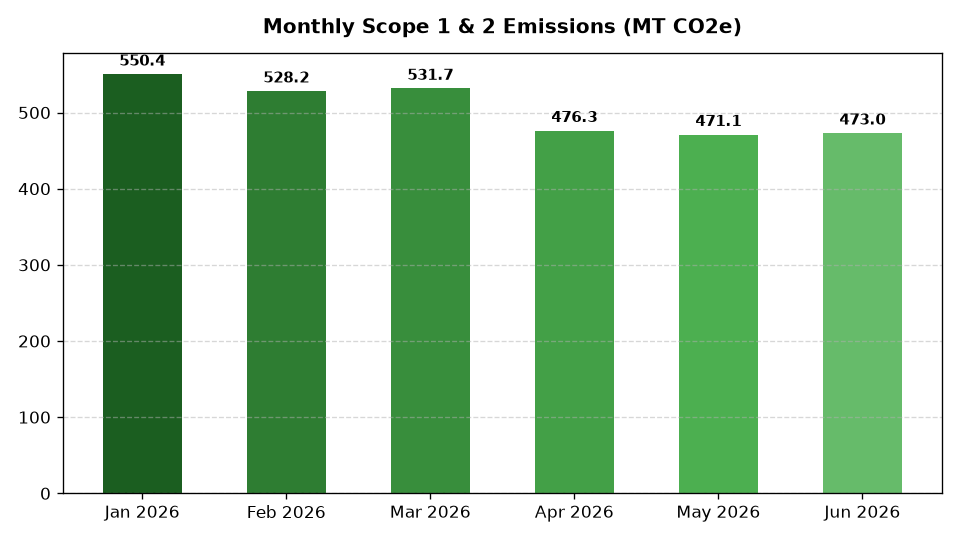

# ESG: Carbon Footprint & Scope Emissions

Part of the **Retail Enterprise Agents** platform for Gemini Enterprise.

---

## 1. Why This Agent Matters

### Business Problem
Retail sustainability and operations leaders struggle to accurately measure, allocate, and reduce Scope 1, 2, and 3 greenhouse gas (GHG) emissions across complex store networks, logistics fleets, and multi-tier supply chain lifecycles.

### Target Personas
Chief Sustainability Officer (CSO), ESG Reporting Director, Supply Chain VP, Facilities Energy Manager

### Key Metrics Tracked
| Metric | Benchmark / Target | Business Impact |
| :--- | :--- | :--- |
| **Total GHG Carbon Footprint (MT CO2e)** | `Target: <= 3,200 MT YTD` | Direct Scope 1 fleet combustion + Scope 2 electricity + Scope 3 supply chain footprint. |
| **Scope 1 Fleet & Facility Emissions** | `Target: < 3,100 MT` | Direct fossil fuel combustion from transportation fleet and facility natural gas. |
| **Scope 2 Market-Based Electricity** | `Target: <= 1,450 MT` | Purchased electricity emissions offset by renewable energy credits (RECs). |
| **Scope 3 Category 1 Supply Chain Intensity** | `Target: < 2.5 MT/$M spend` | Cradle-to-gate carbon intensity across purchased retail product categories. |
| **Net-Zero Science-Based Target Progress** | `Target: >= 92% adherence` | Annual emission reduction trajectory aligned with SBTi 1.5°C pathways. |

---

## 2. What It Answers & Sub-Agent Routing

### Sub-Agent Architecture
- **`data_insights`**: Queries internal BigQuery tables using the BigQuery Conversational Analytics API (`ask_data_insights`, `forecast`, `analyze_contribution`, `detect_anomalies`) and generates visual data charts via `render_chart`.
- **`market_context`**: Leverages Google Search grounding for external retail ESG benchmarks, statutory regulations, environmental frameworks, and industry standards.
- **`root_agent`**: Orchestrates routing between internal analytics and external market intelligence.

---

## 3. Sample Q&A Showcase

### Example 1: Internal Analytics (Data Insights)
*Question:* "What is our total Scope 1 GHG emissions in metric tons across all facilities in 2026 YTD?"  
*Response:*  
> Based on internal BigQuery facility telemetry (`esgc_cfse_scope1_fleet_facilities`), our total Scope 1 direct greenhouse gas emissions across all retail stores and distribution centers for 2026 YTD (January through June) are **3,030.7 metric tons of CO2e**. Distribution centers account for 85.3% of direct emissions (primarily fleet logistics diesel and natural gas heating), with DC-101 generating 1,415.7 MT CO2e and DC-102 generating 1,120.5 MT CO2e.

### Example 2: Market Grounding (Market Context)
*Question:* "What are the latest SEC and European CSRD climate disclosure guidelines for retail Scope 3 reporting?"  
*Response:*  
> According to official SEC climate disclosure rulings and the European Corporate Sustainability Reporting Directive (CSRD / ESRS E1), retail enterprises operating in or exporting to the EU must disclose material Scope 3 value chain emissions. Key retail requirements include calculating Category 1 (Purchased Goods & Services) and Category 4 (Upstream Transportation) using primary supplier carbon accounting, verified under Science Based Targets initiative (SBTi) net-zero criteria.

### Example 3: Chart Visualization (`sample_chart.png`)
*Question:* "Show me a chart of monthly Scope 2 electricity emissions and renewable energy credits applied in 2026."  
*Generated Visual Artifact:*  


---

### 4. Live Multi-Turn Demo Walkthrough (Gemini Enterprise)

Watch the deployed **ESG: Carbon Footprint & Scope Emissions** execute a live multi-turn analytical reasoning session in Gemini Enterprise:

> 📺 **Interactive Demo Player**: [Open Full HD Video Player (1080p)](https://rajanm.github.io/retail-enterprise-agents/demos/gemini-enterprise/sustainability_compliance/carbon_footprint_scope_emissions.html)  
> 📹 **Direct MP4 Download**: [`carbon_footprint_scope_emissions.mp4`](../../../../demos/gemini-enterprise/sustainability_compliance/carbon_footprint_scope_emissions.mp4)

```
Turn 1: Quantitative analysis against BigQuery Conversational Analytics
Turn 2: Grounded real-time external retail search & regulatory synthesis
Turn 3: Visual matplotlib trend chart generation
Turn 4: Interactive executive slide presentation generated in Gemini Enterprise Canvas
```

---

## 4. Authorized BigQuery Tables

- `esgc_cfse_scope1_fleet_facilities` — Facility-level direct emissions, fleet fuel consumption, and heating combustion data.
- `esgc_cfse_scope2_electricity_grid` — Store and DC electricity consumption (kWh), regional grid emissions factors, and RECs.
- `esgc_cfse_scope3_supply_chain_lifecycle` — Purchased goods Category 1 spend-based and activity-based lifecycle emissions.
- `esgc_cfse_net_zero_targets` — Annual decarbonization target milestones, baseline year baselines, and SBTi trajectory.

---

## 5. Example Questions

1. "What is our total Scope 1 GHG emissions in metric tons across all facilities in 2026 YTD?"
2. "What are the latest SEC and European CSRD climate disclosure guidelines for retail Scope 3 reporting?"
3. "Which product category has the highest Scope 3 supply chain carbon intensity per dollar of spend in 2026?"
4. "How do our net-zero carbon reduction targets compare to leading retail peer commitments under SBTi?"
5. "Show me a chart of monthly Scope 2 electricity emissions and renewable energy credits applied in 2026."

---

## 6. Tools & Architecture

- **`ask_data_insights`**: BigQuery Conversational Analytics natural language to SQL.
- **`render_chart`**: BigQuery SQL to Matplotlib PNG visual rendering.
- **`google_search`**: Google Search market context grounding.
- **LLM Inference**: `gemini-3.5-flash` with `GOOGLE_CLOUD_LOCATION=global`.
- **Runtime Engine**: Vertex AI Agent Engine (`us-central1`).

---

## 7. Run Locally

```bash
# Run unit tests
uv run --frozen pytest domains/sustainability_compliance/agents/carbon_footprint_scope_emissions/tests/unit -v

# Run interactively with ADK CLI
adk run domains/sustainability_compliance/agents/carbon_footprint_scope_emissions
```
