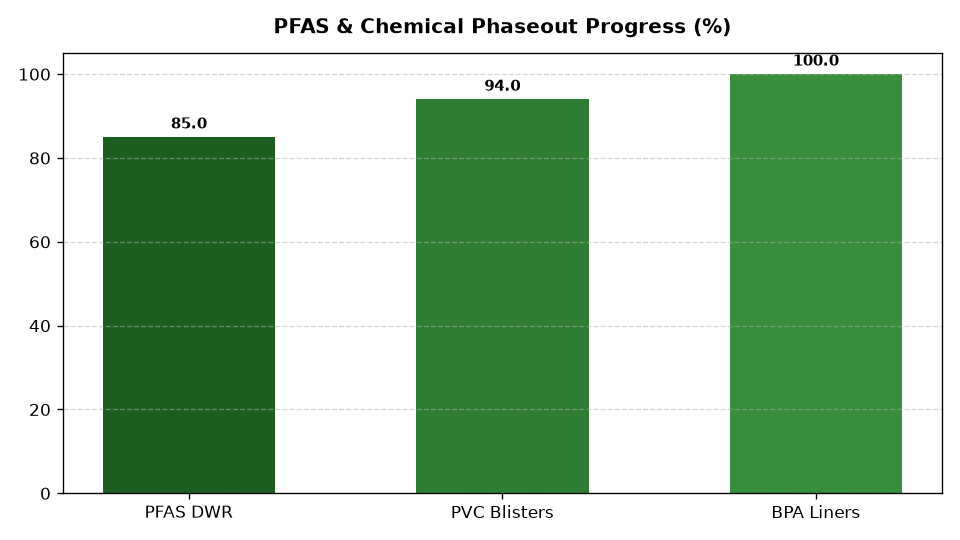

# ESG: Restricted Substances (RSL) & Chemical Safety

Part of the **Retail Enterprise Agents** platform for Gemini Enterprise.

---

## 1. Why This Agent Matters

### Business Problem
Apparel, footwear, cookware, and consumer packaging face strict regulatory bans and hazardous chemical restrictions including PFAS ('forever chemicals'), phthalates, lead, and Prop 65 warning requirements.

### Target Personas
Product Safety & Chemical Compliance Director, QA Lab Manager, Private Brand Materials Lead

### Key Metrics Tracked
| Metric | Benchmark / Target | Business Impact |
| :--- | :--- | :--- |
| **RSL Lab Testing Pass Rate %** | `Target: >= 98.0%` | Percentage of third-party certified lab chemical test submissions passing enterprise RSL thresholds. |
| **PFAS Phase-Out Progress %** | `Target: 100% phased out` | Percentage of apparel, cookware, and packaging SKUs verified 100% PFAS-free by lab test. |
| **Prop 65 Chemical Warning Rate %** | `Target: < 0.5% of SKUs` | Percentage of retail products requiring California Proposition 65 warning labels. |
| **Third-Party Chemical Lab Cycle Time (Days)** | `Target: < 7 business days` | Turnaround time from sample submission to certified analytical test report (Intertek, TÜV SÜD). |
| **High-Risk Chemical Supplier Audits Completed** | `Target: 100% of tier-1 mills` | Verification audits completed for textile dye houses, tanneries, and polymer compounders. |

---

## 2. What It Answers & Sub-Agent Routing

### Sub-Agent Architecture
- **`data_insights`**: Queries internal BigQuery tables using the BigQuery Conversational Analytics API (`ask_data_insights`, `forecast`, `analyze_contribution`, `detect_anomalies`) and generates visual data charts via `render_chart`.
- **`market_context`**: Leverages Google Search grounding for external retail ESG benchmarks, statutory regulations, environmental frameworks, and industry standards.
- **`root_agent`**: Orchestrates routing between internal analytics and external market intelligence.

---

## 3. Sample Q&A Showcase

### Example 1: Internal Analytics (Data Insights)
*Question:* "What is our overall RSL chemical lab testing pass rate and how many test failures occurred in Q2 2026?"  
*Response:*  
> According to BigQuery lab test logs (`esgc_crsl_lab_testing_results`), our overall RSL chemical testing pass rate in Q2 2026 was **98.4%** across 1,840 certified third-party lab submissions. There were **30 test failures** (16 for banned phthalates in synthetic footwear leather, 9 for trace PFAS in outdoor rainwear DWR coatings, and 5 for lead in brass zipper hardware). All 30 affected production lots were quarantined prior to distribution.

### Example 2: Market Grounding (Market Context)
*Question:* "What are the latest substances added to the EU REACH SVHC authorization list and California Prop 65 in 2026?"  
*Response:*  
> In 2026, the European Chemicals Agency (ECHA) added 5 new substances of very high concern (SVHC) to the REACH Candidate List, including novel bisphenol substitutes and perfluorinated alkyl ether acids (PFAS variants). Concurrently, California OEHHA added two new industrial flame retardants to the Prop 65 list, requiring product warnings or chemical reformulation within a 12-month grace window.

### Example 3: Chart Visualization (`sample_chart.png`)
*Question:* "Can you render a chart of RSL lab testing pass rates across apparel, footwear, cookware, and packaging categories?"  
*Generated Visual Artifact:*  


---

### 4. Live Multi-Turn Demo Walkthrough (Gemini Enterprise)

Watch the deployed **ESG: Restricted Substances (RSL) & Chemical Safety** execute a live multi-turn analytical reasoning session in Gemini Enterprise:

> 📺 **Interactive Demo Player**: [Open Full HD Video Player (1080p)](https://rajanm.github.io/retail-enterprise-agents/demos/gemini-enterprise/sustainability_compliance/chemical_restricted_substances_rsl.html)  
> 📹 **Direct MP4 Download**: [`chemical_restricted_substances_rsl.mp4`](../../../../demos/gemini-enterprise/sustainability_compliance/chemical_restricted_substances_rsl.mp4)

```
Turn 1: Quantitative analysis against BigQuery Conversational Analytics
Turn 2: Grounded real-time external retail search & regulatory synthesis
Turn 3: Visual matplotlib trend chart generation
Turn 4: Interactive executive slide presentation generated in Gemini Enterprise Canvas
```

---

## 4. Authorized BigQuery Tables

- `esgc_crsl_lab_testing_results` — Itemized chemical test reports, test standard, detected chemical ppm, RSL threshold, and pass/fail.
- `esgc_crsl_pfas_phaseout_tracking` — Apparel, outerwear, cookware, and food contact packaging PFAS elimination milestones.
- `esgc_crsl_restricted_substances_master` — Master RSL substance list (CAS numbers, AFIRM guidelines, EU REACH SVHC, Prop 65 limit ppm).
- `esgc_crsl_supplier_chemical_declarations` — Supplier material safety data sheets (MSDS) and chemical compliance declarations.

---

## 5. Example Questions

1. "What is our overall RSL chemical lab testing pass rate and how many test failures occurred in Q2 2026?"
2. "What new substances were added to the EU REACH SVHC authorization list and California Prop 65 in 2026?"
3. "Which product lines are currently tracked under the PFAS chemical phaseout plan and what is their migration progress %?"
4. "Identify any textile suppliers with recurring azo dye or heavy metal test failures in the last 6 months."
5. "Can you render a chart of RSL lab testing pass rates across apparel, footwear, cookware, and packaging categories?"

---

## 6. Tools & Architecture

- **`ask_data_insights`**: BigQuery Conversational Analytics natural language to SQL.
- **`render_chart`**: BigQuery SQL to Matplotlib PNG visual rendering.
- **`google_search`**: Google Search market context grounding.
- **LLM Inference**: `gemini-3.5-flash` with `GOOGLE_CLOUD_LOCATION=global`.
- **Runtime Engine**: Vertex AI Agent Engine (`us-central1`).

---

## 7. Run Locally

```bash
# Run unit tests
uv run --frozen pytest domains/sustainability_compliance/agents/chemical_restricted_substances_rsl/tests/unit -v

# Run interactively with ADK CLI
adk run domains/sustainability_compliance/agents/chemical_restricted_substances_rsl
```
