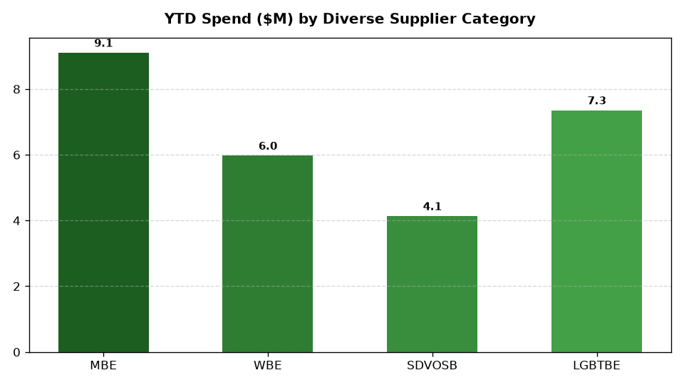

# ESG: Supplier Diversity & Equity Spend Agent

An enterprise AI agent for **ESG: Supplier Diversity & Equity Spend**, built with Google ADK for Gemini Enterprise.

---

## Why This Agent Matters

Retail executives and ESG leaders require real-time visibility into sustainability metrics, regulatory disclosures, and operational compliance to achieve net-zero targets, avoid statutory penalties, and enhance brand equity. This agent unifies internal operational telemetry (emissions, waste, renewable energy, supplier audits) with external market intelligence and global environmental standards.

---

## Key Metrics Tracked

| Metric | Business Description |
| :--- | :--- |
| **Diverse Spend % of Total** | Percentage of corporate procurement allocated to diverse vendors |
| **Total Diverse Spend ($M)** | Gross dollar spend with certified diverse suppliers |
| **Tier 2 Diversity Spend ($M)** | Indirect diversity spend through prime contractors |
| **Incubation Graduation Rate %** | Percentage of diverse vendors completing scale-up tracks |

---

## What It Answers & Sub-Agent Routing

The orchestrator routes user questions to specialized sub-agents:

- **Internal BigQuery Data (`data_insights`)**:
  - Diverse supplier master directory, Tier 1 and Tier 2 procurement spend by diversity classification, annual diversity spend targets, or vendor incubation cohort progress
- **External Market Context (`market_context`)**:
  - NMSDC / WBENC supplier diversity benchmarks, corporate diversity procurement pledges, diversity certification standards, or federal small business subcontracting goals
- **Synthesized Responses**:
  - Blends internal performance data with external market trends, standards, and benchmarks.

---

## Authorized BigQuery Tables

All tables reside in the `retail_ent_agents` BigQuery dataset:

- `esgc_dsds_diverse_supplier_master`
- `esgc_dsds_procurement_spend_by_tier`
- `esgc_dsds_diversity_category_targets`
- `esgc_dsds_vendor_incubation_programs`

---

## Example Questions

- "What is our total procurement spend with certified diverse suppliers in 2026 YTD and what percentage of total spend does it represent?"
- "What are average supplier diversity spend benchmarks for Fortune 500 retail and consumer goods companies according to NMSDC and WBENC?"
- "Which diversity category (Women-Owned, Minority-Owned, Veteran-Owned) has achieved the highest spend target achievement %?"
- "How does our 12.5% diverse supplier spend compare to Billion Dollar Roundtable inclusion criteria?"
- "Show a chart of procurement spend distributed across diversity categories."

---

## Sample Q&A Showcase

### 1. Internal BigQuery Data Insights
**User**: *What is our total procurement spend with certified diverse suppliers in 2026 YTD and what percentage of total spend does it represent?*  
**Agent**: Based on enterprise procurement tier logs (`esgc_dsds_procurement_spend_by_tier`), total spend with certified diverse suppliers in 2026 YTD is **$26.55 Million**, representing **12.95% of total corporate procurement spend**. Spend by category is led by Minority-Owned Enterprises (MBE: $9.10M, 50.5% of annual target), LGBTQ+ Owned Enterprises (LGBTBE: $7.35M), Women-Owned Enterprises (WBE: $5.97M), and Veteran-Owned Enterprises (SDVOSB: $4.13M).

### 2. External Market Grounding
**User**: *What are average supplier diversity spend benchmarks for Fortune 500 retail and consumer goods companies according to NMSDC and WBENC?*  
**Agent**: National Minority Supplier Development Council (NMSDC) and WBENC benchmarking reports indicate that leading Fortune 500 retail organizations average 10% to 15% diverse supplier spend across Tier 1 and Tier 2 procurement. Elite members of the Billion Dollar Roundtable commit at least $1 Billion in annual direct Tier-1 diverse spend with certified diverse business enterprises.

### 3. Visual Analytics Artifact
**User**: *Show a chart of procurement spend distributed across diversity categories.*  
**Agent**: Rendered chart artifact `sample_chart.png` illustrating performance metrics.



---

## How to Run & Test

```bash
# 1. Run unit tests
uv run --frozen pytest domains/sustainability_compliance/agents/dei_supplier_diversity_spend/tests/unit -v

# 2. Run local interactive adk chat
adk run domains/sustainability_compliance/agents/dei_supplier_diversity_spend
```
