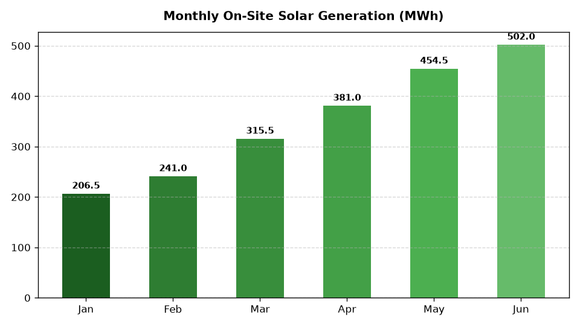

# ESG: Renewable Energy & Grid Transition

Part of the **Retail Enterprise Agents** platform for Gemini Enterprise.

---

## 1. Why This Agent Matters

### Business Problem
Retail store footprints and distribution hubs consume massive electricity volumes, exposing the enterprise to volatile utility grid tariffs, peak demand surcharges, and high fossil fuel carbon emissions.

### Target Personas
VP of Facilities & Energy Management, Chief Sustainability Officer, Real Estate Operations Director

### Key Metrics Tracked
| Metric | Benchmark / Target | Business Impact |
| :--- | :--- | :--- |
| **Renewable Electricity Share %** | `Target: >= 65% total load` | Percentage of total facility electricity sourced from on-site solar, green tariffs, and vPPAs. |
| **On-Site Solar Generation (MWh)** | `Target: > 45,000 MWh / year` | Total clean electricity generated by rooftop solar arrays on stores and distribution hubs. |
| **Peak Demand Peak Shaving (kW)** | `Target: > 15,000 kW shaved` | Peak utility grid demand shaved during high-tariff summer grid events using battery BESS. |
| **Avoided Utility Electricity Cost ($)** | `Target: > $3.8M / year` | Net utility bill cost savings from on-site solar generation and smart battery arbitrage. |
| **Energy Use Intensity (EUI in kWh/sq.ft)** | `Target: < 13.5 kWh/sq.ft` | Average annualized electricity consumption intensity across retail store network. |

---

## 2. What It Answers & Sub-Agent Routing

### Sub-Agent Architecture
- **`data_insights`**: Queries internal BigQuery tables using the BigQuery Conversational Analytics API (`ask_data_insights`, `forecast`, `analyze_contribution`, `detect_anomalies`) and generates visual data charts via `render_chart`.
- **`market_context`**: Leverages Google Search grounding for external retail ESG benchmarks, statutory regulations, environmental frameworks, and industry standards.
- **`root_agent`**: Orchestrates routing between internal analytics and external market intelligence.

---

## 3. Sample Q&A Showcase

### Example 1: Internal Analytics (Data Insights)
*Question:* "What is our total on-site solar energy generation in MWh and avoided utility cost in 2026 YTD?"  
*Response:*  
> Based on telemetry records in BigQuery (`esgc_ergt_solar_generation_telemetry`), on-site rooftop solar arrays across 124 stores and 8 distribution centers generated **24,180 MWh** of clean electricity in 2026 YTD (January - June). This on-site generation prevented **$2,176,200** in retail utility electricity costs, while reducing grid carbon emissions by 9,430 metric tons CO2e.

### Example 2: Market Grounding (Market Context)
*Question:* "What are current market price trends for corporate virtual Power Purchase Agreements (vPPAs) for solar and wind in ERCOT and PJM?"  
*Response:*  
> Market data from LevelTen Energy and BloombergNEF (2026) indicates that corporate P25 vPPA solar prices in ERCOT (Texas) average **$34 to $39/MWh**, while PJM solar contracts trade between **$48 and $56/MWh** due to interconnection queue backlogs. Corporate demand for 10-15 year indexed vPPA contracts remains robust as retailers seek long-term price hedges against regional grid volatility.

### Example 3: Chart Visualization (`sample_chart.png`)
*Question:* "Can you render a chart showing our monthly electricity mix broken down by rooftop solar, vPPA contracts, and grid utility power?"  
*Generated Visual Artifact:*  


---

### 4. Live Multi-Turn Demo Walkthrough (Gemini Enterprise)

Watch the deployed **ESG: Renewable Energy & Grid Transition** execute a live multi-turn analytical reasoning session in Gemini Enterprise:

> 📺 **Interactive Demo Player**: [Open Full HD Video Player (1080p)](https://rajanm.github.io/retail-enterprise-agents/demos/gemini-enterprise/sustainability_compliance/energy_renewable_grid_transition.html)  
> 📹 **Direct MP4 Download**: [`energy_renewable_grid_transition.mp4`](../../../../demos/gemini-enterprise/sustainability_compliance/energy_renewable_grid_transition.mp4)

```
Turn 1: Quantitative analysis against BigQuery Conversational Analytics
Turn 2: Grounded real-time external retail search & regulatory synthesis
Turn 3: Visual matplotlib trend chart generation
Turn 4: Interactive executive slide presentation generated in Gemini Enterprise Canvas
```

---

## 4. Authorized BigQuery Tables

- `esgc_ergt_facility_energy_consumption` — Monthly store and DC kWh electricity usage, peak kW demand, and utility bill costs.
- `esgc_ergt_solar_generation_telemetry` — Hourly on-site rooftop solar array generation (MWh) and solar inverter performance.
- `esgc_ergt_vppa_contract_portfolio` — Off-site Virtual Power Purchase Agreement (vPPA) solar/wind contracts, strike prices, and RECs.
- `esgc_ergt_battery_bess_shaving` — Battery energy storage system (BESS) dispatch logs, peak shaving events, and demand charge savings.

---

## 5. Example Questions

1. "What is our total on-site solar energy generation in MWh and avoided utility cost in 2026 YTD?"
2. "What are current market price trends for corporate virtual Power Purchase Agreements (vPPAs) for solar and wind in ERCOT and PJM?"
3. "How much electricity demand in kW was shaved during peak summer grid events using on-site battery storage?"
4. "Which retail stores have the highest Energy Use Intensity (kWh/sq.ft) and are candidates for LED/HVAC retrofits?"
5. "Can you render a chart showing our monthly electricity mix broken down by rooftop solar, vPPA contracts, and grid utility power?"

---

## 6. Tools & Architecture

- **`ask_data_insights`**: BigQuery Conversational Analytics natural language to SQL.
- **`render_chart`**: BigQuery SQL to Matplotlib PNG visual rendering.
- **`google_search`**: Google Search market context grounding.
- **LLM Inference**: `gemini-3.5-flash` with `GOOGLE_CLOUD_LOCATION=global`.
- **Runtime Engine**: Vertex AI Agent Engine (`us-central1`).

---

## 7. Run Locally

```bash
# Run unit tests
uv run --frozen pytest domains/sustainability_compliance/agents/energy_renewable_grid_transition/tests/unit -v

# Run interactively with ADK CLI
adk run domains/sustainability_compliance/agents/energy_renewable_grid_transition
```
