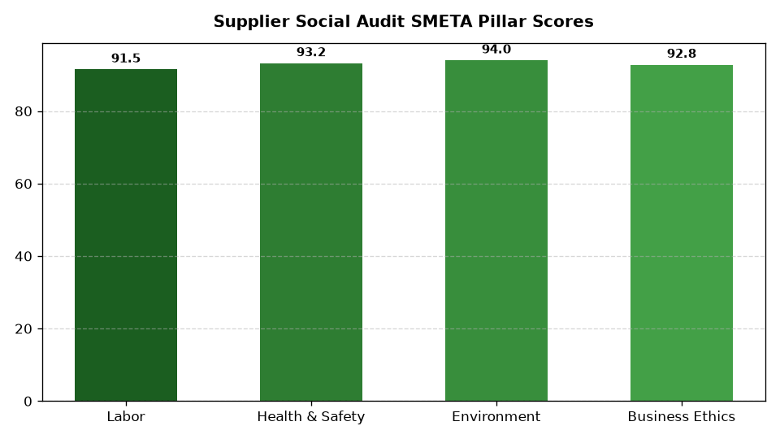

# ESG: Ethical Sourcing & Labor Audits

Part of the **Retail Enterprise Agents** platform for Gemini Enterprise.

---

## 1. Why This Agent Matters

### Business Problem
Global supply chain risks such as forced labor, underage workers, excessive overtime, and unsafe factory conditions threaten brand reputation, customs import clearance, and ESG audit compliance.

### Target Personas
Chief Compliance Officer, Global Sourcing VP, Human Rights & Labor Standards Director, Sourcing Manager

### Key Metrics Tracked
| Metric | Benchmark / Target | Business Impact |
| :--- | :--- | :--- |
| **Supplier Social Audit Pass Rate %** | `Target: >= 90% Grade A/B` | Percentage of active manufacturing facilities passing Sedex SMETA or amfori BSCI audits. |
| **Zero-Tolerance Labor Violations** | `Target: 0 open cases` | Confirmed child labor, forced labor, physical abuse, or critical safety violations. |
| **Audit Remediation Closure SLA (Days)** | `Target: < 45 days` | Average days required for suppliers to resolve and verify non-conformance corrective actions. |
| **Fair Living Wage Compliance %** | `Target: >= 95%` | Percentage of supplier workforce paid at or above regional living wage standards. |
| **UFLPA Traceability Verification %** | `Target: 100% compliant` | Supply chain raw material mapping compliance for cotton, polysilicon, and tomato supply chains. |

---

## 2. What It Answers & Sub-Agent Routing

### Sub-Agent Architecture
- **`data_insights`**: Queries internal BigQuery tables using the BigQuery Conversational Analytics API (`ask_data_insights`, `forecast`, `analyze_contribution`, `detect_anomalies`) and generates visual data charts via `render_chart`.
- **`market_context`**: Leverages Google Search grounding for external retail ESG benchmarks, statutory regulations, environmental frameworks, and industry standards.
- **`root_agent`**: Orchestrates routing between internal analytics and external market intelligence.

---

## 3. Sample Q&A Showcase

### Example 1: Internal Analytics (Data Insights)
*Question:* "What is the breakdown of our active suppliers by social audit rating grade (A, B, C, D)?"  
*Response:*  
> Based on BigQuery social audit records (`esgc_esla_factory_social_audits`), 284 active tier-1 manufacturing facilities show the following audit distribution: **Grade A (Excellent): 142 factories (50.0%)**, **Grade B (Minor Issues): 108 factories (38.0%)**, **Grade C (Major Non-Conformance): 28 factories (9.9%)**, and **Grade D (Critical Risk): 6 factories (2.1%)**. All 6 Grade D facilities are currently under probationary quarantine with mandatory 30-day corrective action plans.

### Example 2: Market Grounding (Market Context)
*Question:* "What are the latest CBP customs enforcement guidelines under the Uyghur Forced Labor Prevention Act?"  
*Response:*  
> U.S. Customs and Border Protection (CBP) enforces a rebuttable presumption under the Uyghur Forced Labor Prevention Act (UFLPA) for goods mined, produced, or manufactured wholly or in part in Xinjiang. Importers must provide comprehensive supply chain traceability dossiers, including raw cotton DNA testing, transaction-level purchase orders from farm to finished garment, and proof of non-use of state-sponsored labor transfer programs.

### Example 3: Chart Visualization (`sample_chart.png`)
*Question:* "Can you render a chart of factory audit grade distributions across our top 5 sourcing countries?"  
*Generated Visual Artifact:*  


---

### 4. Live Multi-Turn Demo Walkthrough (Gemini Enterprise)

Watch the deployed **ESG: Ethical Sourcing & Labor Audits** execute a live multi-turn analytical reasoning session in Gemini Enterprise:

> 📺 **Interactive Demo Player**: [Open Full HD Video Player (1080p)](https://rajanm.github.io/retail-enterprise-agents/demos/gemini-enterprise/sustainability_compliance/ethical_sourcing_labor_audits.html)  
> 📹 **Direct MP4 Download**: [`ethical_sourcing_labor_audits.mp4`](../../../../demos/gemini-enterprise/sustainability_compliance/ethical_sourcing_labor_audits.mp4)

```
Turn 1: Quantitative analysis against BigQuery Conversational Analytics
Turn 2: Grounded real-time external retail search & regulatory synthesis
Turn 3: Visual matplotlib trend chart generation
Turn 4: Interactive executive slide presentation generated in Gemini Enterprise Canvas
```

---

## 4. Authorized BigQuery Tables

- `esgc_esla_factory_social_audits` — Factory audit scores, audit date, auditing firm (SGS, Intertek, Elevate), and grade.
- `esgc_esla_labor_non_conformances` — Itemized labor violations, corrective action plans (CAPs), and remediation status.
- `esgc_esla_tier1_supplier_profiles` — Supplier facility location, country risk tier, active worker headcount, and certifications.
- `esgc_esla_customs_traceability_logs` — Raw material origin tracking records and UFLPA import admissibility documentation.

---

## 5. Example Questions

1. "What is the breakdown of our active suppliers by social audit rating grade (A, B, C, D)?"
2. "What are the latest CBP customs enforcement guidelines under the Uyghur Forced Labor Prevention Act?"
3. "Are there any open zero-tolerance labor violations across our apparel and home goods suppliers?"
4. "What is the average corrective action remediation time in days for factories in Southeast Asia?"
5. "Can you render a chart of factory audit grade distributions across our top 5 sourcing countries?"

---

## 6. Tools & Architecture

- **`ask_data_insights`**: BigQuery Conversational Analytics natural language to SQL.
- **`render_chart`**: BigQuery SQL to Matplotlib PNG visual rendering.
- **`google_search`**: Google Search market context grounding.
- **LLM Inference**: `gemini-3.5-flash` with `GOOGLE_CLOUD_LOCATION=global`.
- **Runtime Engine**: Vertex AI Agent Engine (`us-central1`).

---

## 7. Run Locally

```bash
# Run unit tests
uv run --frozen pytest domains/sustainability_compliance/agents/ethical_sourcing_labor_audits/tests/unit -v

# Run interactively with ADK CLI
adk run domains/sustainability_compliance/agents/ethical_sourcing_labor_audits
```
