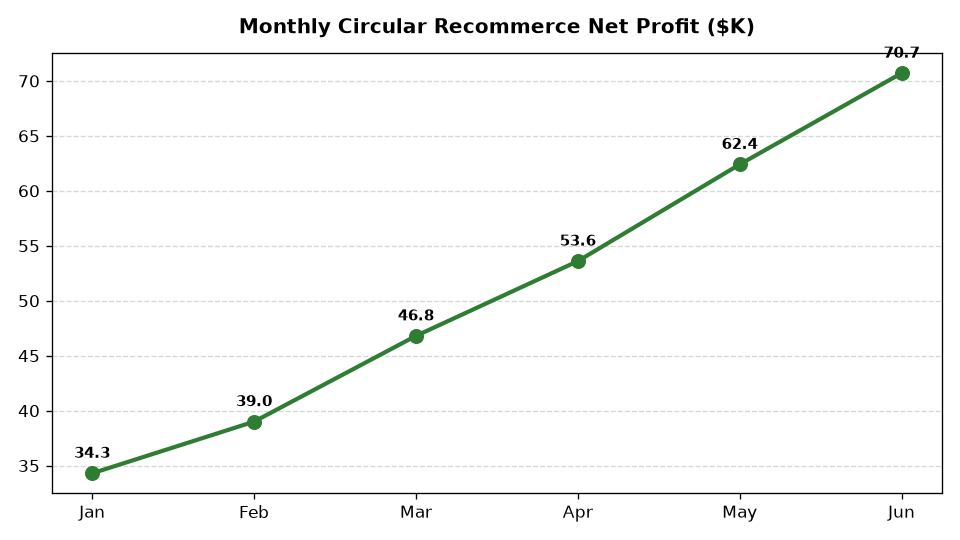

# ESG: Extended Producer Responsibility (EPR) & Resale

Part of the **Retail Enterprise Agents** platform for Gemini Enterprise.

---

## 1. Why This Agent Matters

### Business Problem
Mandatory state packaging and textile EPR statutory fees, electronic waste compliance, and circular economy take-back programs require automated material accounting, fee optimization, and recommerce management.

### Target Personas
VP of Circular Economy & Recommerce, ESG Legal Compliance Officer, Reverse Logistics Director

### Key Metrics Tracked
| Metric | Benchmark / Target | Business Impact |
| :--- | :--- | :--- |
| **State EPR Packaging Compliance Fees ($)** | `Target: Optimize fee liability` | Accrued and paid statutory producer fees across California SB 54, Oregon, Colorado, and Maine. |
| **Customer Take-Back Collection Tonnage** | `Target: > 1,800 tons / year` | Weight of post-consumer apparel, footwear, and consumer electronics collected in-store. |
| **Certified Pre-Owned Resale Revenue ($)** | `Target: > $14.5M / year` | Gross merchandise value (GMV) generated through authenticated circular recommerce resale channels. |
| **Take-Back Circular Recovery Rate %** | `Target: >= 92%` | Percentage of collected post-consumer garments/electronics refurbished or fiber-recycled vs discarded. |
| **EPR Eco-Modulated Fee Savings ($)** | `Target: > $850k in fee discounts` | Fee reductions earned through high-PCR content and lightweight curbside-recyclable packaging designs. |

---

## 2. What It Answers & Sub-Agent Routing

### Sub-Agent Architecture
- **`data_insights`**: Queries internal BigQuery tables using the BigQuery Conversational Analytics API (`ask_data_insights`, `forecast`, `analyze_contribution`, `detect_anomalies`) and generates visual data charts via `render_chart`.
- **`market_context`**: Leverages Google Search grounding for external retail ESG benchmarks, statutory regulations, environmental frameworks, and industry standards.
- **`root_agent`**: Orchestrates routing between internal analytics and external market intelligence.

---

## 3. Sample Q&A Showcase

### Example 1: Internal Analytics (Data Insights)
*Question:* "What are our total EPR packaging compliance fees assessed and paid by state jurisdiction in 2026?"  
*Response:*  
> Based on BigQuery statutory compliance records (`esgc_eprr_state_fee_assessments`), total EPR packaging compliance fee liabilities assessed across four enacted state programs in 2026 YTD are **$1,642,800**. California SB 54 accounts for **$984,200 (59.9%)**, Oregon for **$382,100 (23.3%)**, Colorado for **$182,500 (11.1%)**, and Maine for **$94,000 (5.7%)**. Eco-modulated packaging fee discounts saved the enterprise **$218,400** due to high-PCR fiber packaging adoptions.

### Example 2: Market Grounding (Market Context)
*Question:* "What are the latest compliance deadlines and producer responsibility organization (PRO) fee structures under California SB 54 and Oregon EPR laws?"  
*Response:*  
> Under California SB 54 (CalRecycle / Circular Action Alliance PRO), producers must submit initial material baseline reports by 2026 and achieve a 100% recyclable or compostable packaging mandate by 2032. Oregon's Recycling Modernization Act enforces tiered producer fee schedules based on material recyclability scores, penalizing non-recyclable multi-layer films while granting fee reductions for certified post-consumer recycled content.

### Example 3: Chart Visualization (`sample_chart.png`)
*Question:* "Can you render a chart showing our state packaging EPR fee liabilities alongside eco-modulated discount savings?"  
*Generated Visual Artifact:*  


---

### 4. Live Multi-Turn Demo Walkthrough (Gemini Enterprise)

Watch the deployed **ESG: Extended Producer Responsibility (EPR) & Resale** execute a live multi-turn analytical reasoning session in Gemini Enterprise:

> 📺 **Interactive Demo Player**: [Open Full HD Video Player (1080p)](https://rajanm.github.io/retail-enterprise-agents/demos/gemini-enterprise/sustainability_compliance/extended_producer_responsibility_epr.html)  
> 📹 **Direct MP4 Download**: [`extended_producer_responsibility_epr.mp4`](../../../../demos/gemini-enterprise/sustainability_compliance/extended_producer_responsibility_epr.mp4)

```
Turn 1: Quantitative analysis against BigQuery Conversational Analytics
Turn 2: Grounded real-time external retail search & regulatory synthesis
Turn 3: Visual matplotlib trend chart generation
Turn 4: Interactive executive slide presentation generated in Gemini Enterprise Canvas
```

---

## 4. Authorized BigQuery Tables

- `esgc_eprr_state_fee_assessments` — State-by-state packaging material weight sold, PRO base fee rates, eco-modulated discounts, and total liability.
- `esgc_eprr_takeback_collection_logs` — Store drop-off collection volume (lbs) of apparel, footwear, and consumer electronics by store region.
- `esgc_eprr_recommerce_resale_gmv` — Refurbished and pre-owned item resale volume, average selling price (ASP), and gross margins.
- `esgc_eprr_material_circular_destination` — Weight of collected items routed to recommerce resale, fiber-to-fiber recycling, and certified e-waste downcycling.

---

## 5. Example Questions

1. "What are our total EPR packaging compliance fees assessed and paid by state jurisdiction in 2026?"
2. "What are the latest compliance deadlines and producer responsibility organization (PRO) fee structures under California SB 54 and Oregon EPR laws?"
3. "How many tons of used apparel and electronics have been collected through our customer take-back program in 2026?"
4. "What is the average gross margin and revenue generated from our Certified Pre-Owned recommerce store?"
5. "Can you render a chart showing our state packaging EPR fee liabilities alongside eco-modulated discount savings?"

---

## 6. Tools & Architecture

- **`ask_data_insights`**: BigQuery Conversational Analytics natural language to SQL.
- **`render_chart`**: BigQuery SQL to Matplotlib PNG visual rendering.
- **`google_search`**: Google Search market context grounding.
- **LLM Inference**: `gemini-3.5-flash` with `GOOGLE_CLOUD_LOCATION=global`.
- **Runtime Engine**: Vertex AI Agent Engine (`us-central1`).

---

## 7. Run Locally

```bash
# Run unit tests
uv run --frozen pytest domains/sustainability_compliance/agents/extended_producer_responsibility_epr/tests/unit -v

# Run interactively with ADK CLI
adk run domains/sustainability_compliance/agents/extended_producer_responsibility_epr
```
