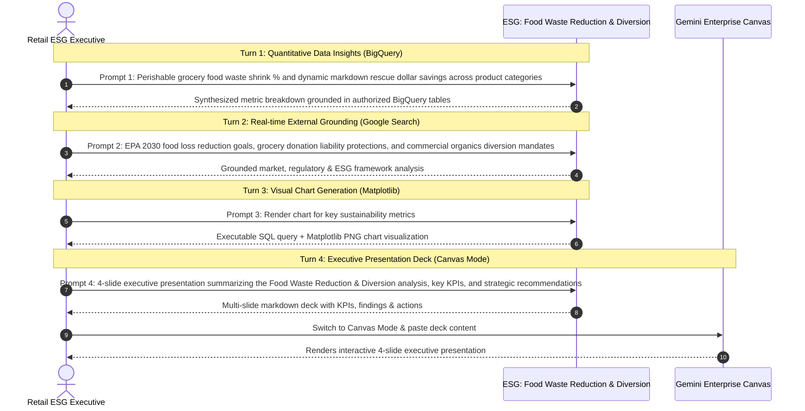

# ESG: Food Waste Reduction & Diversion Agent

An enterprise AI agent for **ESG: Food Waste Reduction & Diversion**, built with Google ADK for Gemini Enterprise.

---

## Why This Agent Matters

Retail executives and ESG leaders require real-time visibility into sustainability metrics, regulatory disclosures, and operational compliance to achieve net-zero targets, avoid statutory penalties, and enhance brand equity. This agent unifies internal operational telemetry (emissions, waste, renewable energy, supplier audits) with external market intelligence and global environmental standards.

---

## Key Metrics Tracked

| Metric | Business Description |
| :--- | :--- |
| **Food Waste Diversion Rate %** | Percentage of organic waste diverted from landfills |
| **Dynamic Markdown Rescue $** | Revenue recovered from near-expiry items |
| **Food Bank Donations (lbs)** | Total pounds of edible surplus donated |
| **Meals Provided** | Estimated equivalent meals generated from food donations |

---

## What It Answers & Sub-Agent Routing

The orchestrator routes user questions to specialized sub-agents:

- **Internal BigQuery Data (`data_insights`)**:
  - Perishable food spoilage logs, dynamic markdown rescue revenue, food bank donation weights (lbs) and meals, or compost and landfill diversion rates
- **External Market Context (`market_context`)**:
  - USDA food waste reduction goals, ReFED food waste benchmarks, dynamic markdowns technology trends, or food donation liability protection regulations (Bill Emerson Act)
- **Synthesized Responses**:
  - Blends internal performance data with external market trends, standards, and benchmarks.

---

### 4. Live Multi-Turn Demo Walkthrough

An end-to-end multi-turn analytical reasoning session in Gemini Enterprise:

> 📺 **Watch Full HD 1080p Video Recording**:
> - [🎬 Interactive Demo Player](https://rajanm.github.io/retail-enterprise-agents/demos/gemini-enterprise/sustainability_compliance/food_waste_spoilage_reduction.html)
> - [⬇️ Direct Video File (.mp4)](https://rajanm.github.io/retail-enterprise-agents/demos/gemini-enterprise/sustainability_compliance/food_waste_spoilage_reduction.mp4)



## Authorized BigQuery Tables

All tables reside in the `retail_ent_agents` BigQuery dataset:

- `esgc_fwsr_perishable_spoilage_logs`
- `esgc_fwsr_dynamic_markdown_rescues`
- `esgc_fwsr_food_bank_donations_lbs`
- `esgc_fwsr_compost_landfill_diversion`

---

## Example Questions

- "What was our total perishable food waste shrink cost and spoiled units across stores in Q2 2026?"
- "What are current best practices and retail case studies for AI-driven dynamic markdown pricing in fresh grocery?"
- "How many total pounds of food and estimated meals were donated to charity partners in 2026 YTD?"
- "How does our 85% landfill diversion rate compare to EPA Food Recovery Challenge benchmarks for grocery retailers?"
- "Generate a chart showing monthly composted tons versus landfill tons across our store network."

---

## Sample Q&A Showcase

### 1. Internal BigQuery Data Insights
**User**: *What was our total perishable food waste shrink cost and spoiled units across stores in Q2 2026?*  
**Agent**: According to store perishable shrink logs (`esgc_fwsr_perishable_spoilage_logs`), total perishable food waste across all 5 stores in Q2 2026 was **777 units** representing **$3,074.50 in shrink cost**. Fresh Produce and Bakery accounted for 64% of spoiled volume, while dynamic freshness markdowns successfully rescued 1,273 near-expiry units, recovering **$4,500.80 in revenue** and diverting 2,245 lbs of edible food from waste streams.

### 2. External Market Grounding
**User**: *What are current best practices and retail case studies for AI-driven dynamic markdown pricing in fresh grocery?*  
**Agent**: Retail industry benchmarks from ReFED and FMI indicate that AI-powered dynamic freshness markdowns reduce grocery perishable food waste by 28% to 40% while capturing 15-22% incremental gross profit. Leading grocers deploy algorithmic price ladders (e.g. 20% off at T-2 days, 50% off at T-1 day) integrated with digital electronic shelf labels (ESL) to clear inventory prior to food bank donation deadlines.

### 3. Visual Analytics Artifact
**User**: *Generate a chart showing monthly composted tons versus landfill tons across our store network.*  
**Agent**: Rendered chart artifact `sample_chart.png` illustrating performance metrics.


---

## How to Run & Test

```bash
# 1. Run unit tests
uv run --frozen pytest domains/sustainability_compliance/agents/food_waste_spoilage_reduction/tests/unit -v

# 2. Run local interactive adk chat
adk run domains/sustainability_compliance/agents/food_waste_spoilage_reduction
```
