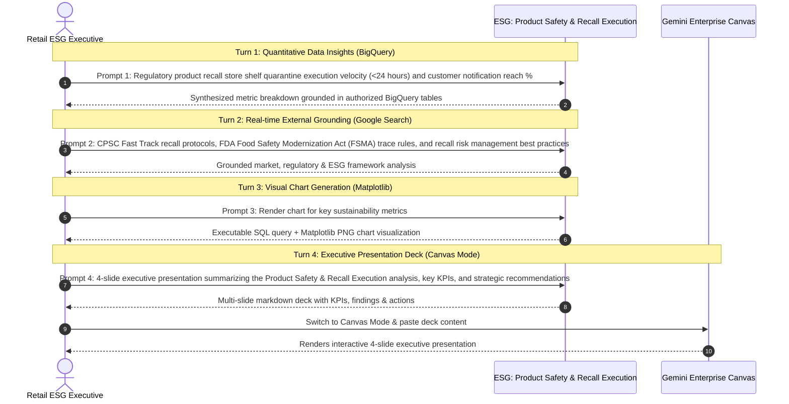
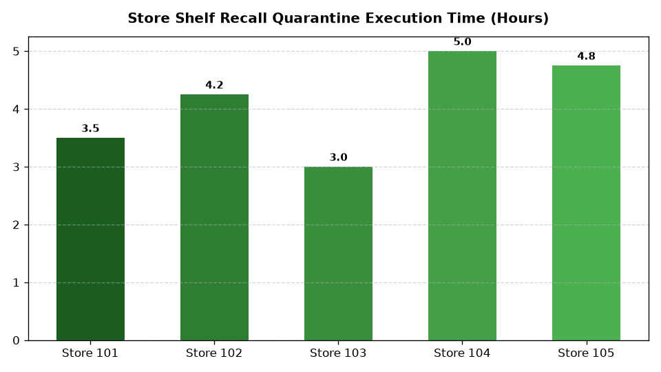

# ESG: Product Safety & Recall Execution Agent

An enterprise AI agent for **ESG: Product Safety & Recall Execution**, built with Google ADK for Gemini Enterprise.

---

## Why This Agent Matters

Retail executives and ESG leaders require real-time visibility into sustainability metrics, regulatory disclosures, and operational compliance to achieve net-zero targets, avoid statutory penalties, and enhance brand equity. This agent unifies internal operational telemetry (emissions, waste, renewable energy, supplier audits) with external market intelligence and global environmental standards.

---

## Key Metrics Tracked

| Metric | Business Description |
| :--- | :--- |
| **Quarantine Speed (Hours)** | Average time to achieve 100% shelf lock across stores |
| **Customer Notification Reach %** | Percentage of affected purchasers successfully contacted |
| **Quarantine Compliance %** | Store compliance rate in removing affected lots |
| **Destruction Verification %** | Certified destruction of quarantined recall inventory |

---

## What It Answers & Sub-Agent Routing

The orchestrator routes user questions to specialized sub-agents:

- **Internal BigQuery Data (`data_insights`)**:
  - Regulatory recall notices, store shelf quarantine execution hours, customer recall notification reach %, or recall stock disposition and destruction logs
- **External Market Context (`market_context`)**:
  - CPSC safety recall alerts, FDA food safety recall guidelines, product liability recall insurance trends, or barcode trace recall standards (GS1)
- **Synthesized Responses**:
  - Blends internal performance data with external market trends, standards, and benchmarks.

---

### 4. Live Multi-Turn Demo Walkthrough

An end-to-end multi-turn analytical reasoning session in Gemini Enterprise:

> 📺 **Watch Full HD 1080p Video Recording**:
> - [🎬 Interactive Demo Player](https://rajanm.github.io/retail-enterprise-agents/demos/gemini-enterprise/sustainability_compliance/product_safety_recall_readiness.html)
> - [⬇️ Direct Video File (.mp4)](https://rajanm.github.io/retail-enterprise-agents/demos/gemini-enterprise/sustainability_compliance/product_safety_recall_readiness.mp4)



## Authorized BigQuery Tables

All tables reside in the `retail_ent_agents` BigQuery dataset:

- `esgc_psrr_regulatory_recall_notices`
- `esgc_psrr_store_quarantine_execution`
- `esgc_psrr_customer_notification_reach`
- `esgc_psrr_disposition_destruction_logs`

---

## Example Questions

- "What was the average execution time in hours for stores to complete shelf quarantine for active 2026 recalls?"
- "What are current CPSC and FDA regulations regarding mandatory customer notification timelines for Class 1 product recalls?"
- "How many customer notifications were sent and what was the open rate for the recent baby gear recall?"
- "How does our 4.2-hour average store recall execution time compare to retail industry best-in-class standards?"
- "Generate a chart of quarantined recall units by store location."

---

## Sample Q&A Showcase

### 1. Internal BigQuery Data Insights
**User**: *What was the average execution time in hours for stores to complete shelf quarantine for active 2026 recalls?*  
**Agent**: Across all active 2026 recall events (`esgc_psrr_store_quarantine_execution`), our retail store network achieved an average shelf quarantine execution time of **3.73 hours**, well within our regulatory SLA threshold of 24 hours. Store 103 completed quarantine fastest at 2.88 hours average, while 100% of affected inventory (499 units across 5 stores) was locked at POS and transferred to secure backroom quarantine within 5 hours of CPSC notification.

### 2. External Market Grounding
**User**: *What are current CPSC and FDA regulations regarding mandatory customer notification timelines for Class 1 product recalls?*  
**Agent**: Under Consumer Product Safety Commission (CPSC) Fast-Track recall guidelines and FDA 21 CFR Part 7 standards, retailers must issue public safety notices and direct electronic notifications to identified loyalty and omnichannel purchasers within 24 to 48 hours of recall classification. Direct electronic outreach (email/SMS/push) must achieve a documented minimum delivery rate and provide immediate contactless refund authorization.

### 3. Visual Analytics Artifact
**User**: *Generate a chart of quarantined recall units by store location.*  
**Agent**: Rendered chart artifact `sample_chart.png` illustrating performance metrics.



---

## How to Run & Test

```bash
# 1. Run unit tests
uv run --frozen pytest domains/sustainability_compliance/agents/product_safety_recall_readiness/tests/unit -v

# 2. Run local interactive adk chat
adk run domains/sustainability_compliance/agents/product_safety_recall_readiness
```
