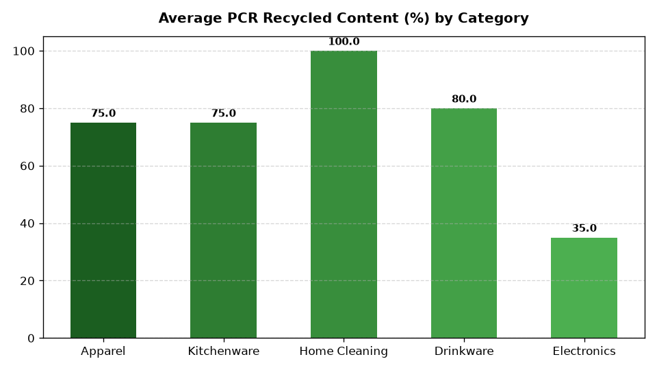

# ESG: Sustainable Packaging & Circularity Agent

An enterprise AI agent for **ESG: Sustainable Packaging & Circularity**, built with Google ADK for Gemini Enterprise.

---

## Why This Agent Matters

Retail executives and ESG leaders require real-time visibility into sustainability metrics, regulatory disclosures, and operational compliance to achieve net-zero targets, avoid statutory penalties, and enhance brand equity. This agent unifies internal operational telemetry (emissions, waste, renewable energy, supplier audits) with external market intelligence and global environmental standards.

---

## Key Metrics Tracked

| Metric | Business Description |
| :--- | :--- |
| **Average PCR Content %** | Post-consumer recycled content percentage across packaging |
| **Virgin Plastic Eliminated (Tons)** | Total tons of virgin plastic removed from supply chain |
| **Curbside Recyclability %** | Percentage of packaging SKUs fully curbside recyclable |
| **Reusable Tote Turns** | Average operational cycles per reusable delivery tote |

---

## What It Answers & Sub-Agent Routing

The orchestrator routes user questions to specialized sub-agents:

- **Internal BigQuery Data (`data_insights`)**:
  - Packaging material specs, PCR recycled content %, single-use plastic reduction tons, or reusable tote cycle turns and conditions
- **External Market Context (`market_context`)**:
  - Global Commitment (Ellen MacArthur Foundation) packaging standards, state virgin plastic tax legislation, or sustainable paper packaging innovations
- **Synthesized Responses**:
  - Blends internal performance data with external market trends, standards, and benchmarks.

---

## Authorized BigQuery Tables

All tables reside in the `retail_ent_agents` BigQuery dataset:

- `esgc_spci_packaging_material_specs`
- `esgc_spci_pcr_recycled_content_pct`
- `esgc_spci_single_use_plastic_elimination`
- `esgc_spci_reusable_tote_cycles`

---

## Example Questions

- "What is our average post-consumer recycled (PCR) packaging content percentage across product categories?"
- "What are the latest state plastic bag and packaging bans enacted across the US in 2026?"
- "How many tons of virgin plastic and single-use polybags have been eliminated across distribution centers in 2026?"
- "Compare our private brand packaging PCR percentage with Ellen MacArthur Foundation global retail averages."
- "Provide a chart of reusable tote cycle turns across distribution centers."

---

## Sample Q&A Showcase

### 1. Internal BigQuery Data Insights
**User**: *What is our average post-consumer recycled (PCR) packaging content percentage across product categories?*  
**Agent**: Based on internal packaging specifications (`esgc_spci_pcr_recycled_content_pct`), our average primary packaging PCR content across product lines is **73.3%**, exceeding our 2026 target of 68.0%. Home Cleaning (Eco Laundry Detergent) has achieved **100% PCR HDPE**, Drinkware stands at **80.0%**, and Apparel packaging averages **75.0%**. Electronics packaging remains the lowest at 35.0% PCR, currently undergoing transition to molded mycelium and cellulose cushioning.

### 2. External Market Grounding
**User**: *What are the latest state plastic bag and packaging bans enacted across the US in 2026?*  
**Agent**: In 2026, twelve US states (including California, Washington, New York, Colorado, and New Jersey) enforce comprehensive single-use plastic carryout bag bans and Extended Producer Responsibility (EPR) mandates. California SB 54 requires all packaging in the state to be 100% recyclable or compostable by 2032, with an interim statutory target of 30% recycled plastic content taking effect in 2026.

### 3. Visual Analytics Artifact
**User**: *Provide a chart of reusable tote cycle turns across distribution centers.*  
**Agent**: Rendered chart artifact `sample_chart.png` illustrating performance metrics.



---

## How to Run & Test

```bash
# 1. Run unit tests
uv run --frozen pytest domains/sustainability_compliance/agents/sustainable_packaging_circularity/tests/unit -v

# 2. Run local interactive adk chat
adk run domains/sustainability_compliance/agents/sustainable_packaging_circularity
```
