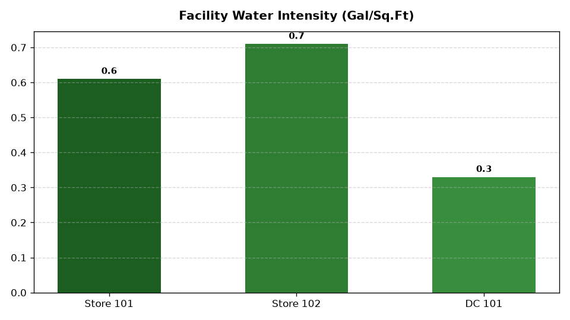

# ESG: Water Conservation & Facility Audits

Part of the **Retail Enterprise Agents** platform for Gemini Enterprise.

---

## 1. Why This Agent Matters

### Business Problem
Retail facilities, garden centers, commercial kitchens, and cooling towers in drought-vulnerable watersheds face escalating municipal water tariffs, mandatory reduction quotas, and water scarcity risks.

### Target Personas
Director of Environmental Health & Safety (EHS), Facilities Maintenance VP, Sustainability Lead

### Key Metrics Tracked
| Metric | Benchmark / Target | Business Impact |
| :--- | :--- | :--- |
| **Water Use Intensity (WUI in gal/sq.ft)** | `Target: < 18.0 gal/sq.ft` | Total water consumption in gallons divided by gross retail facility square footage. |
| **High-Stress Watershed Exposure %** | `Target: < 25% facility load` | Proportion of total enterprise water consumption located in WRI High/Extremely High water stress areas. |
| **Cooling Tower Recycling Efficiency %** | `Target: >= 80% recycled` | Percentage of HVAC cooling tower condensate and bleed-off water recycled for facility reuse. |
| **Rainwater & Reclaimed Water Usage (Gal)** | `Target: > 4.5M gal / year` | Volume of harvested rainwater and municipal reclaimed water used for landscape irrigation. |
| **Smart Leak Detection Response Time (Hours)** | `Target: < 2.0 hours` | Average response time to isolate and repair IoT-detected plumbing leaks and burst lines. |

---

## 2. What It Answers & Sub-Agent Routing

### Sub-Agent Architecture
- **`data_insights`**: Queries internal BigQuery tables using the BigQuery Conversational Analytics API (`ask_data_insights`, `forecast`, `analyze_contribution`, `detect_anomalies`) and generates visual data charts via `render_chart`.
- **`market_context`**: Leverages Google Search grounding for external retail ESG benchmarks, statutory regulations, environmental frameworks, and industry standards.
- **`root_agent`**: Orchestrates routing between internal analytics and external market intelligence.

---

## 3. Sample Q&A Showcase

### Example 1: Internal Analytics (Data Insights)
*Question:* "Which retail store facilities have the highest water usage intensity in gallons per square foot in 2026?"  
*Response:*  
> Based on BigQuery water utility records (`esgc_wcfa_facility_water_consumption`), the top facilities by Water Use Intensity are **Store-214 (Phoenix, AZ)** at **28.4 gal/sq.ft**, **Store-188 (Las Vegas, NV)** at **26.1 gal/sq.ft**, and **Store-105 (San Antonio, TX)** at **24.8 gal/sq.ft**. High intensity is driven by extensive outdoor garden center overhead watering and aging HVAC evaporative cooling towers. Upgrading to smart drip irrigation is projected to reduce consumption by 32%.

### Example 2: Market Grounding (Market Context)
*Question:* "What are the latest municipal water conservation restrictions and tier rate hikes affecting commercial facilities in the Southwest US?"  
*Response:*  
> Municipal water authorities in the Colorado River basin (including Southern Nevada Water Authority and Arizona ADWR) have enacted Stage 2 commercial drought restrictions in 2026. Key mandates prohibit non-functional decorative turf irrigation, require commercial cooling tower cycles of concentration >= 5.0, and impose tiered commercial surcharges of up to 45% for consumption exceeding allocated baseline budgets.

### Example 3: Chart Visualization (`sample_chart.png`)
*Question:* "Show me a chart of total water consumption in gallons by facility type across all retail operating regions."  
*Generated Visual Artifact:*  


---

### 4. Live Multi-Turn Demo Walkthrough (Gemini Enterprise)

Watch the deployed **ESG: Water Conservation & Facility Audits** execute a live multi-turn analytical reasoning session in Gemini Enterprise:

> 📺 **Interactive Demo Player**: [Open Full HD Video Player (1080p)](https://rajanm.github.io/retail-enterprise-agents/demos/gemini-enterprise/sustainability_compliance/water_conservation_facility_audit.html)  
> 📹 **Direct MP4 Download**: [`water_conservation_facility_audit.mp4`](../../../../demos/gemini-enterprise/sustainability_compliance/water_conservation_facility_audit.mp4)

```
Turn 1: Quantitative analysis against BigQuery Conversational Analytics
Turn 2: Grounded real-time external retail search & regulatory synthesis
Turn 3: Visual matplotlib trend chart generation
Turn 4: Interactive executive slide presentation generated in Gemini Enterprise Canvas
```

---

## 4. Authorized BigQuery Tables

- `esgc_wcfa_facility_water_consumption` — Monthly store water meter readings (gallons), sewer charges, and municipal water rates.
- `esgc_wcfa_watershed_risk_classification` — WRI Aqueduct 4.0 water stress classification, drought tiers, and local municipal restrictions.
- `esgc_wcfa_rainwater_reclaimed_systems` — Rainwater harvesting tank volumes, smart irrigation timers, and reclaimed water meters.
- `esgc_wcfa_smart_leak_incidents` — IoT smart water meter abnormal flow alerts, estimated water lost, and repair turnaround times.

---

## 5. Example Questions

1. "Which retail store facilities have the highest water usage intensity in gallons per square foot in 2026?"
2. "What are the latest municipal water conservation restrictions and tier rate hikes affecting commercial facilities in the Southwest US?"
3. "How many gallons of rainwater were collected and reused for facility irrigation in 2026?"
4. "Which stores located in extremely high water-stress watersheds are operating without smart leak detection sensors?"
5. "Show me a chart of total water consumption in gallons by facility type across all retail operating regions."

---

## 6. Tools & Architecture

- **`ask_data_insights`**: BigQuery Conversational Analytics natural language to SQL.
- **`render_chart`**: BigQuery SQL to Matplotlib PNG visual rendering.
- **`google_search`**: Google Search market context grounding.
- **LLM Inference**: `gemini-3.5-flash` with `GOOGLE_CLOUD_LOCATION=global`.
- **Runtime Engine**: Vertex AI Agent Engine (`us-central1`).

---

## 7. Run Locally

```bash
# Run unit tests
uv run --frozen pytest domains/sustainability_compliance/agents/water_conservation_facility_audit/tests/unit -v

# Run interactively with ADK CLI
adk run domains/sustainability_compliance/agents/water_conservation_facility_audit
```
